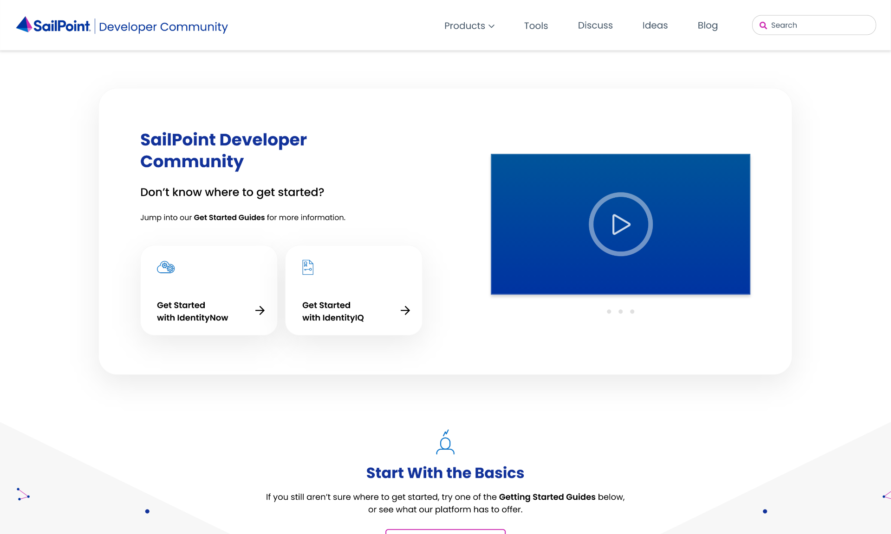

<a id="readme-top"></a>

[![Discourse Topics][discourse-shield]][discourse-url] ![Issues][issues-shield] ![Latest Releases][release-shield] ![Contributor Shield][contributor-shield] [](https://github.com/sailpoint-oss/developer.sailpoint.com/actions/workflows/build-and-deploy-prod-gh-pages.yml)

[discourse-shield]: https://img.shields.io/discourse/topics?label=Discuss%20This%20Tool&server=https%3A%2F%2Fdeveloper.sailpoint.com%2Fdiscuss
[discourse-url]: https://developer.sailpoint.com/discuss/
[issues-shield]: https://img.shields.io/github/issues/sailpoint-oss/developer.sailpoint.com?label=Issues
[release-shield]: https://img.shields.io/github/v/release/sailpoint-oss/developer.sailpoint.com?label=Current%20Release
[contributor-shield]: https://img.shields.io/github/contributors/sailpoint-oss/developer.sailpoint.com?label=Contributors

<!-- PROJECT LOGO -->
<br />
<div align="center">
    

  <h3 align="center">SailPoint Developer Community - README</h3>
  <br/>
<div align="center">

</div>
</div>
 
<!-- ABOUT THE PROJECT -->

## About The Project

This repository contains the complete build, with assets, for everything seen on developer.sailpoint.com. This includes the homepage, all static elements, _documentation_, API specifications, etc. The API specifications come in from a GitHub Action in another repository, but ultimately the API specifications used to generate this static site are those found in the `static` folder.

Please use GitHub [issues](https://github.com/sailpoint-oss/developer.sailpoint.com/issues) to [submit bugs](https://github.com/sailpoint-oss/developer.sailpoint.com/issues/new?assignees=&labels=&template=bug-report.md&title=%5BBug%5D+Your+Bug+Report+Here) or make [feature requests](https://github.com/sailpoint-oss/developer.sailpoint.com/issues/new?assignees=&labels=&template=feature-request.md&title=%5BFeature%5D+Your+Feature+Request+Here).

If you'd like to contribute directly (which we encourage!), please read the contribution guidelines below, first!

<!-- GETTING STARTED -->

## Getting Started

If you want to build this project locally, follow the steps below.
 <br> If you're new to GitHub or web development, you can also start by editing files directly in the browser — no need to install anything!


### Prerequisites

To run this project you must first have node.js and npm installed.

## 📌 Note

> **Important**: Node.js version 23.6.0 does not work with this build currently. 

```sh
npm install npm@latest -g
```

### Installation

1. Clone the repo

   ```bash
   git clone https://github.com/sailpoint-oss/developer.sailpoint.com.git
   ```

2. Install the project's NPM packages

   ```bash
   npm install
   ```

3. Generate the API docs. They are auto-generated, so we do not track them in the repository and instead build them at runtime.

   ```bash
   npm run gen-api-docs-all
   ```

4. Start the website
   ```bash
   npm run start
   ```

## Discuss

[Click Here](https://developer.sailpoint.com/discuss) to discuss this tool with other users.<br>You can ask questions, suggest ideas, or get help from the SailPoint developer community.

<!-- LICENSE -->

## License

Distributed under the MIT License. See [the license](./LICENSE) for more information.

<!-- CONTRIBUTING -->

## Contributing

Before you contribute you [must sign our CLA](https://cla-assistant.io/sailpoint-oss/developer.sailpoint.com). Please also read our [contribution guidelines](./CONTRIBUTING.md) for all the details on contributing.

<!-- CODE OF CONDUCT -->

## Code of Conduct

We pledge to act and interact in ways that contribute to an open, welcoming, diverse, inclusive, and healthy community. Read our [code of conduct](./CODE_OF_CONDUCT.md) to learn more.

<p align="right">(<a href="#readme-top">back to top</a>)</p>
