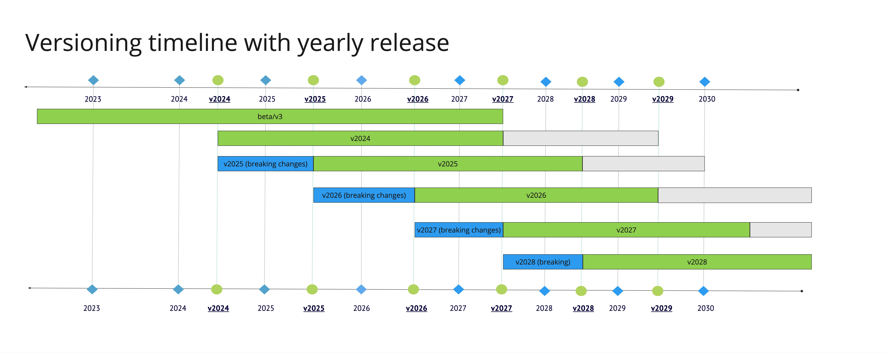

With the introduction of this API versioning strategy SailPoint’s Identity Security Cloud APIs will now follow a annual release schedule to facilitate the introduction of new APIs and the deprecation of unsupported APIs. This annual release schedule enables SailPoint to continually evolve its APIs to meet the needs of users while allowing outdated functionality to be gracefully retired. This document describes the yearly release process and how you, the user, should operate within SailPoint’s API ecosystem to ensure your integrations are always up-to-date and are not impacted by deprecations.

:::info

SailPoint’s API versioning process is subject to change at any time. SailPoint will use reasonable efforts, when possible, to communicate changes that affect users of the API in the appropriate channels in advance of such changes.

:::

## Public vs Experimental

### Public

Public APIs are production ready APIs that are meant to be used by customers, partners, and other external users. Public APIs will generally not receive any breaking changes, but additional features that don’t break compatibility may be introduced. When possible, it is preferred to use the latest public API version in your custom integrations to avoid any short notice deprecations or other complications. Examples of non-breaking changes include, but are not limited to:

* Adding a new endpoint.

* Adding an optional parameter.

* Adding an optional request header.

* Adding a response property.

* Adding a response header.

* Adding enum values.

* Changing a required parameter to an optional parameter.

* Changing response properties or status code for requests using new enums, new optional parameters, or new request headers.

* Expanding authentication or authorization requirements.

### Experimental

Experimental APIs are APIs that are still under development, but may be used by customers, partners, and other external users for evaluation purposes. We offer these APIs to the public in order to get feedback from users on how we can improve them before they are released into production. These APIs may introduce breaking changes with little to no notice, and are not suitable for production use cases. Examples of breaking changes include, but are not limited to:

* Removing an entire endpoint.

* Removing or renaming a parameter.

* Removing or renaming a response property.

* Removing enum values.

* Adding a new required parameter.

* Adding a new validation rule to an existing parameter.

* Changing the type of a request parameter or response property.

* Changing the response status code.

* Changing synchronous effects to asynchronous effects.

* Restricting authentication or authorization requirements.

* Changing the definition of request parameter or response property

Access to experimental APIs requires an opt-in header flag. When an endpoint transitions from the experimental to public, the header is no longer necessary, but its presence won’t cause any issues.

To enable preview for a request, add the `X-SailPoint-Experimental` header with a value of true to each API request that invokes a experimental endpoint. For example:

```bash
curl --header "X-SailPoint-Experimental: true" https://acme.api.identitynow.com/v2026/endpoint
```

:::warning

If you attempt to invoke an experimental API without specifying the `X-SailPoint-Experimental` header, you will receive an error message indicating that the endpoint is in preview status and requires the `X-SailPoint-Experimental` header.
:::

## Release schedule

SailPoint will introduce an annual release which includes both public and experimental APIs. Each yearly version will be named according to its release year. For instance, if the release occurs in 2025, the version will be designated as v2025.

Each annual release will be accompanied by an experimental release if there is at least one breaking change introduced in the current annual release. This experimental release will be named after the next year. For example, if the current year is 2025, the experimental version will be named v2026. Any breaking changes to public endpoints in a public version throughout the year will be introduced in the experimental version.

When a new annual release is introduced, non-deprecated endpoints will generally be transferred to the new release without modifications. As a result, the same endpoint will usually be able to be accessed via both the old and new versions. Only the latest public release will receive new functionality. If at anytime throughout the year a experimental API is deemed ready for production, it will be released into the current year’s public version, but not previous years.

Annual release versions will typically be supported for 3 years and then remain operational for an additional 2-year transition period, unless otherwise noted or an exception applies.  Customers will be expected to move to the latest public release during those two years. Customers seeking support for an annual release that is over 3 years old will be asked to transition to a newer version.

The following image demonstrates the support model for public and experimental releases. The green bars represent how long an annual release version will be supported by our support team. When a annual release is older than three years, it may still remain operational, but it is no longer supported. The blue bars represent experimental releases which are available for one year in the preview state before being changed to a production release.



## Deprecations

Individual APIs may be deprecated at anytime. The term “deprecation” means that we intend to turn off an API or change the functionality of an API in a way that breaks backwards compatibility. Deprecated APIs will be functional for two years before they are turned off or the old functionality is removed. Deprecations will be announced in one of the following three ways.

## Announcements

Communications will be sent out to notify impacted users of any deprecations. These communications may appear in the Admin page of the Identity Security Cloud UI, in the [Announcements](https://developer.sailpoint.com/discuss/c/announcements/14) category, in Compass, or in newsletters or emails.

## API specification

Deprecated APIs will be marked as “Deprecated” in the API specification. Additional information on why it is being deprecated and what, if any, replacements are available may be provided in the deprecation notice.


Experimental APIs will be marked as "Experimental" in the API specification.


## Deprecation header

Deprecated APIs will use a response header to inform users when a particular endpoint is deprecated. If you receive a response header in the form of `X-Deprecated: true`, it means that the endpoint has been deprecated and you should check the API specification for more information.

## Exceptions to the versioning process

SailPoint may occasionally decide to make exceptions to the versioning process. These exceptions may be due to a variety of factors, including security, performance, or delivery.

### Security

SailPoint’s Product Security team may approve breaking changes to our APIs to resolve security issues. In these cases, no prior notice about the breaking change will be provided, in order to ensure the security issue is fixed in a timely manner and to limit knowledge of the security issue to third parties.

### Performance

SailPoint may approve breaking changes to our API to address performance issues. The impact to customers will be weighed against the performance improvements in order to determine if an exception to the versioning process will be made or not.

### Delivery

SailPoint may make breaking changes to our APIs in order to decrease the time to deliver new features, as long as there is minimal impact to users of the API.

## V3 and Beta APIs

The V3 and Beta APIs will remain operational for as long as they contain non-deprecated endpoints. V3 and Beta will be supported until Q1 of 2027, meaning that users can submit support tickets for these versions. After Q1 of 2027, users may no longer submit support tickets for these versions, and they will be asked to use a supported version instead.