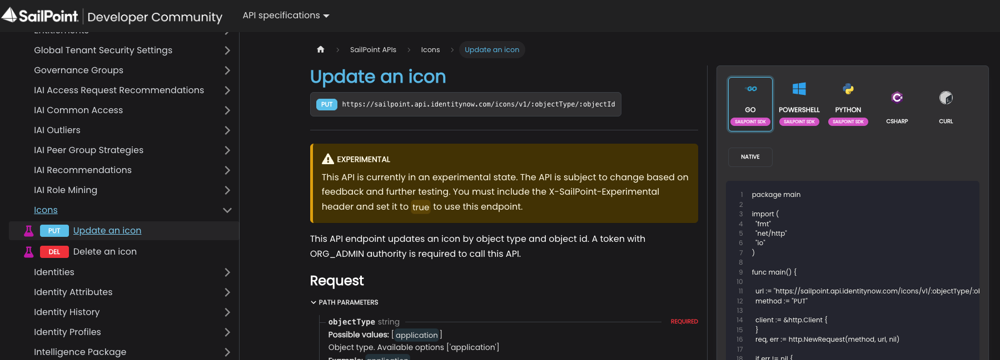
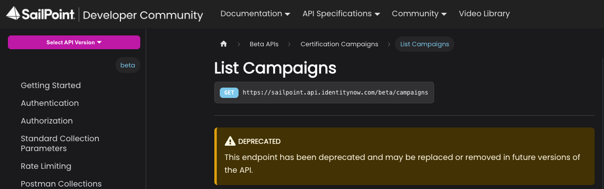

SailPoint's Identity Security Cloud (ISC) REST APIs follow true semantic versioning, where each service is versioned independently. A service's major version only increments when its core usage contract changes. This gives you a stable, predictable integration target: as long as a version's contract is unchanged, your integrations continue to work without modification.

When breaking changes are required, a new major version is released in parallel and the previous version enters a clearly defined deprecation schedule on its own timeline. Services are documented once and maintained in place, rather than duplicated across yearly releases.

:::info

SailPoint's API versioning process is subject to change at any time. SailPoint will use reasonable efforts, when possible, to communicate changes that affect users of the API in the appropriate channels in advance of such changes.

:::

## How versioning works

Each ISC service is versioned independently using a URL structure that follows this pattern:

```
/service/v1/action
```

For example, an endpoint to list identities would be accessible at a path like `/identities/v1/`. The major version (`v1`, `v2`, etc.) only changes when a breaking change is introduced to that service's contract. Non-breaking additions, such as new optional parameters or new response fields, are introduced within the existing version without incrementing it.

When a breaking change is needed, the new version (`v2`) is developed as experimental and released alongside the existing version (`v1`). Breaking changes can be scoped to a single endpoint — that endpoint moves to `v2` while the rest of the service continues on `v1`. The previous version remains operational until `v2` reaches feature parity or establishes a fundamentally different direction. Once `v2` is ready, its predecessor is deprecated, starting the two-year end-of-life period.

## Public vs Experimental

### Public

Public APIs are production-ready and intended for use by customers, partners, and other external users. Public APIs will generally not receive breaking changes, but non-breaking additions may be introduced within an existing version at any time. Examples of non-breaking changes include, but are not limited to:

* Adding a new endpoint.

* Adding an optional parameter.

* Adding an optional request header.

* Adding a response property.

* Adding a response header.

* Adding enum values.

* Changing a required parameter to an optional parameter.

* Changing response properties or status code for requests using new enums, new optional parameters, or new request headers.

* Expanding authentication or authorization requirements.

### Experimental

Experimental APIs are still under development but are made available for evaluation and feedback before they are released into production. These APIs may introduce breaking changes with little or no notice and are not suitable for production use cases. Examples of breaking changes include, but are not limited to:

* Removing an entire endpoint.

* Removing or renaming a parameter.

* Removing or renaming a response property.

* Removing enum values.

* Adding a new required parameter.

* Adding a new validation rule to an existing parameter.

* Changing the type of a request parameter or response property.

* Changing the response status code.

* Changing synchronous effects to asynchronous effects.

* Restricting authentication or authorization requirements.

* Changing the definition of a request parameter or response property.

Experimental APIs will be marked as "Experimental" in the API specification.



Access to experimental APIs requires an opt-in header flag. When an endpoint transitions from experimental to public, the header is no longer necessary, but its presence won't cause any issues.

To enable experimental access for a request, add the `X-SailPoint-Experimental` header with a value of `true` to each API request that invokes an experimental endpoint. For example:

```bash
curl --header "X-SailPoint-Experimental: true" https://acme.api.identitynow.com/identities/v1/action
```

:::warning

If you attempt to invoke an experimental API without the `X-SailPoint-Experimental` header, you will receive an error indicating that the endpoint requires it.

:::

## Deprecations

Individual API versions may be deprecated at any time. The term "deprecation" means that SailPoint intends to retire a version or change its functionality in a way that breaks backwards compatibility. Deprecated versions will remain functional for two years before they are turned off. Deprecations will be announced in one of the following three ways.

### Announcements

Communications will be sent out to notify impacted users of any deprecations. These communications may appear in the Admin page of the Identity Security Cloud UI, in the [Announcements](https://developer.sailpoint.com/discuss/c/announcements/14) category, in Compass, or in newsletters or emails.

### API specification

Deprecated APIs will be marked as "Deprecated" in the API specification. Additional information on why it is being deprecated and what replacements are available, if any, may be provided in the deprecation notice.



### Deprecation header

Deprecated APIs will use a response header to inform users when a particular endpoint is deprecated. If you receive a response header in the form of `X-Deprecated: true`, it means that the endpoint has been deprecated and you should check the API specification for more information.

## Exceptions to the versioning process

SailPoint may occasionally make exceptions to the versioning process due to a variety of factors, including security, performance, or delivery.

### Security

SailPoint's Product Security team may approve breaking changes to our APIs to resolve security issues. In these cases, no prior notice about the breaking change will be provided, in order to ensure the security issue is fixed in a timely manner and to limit knowledge of the security issue to third parties.

### Performance

SailPoint may approve breaking changes to our API to address performance issues. The impact to customers will be weighed against the performance improvements in order to determine if an exception to the versioning process will be made.

### Delivery

SailPoint may make breaking changes to our APIs in order to decrease the time to deliver new features, as long as there is minimal impact to users of the API.

## Legacy V3 and Beta APIs

The V3 and Beta APIs were part of SailPoint's previous annual release versioning model and will remain operational for as long as they contain non-deprecated endpoints. V3 and Beta will be supported until Q1 of 2027, meaning that users can submit support tickets for these versions. After Q1 of 2027, users may no longer submit support tickets for these versions and will be asked to migrate to a supported version instead.
