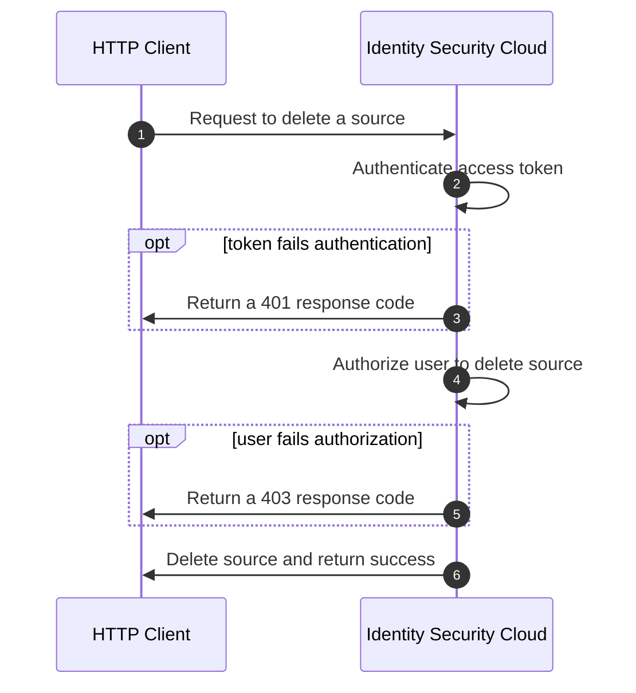

import Tabs from '@theme/Tabs'; import TabItem from '@theme/TabItem';

## Overview

Authorization and authentication are two related concepts that help secure APIs. Authentication is the act of verifying a user's identity. Authorization is the act of validating the user's permission to access a given resource. When a user sends an API request, the server authenticates the user by checking the validity of the access token sent with the request. If the token is valid, the server checks whether the user is authorized to perform the desired operation on the resource. If the user is both authenticated and authorized, the server fulfills the request.

<div align="center">



</div>

## User Level Permissions

When managing a user's access to the API, you must first assign the target user an appropriate [user level](https://documentation.sailpoint.com/saas/help/common/users/user_level_matrix.html). It is important to choose the correct user level as it will place a boundary on which APIs a user can call, which also affects the areas and functions of the UI they have access to. For example, if a user is in charge of creating reports for auditing requirements, consider granting them the "Report Admin" user level.


User levels are typically granted through the UI, [following the procedures from this document](https://documentation.sailpoint.com/saas/help/accounts/identities.html#setting-user-level-permissions). You can also set user levels via API using the [auth user update](https://developer.sailpoint.com/docs/api/v3/patch-auth-user) endpoint.


User levels act as the first line of defense by applying a rigid boundary around the APIs that a user can call. The next section introduces scopes, which allow users to apply granular controls on the APIs an access token can call.

## Scopes

Scopes are granular permissions you can add to personal access tokens (PATs) to create tokens with the least privilege necessary to fulfill their functions. User levels place a broad border around the APIs a token has access to, while scopes can further limit the set of endpoints a token can call. Scopes allow an API user to have multiple tokens with different privileges that support unique use cases and software applications. Using scopes is beneficial to security - if a bad actor compromises any one of the tokens, the bad actor can only perform the limited set of operations defined by the token's scopes, significantly reducing the potential damage that can be done. Therefore, it is recommended that all users apply scopes to each PAT they create in order to reduce the impact of stolen credentials.

Scopes contain one or more rights, which are low level permissions that grant access to individual endpoints. This means that a single scope, like `idn:access-request:manage`, can grant access to multiple API endpoints. To determine which scopes a PAT needs, you must first identify which endpoints the PAT needs to invoke. Each endpoint's API specification indicates which scope is necessary to call the endpoint. You can use this approach to curate a list of scopes that must be applied to the credential to call the necessary endpoints. [Learn more about how to find an API's required scopes here](#identifying-necessary-authorization-for-an-endpoint).

By default, each PAT has the scope `sp:scopes:default`, which is the least privileged scope. It only grants access to endpoints that require no authorization at all, such as [List Public Identities](https://developer.sailpoint.com/idn/api/v3/get-public-identities). Access to the endpoint may still be determined by the user's [user level](https://documentation.sailpoint.com/saas/help/common/users/user_level_matrix.html).

Alternatively, `sp:scopes:all` grants access to all the rights appropriate for the [user level](https://documentation.sailpoint.com/saas/help/common/users/user_level_matrix.html). For example, a user with the **Admin** user level has access to all APIs, so `sp:scopes:all` grants **Admin** users access to all APIs. A user with the **Cert Admin** user level, however, has access to only a subset of APIs necessary to perform their role, most notably the certification APIs, so `sp:scopes:all` grants **Cert Admin** users access to only that subset of APIs.

Scopes are additive, which means the final right set is the intersection of all the rights granted by the scopes assigned to a PAT, excluding any rights that fall outside of the user level. Each scope added to an PAT builds up the credential's permission set, incrementally increasing access to the API. If a PAT has `sp:scopes:all` granted, then any additional scope is ignored because `sp:scopes:all` already contains the complete set of rights available to the user level.

:::tip

If the API requirements for the personal access token exceed the scopes allowed by the user's assigned user level, then the following options may be considered.

- Re-evaluate the user's responsibilities compared to their user level. It is possible that their user level is no longer appropriate for the functions they need to perform, and a more permissive user level may be necessary.
- If the required access is a one-off need for a specific use case, then consider generating a PAT with the required scopes from a different user and sharing the credentials. This could be a dedicated service account designated for one-off applications. The downside of this approach is that it becomes more difficult to attribute an API call to a specific user, as the user now has a PAT that is not tied to their user account.

:::

## Identifying Necessary Authorization for an Endpoint

Each endpoint document specifies how to authorize with the endpoint in the **Authorization** dropdown, which is located on the right side column below the endpoint path. Selecting **Authorization** expands the dropdown menu showing the details of how to authorize with the endpoint. The following image shows the authorization details of the [List Access Profiles](https://developer.sailpoint.com/docs/api/beta/list-access-profiles) endpoint.


- **type**: The type of authorization method supported for this endpoint. SailPoint uses the [OAuth2 standard](./authentication.md#oauth-20) for all the V3/Beta APIs.
- **flow**: One or more OAuth flows supported by the endpoint. A token only needs to be generated by one flow to be valid. Refer to [Authentication Details](./authentication.md#choose-authorization-grant-flow) for more information about the available flows.
- **scopes**: A list of scopes necessary to access the endpoint. A token only needs one of the scopes to authorize with the endpoint. When possible, choose the least privileged scope. Scopes ending in `read` can only retrieve data. Scopes ending in `manage` can retrieve, modify, and delete data.

You may also notice that many API descriptions will indicate the user level(s) required to call the API endpoint. In the screenshot above, the list access profiles endpoint requires the user to have one of the following user levels: ORG_ADMIN, ROLE_ADMIN, ROLE_SUBADMIN, SOURCE_ADMIN, or SOURCE_SUBADMIN. This means the PAT must have one of those user level **in addition to** the `sp:scopes:all` or `idn:access-profile:read` scope in order to call the endpoint.

:::info

SailPoint is working to define scopes for every endpoint, but you may encounter a scenario where you need access to an endpoint that does not yet have a scope defined. Until a scope is defined for the endpoint, you can assign `sp:scopes:all` to ensure that your credentials can access the necessary endpoints. Once all of the endpoints necessary for your use case have scopes defined, you can update or create a new PAT with the appropriate scopes in place.

:::

## Assigning Scopes with the UI

When you create a PAT in the UI, you can apply scopes to the token. More information on how to do this will be added in the near future.

## Assigning Scopes with the API

You can [create PATs](https://developer.sailpoint.com/docs/api/v3/create-personal-access-token) programmatically with the API. The request body for the endpoint allows the caller to specify a list of scopes to be applied to the PAT. If the `scope` property is omitted from the request body, then `sp:scopes:all` is granted to the credentials. The following example shows how to generate a PAT with the `idn:access-request:manage` and `idn:nelm:manage` scopes.

POST `https://{tenant}.api.identitynow.com/v3/personal-access-tokens`

Request Body

```json
{
  "name": "Access Request and NELM Management",
  "scope": ["idn:access-request:manage", "idn:nelm:manage"]
}
```

This request produces the following response, indicating that the scopes were successfully applied to the PAT.

```json
{
  "id": "86286c0c456e4b03a8ccb1f892dd456d",
  "name": "Access Request and NELM Management",
  "secret": "********",
  "scope": ["idn:access-request:manage", "idn:nelm:manage"],
  "created": "2023-01-04T18:58:17.486584Z",
  "owner": {
    "name": "jane.doe",
    "id": "2c9180ab7624cbd7017642d8c8c81a73",
    "type": "IDENTITY"
  }
}
```

:::caution

If you attempt to add a scope that is outside the permissions of the [target user's level](#user-level-permissions), the request will still succeed and include the invalid scope in the credentials. However, any token generated with these credentials will **not** include the rights of the invalid scope. This is not an issue when you apply scopes with the UI - the UI only shows scopes available to the current user.

:::
