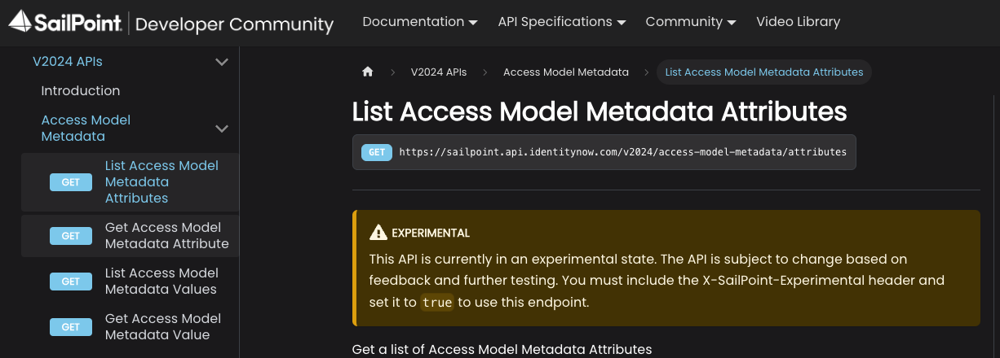
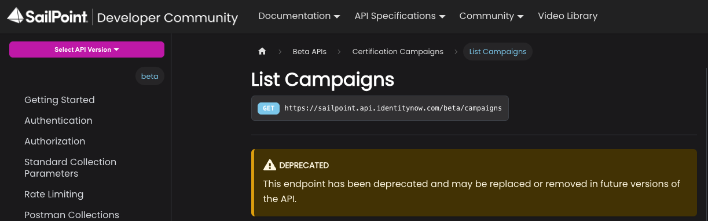

With the introduction of this API versioning strategy SailPoint’s Identity Security Cloud APIs will now follow a annual release schedule to facilitate the introduction of new APIs and the deprecation of unsupported APIs. This annual release schedule enables SailPoint to continually evolve its APIs to meet the needs of users while allowing outdated functionality to be gracefully retired. This document describes the yearly release process and how you, the user, should operate within SailPoint’s API ecosystem to ensure your integrations are always up-to-date and are not impacted by deprecations.

:::info

SailPoint’s API versioning process is subject to change at any time. SailPoint will use reasonable efforts, when possible, to communicate changes that affect users of the API in the appropriate channels in advance of such changes.

:::

## Public vs Experimental

### Public

Public APIs are production ready APIs that are meant to be used by customers, partners, and other external users. Public APIs will generally not receive any breaking changes, but additional features that don’t break compatibility may be introduced. When possible, it is preferred to use the latest public API version in your custom integrations to avoid any short notice deprecations or other complications. Examples of non-breaking changes include, but are not limited to:

* Adding a new endpoint.

* Adding an optional parameter.

* Adding an optional request header.

* Adding a response property.

* Adding a response header.

* Adding enum values.

* Changing a required parameter to an optional parameter.

* Changing response properties or status code for requests using new enums, new optional parameters, or new request headers.

* Expanding authentication or authorization requirements.

### Experimental

Experimental APIs are APIs that are still under development, but may be used by customers, partners, and other external users for evaluation purposes. We offer these APIs to the public in order to get feedback from users on how we can improve them before they are released into production. These APIs may introduce breaking changes with little to no notice, and are not suitable for production use cases. Examples of breaking changes include, but are not limited to:

* Removing an entire endpoint.

* Removing or renaming a parameter.

* Removing or renaming a response property.

* Removing enum values.

* Adding a new required parameter.

* Adding a new validation rule to an existing parameter.

* Changing the type of a request parameter or response property.

* Changing the response status code.

* Changing synchronous effects to asynchronous effects.

* Restricting authentication or authorization requirements.

* Changing the definition of request parameter or response property

Experimental APIs will be marked as "Experimental" in the API specification.



Access to experimental APIs requires an opt-in header flag. When an endpoint transitions from the experimental to public, the header is no longer necessary, but its presence won’t cause any issues.

To enable preview for a request, add the `X-SailPoint-Experimental` header with a value of true to each API request that invokes a experimental endpoint. For example:

```bash
curl --header "X-SailPoint-Experimental: true" https://acme.api.identitynow.com/v2026/endpoint
```

:::warning

If you attempt to invoke an experimental API without specifying the `X-SailPoint-Experimental` header, you will receive an error message indicating that the endpoint is in preview status and requires the `X-SailPoint-Experimental` header.
:::

## Release schedule

SailPoint will introduce an annual release that includes both public and experimental APIs. Each yearly version will be named according to its release year. For instance, if the release occurs in 2025, the version will be designated as v2025.

Each annual release may be accompanied by an experimental release if it introduces at least one breaking change. For example, if the annual release is v2025 and includes breaking changes, those changes will be introduced as experimental APIs in v2026.

When a new annual release is introduced, non-deprecated endpoints will generally be transferred to the new release without modifications. As a result, the same endpoint will usually be able to be accessed via both the old and new versions. Only the latest public release will receive new functionality. If at anytime throughout the year a experimental API is deemed ready for production, it will be released into the current year’s public version, but not previous years.

Annual release versions will typically be supported for 3 years and then remain operational for an additional 2-year transition period, unless otherwise noted or an exception applies.  Customers will be expected to move to the latest public release during those two years. Customers seeking support for an annual release that is over 3 years old will be asked to transition to a newer version.

The following image demonstrates the support model for public and experimental releases. The green bars represent how long an annual release version will be supported by our support team. When a annual release is older than three years, it may still remain operational, but it is no longer supported. During each calendar year’s main release (e.g., v2025), an optional experimental release may be introduced in preparation for the following year’s version (e.g., v2026). Blue bars on the timeline represent these experimental releases. For example, in 2025, if breaking changes are required for a public api, an experimental version (v2026) of the api may be published during the v2025 cycle.


## Deprecations

Individual APIs may be deprecated at anytime. The term “deprecation” means that we intend to turn off an API or change the functionality of an API in a way that breaks backwards compatibility. Deprecated APIs will be functional for two years before they are turned off or the old functionality is removed. Deprecations will be announced in one of the following three ways.

### Announcements

Communications will be sent out to notify impacted users of any deprecations. These communications may appear in the Admin page of the Identity Security Cloud UI, in the [Announcements](https://developer.sailpoint.com/discuss/c/announcements/14) category, in Compass, or in newsletters or emails.

### API specification

Deprecated APIs will be marked as “Deprecated” in the API specification. Additional information on why it is being deprecated and what, if any, replacements are available may be provided in the deprecation notice.



### Deprecation header

Deprecated APIs will use a response header to inform users when a particular endpoint is deprecated. If you receive a response header in the form of `X-Deprecated: true`, it means that the endpoint has been deprecated and you should check the API specification for more information.

## Exceptions to the versioning process

SailPoint may occasionally decide to make exceptions to the versioning process. These exceptions may be due to a variety of factors, including security, performance, or delivery.

### Security

SailPoint’s Product Security team may approve breaking changes to our APIs to resolve security issues. In these cases, no prior notice about the breaking change will be provided, in order to ensure the security issue is fixed in a timely manner and to limit knowledge of the security issue to third parties.

### Performance

SailPoint may approve breaking changes to our API to address performance issues. The impact to customers will be weighed against the performance improvements in order to determine if an exception to the versioning process will be made or not.

### Delivery

SailPoint may make breaking changes to our APIs in order to decrease the time to deliver new features, as long as there is minimal impact to users of the API.

## V3 and Beta APIs

The V3 and Beta APIs will remain operational for as long as they contain non-deprecated endpoints. V3 and Beta will be supported until Q1 of 2027, meaning that users can submit support tickets for these versions. After Q1 of 2027, users may no longer submit support tickets for these versions, and they will be asked to use a supported version instead.

## The `/latest` Endpoint

Following the introduction of SailPoint's annual API versioning strategy (`/v2024`, `/v2025`, etc.), the `/latest` endpoint functionality was created in response to community feedback. This feature allows developers to automatically use the most current version of an endpoint without manually updating version numbers in their code every time a new annual release is published.

### Purpose and use cases

The `/latest` endpoint is designed for developers who want their integrations to automatically adopt the newest API versions as they become available. Instead of hardcoding a specific version number (e.g., `/v2025/accounts`), developers can use `/latest/accounts` to always route to the most current supported version of that endpoint.

#### When to use `/latest`

* Development and testing environments
* Non-critical integrations where occasional updates are acceptable
* Scripts and automations that can tolerate potential changes
* Proof-of-concept implementations

#### When NOT to use `/latest`

**Critical business operations should not use the `/latest` endpoint.** Because `/latest` automatically updates to point to newer API versions when they are released, your integration may experience unexpected behavior if breaking changes are introduced in a new annual release. For production systems and mission-critical workflows, explicitly specify a version number (e.g., `/v2025/accounts`) to ensure stability and predictability.

### How it works

The `/latest` endpoint routes to the most recent **public** (production-ready) version of an API. However, if no public version of an endpoint exists, `/latest` will route to the most recent **experimental** version instead.

#### Determining the routed version

You can identify which version `/latest` is currently routing to by inspecting the response headers. Every response from a `/latest` endpoint call includes an `X-SailPoint-Route-Version` header that indicates the actual version being used.


This header allows you to:

* Verify which version your `/latest` calls are using
* Monitor when automatic version updates occur
* Debug routing behavior during development

#### Basic routing example

If you're operating during calendar year 2025, and an endpoint exists in the following versions:

* `/beta/accounts`
* `/v3/accounts`
* `/v2024/accounts`
* `/v2025/accounts`

Then `/latest/accounts` will route to `/v2025/accounts` since it is the most recent public version.

#### Experimental API handling

**The `/latest` endpoint does NOT automatically route to experimental APIs unless no public version exists.** It only routes to the most recent **public** version of an endpoint, except when only an experimental version is available.

##### Example: new experimental endpoint

If during 2025 a completely new endpoint is released as experimental (e.g., `/v2025/custom-user-levels`), and no public version exists:

* `/latest/custom-user-levels` **will** route to the experimental version
* This occurs because it is the only available version of this endpoint

#### Example: breaking change to existing endpoint

If during 2025 the `/task-status` endpoint receives a breaking change:

* The updated endpoint is released as `/v2026/task-status` marked as experimental
* The previous version remains as `/v2025/task-status` (public)
* `/latest/task-status` continues to route to `/v2025/task-status` (the most recent public version)
* Once `/v2026/task-status` is promoted from experimental to public status, `/latest/task-status` will then route to the v2026 version

#### Deprecated API handling

If an API is deprecated and not carried forward to the newest annual release:

* `/latest` will continue to route to the most recent version where the endpoint exists
* This routing remains in place until that annual release reaches end-of-life
* Deprecation notices and timelines follow the standard deprecation process outlined in the API Versioning Strategy

### Risk acknowledgment

:::warning

By using the `/latest` endpoint, you acknowledge and accept the following risks:

:::

* **Automatic updates**: When a new annual version is released, your integration will automatically begin using the new version
* **Testing responsibility**: You are responsible for monitoring API updates and testing your integration when new versions are released
* **Potential breaking changes**: While rare in public releases, changes to API behavior may impact your integration

### Best Practices

1. **Use explicit versions for production**: Specify version numbers (e.g., `/v2025/accounts`) for all production and business-critical integrations
2. **Monitor release announcements**: Stay informed about new annual releases through the Identity Security Cloud Admin page, Compass, and developer communications
3. **Document your usage**: Clearly document where you're using `/latest` vs. explicit versions so your team understands the update behavior
4. **Be aware of annual updates and test after the switch**: When a new annual version is released, `/latest` integrations will automatically begin using the new version. Monitor for these updates each year and promptly test your scripts and integrations to ensure continued compatibility after the automatic switch.

### Compatibility with API versioning strategy

The `/latest` endpoint works in conjunction with SailPoint's annual versioning strategy:

* Annual releases follow the same 3-year support + 2-year transition period
* Deprecation notices apply regardless of whether you use `/latest` or explicit versions
* The `X-SailPoint-Experimental` header is still required to access experimental endpoints, even via `/latest`
