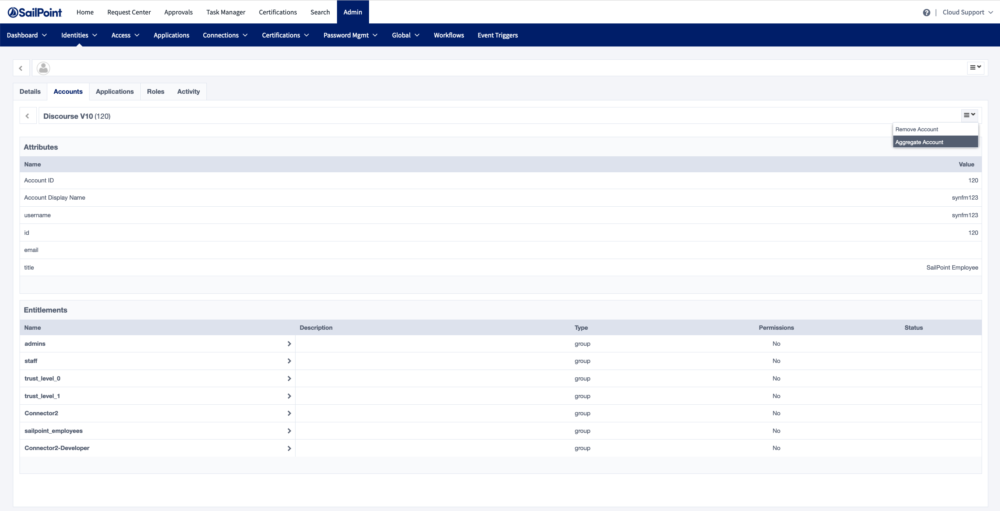

| Input/Output |      Data Type       |
| :----------- | :------------------: |
| Input        | StdAccountReadInput  |
| Output       | StdAccountReadOutput |

### Example StdAccountReadInput

```javascript
"identity": "john.doe",
"key": {
    "simple": {
        "id": "john.doe"
    }
}
```

### Example StdAccountReadOutput

```javascript
{
    "key": {
        "simple": {
            "id": "john.doe"
        }
    },
    "disabled": false,
    "locked": false,
    "attributes": {
        "id": "john.doe",
        "displayName": "John Doe",
        "email": "example@sailpoint.com",
        "entitlements": [
            "administrator",
            "sailpoint"
        ]
    }
}
```

## Description

The account read command aggregates a single account from the target source into SailPoint Human Fabric. SHF can call this command during a “one-off” account refresh, which you can trigger by aggregating an individual account in SHF.

To use this command, you must specify this value in the `commands` array: `std:account:read`



## Implementation

### Extracting the account ID from the input

SHF passes the account's key in `input.key`. For connectors using `keyType: "simple"`, extract the native ID like this:

```typescript
const id = input.key.simple?.id ?? input.identity
```

For `keyType: "compound"`, the key contains multiple named fields:

```typescript
const id = input.key.compound?.id
const domain = input.key.compound?.domain
```

### Registering the handler

```typescript
import {
    ConnectorError,
    ConnectorErrorType,
    Context,
    Response,
    SimpleKey,
    StdAccountReadInput,
    StdAccountReadOutput,
} from '@sailpoint/connector-sdk'

.stdAccountRead(async (context: Context, input: StdAccountReadInput, res: Response<StdAccountReadOutput>) => {
    const id = input.key.simple?.id ?? input.identity

    const account = await myClient.getAccount(id)

    // If the account is not found, throw NotFound — SHF will then trigger account create
    if (!account) {
        throw new ConnectorError('Account not found', ConnectorErrorType.NotFound)
    }

    res.send({
        key: SimpleKey(account.id),
        disabled: !account.active,
        locked: account.locked,
        attributes: {
            id: account.id,
            displayName: account.displayName,
            email: account.email,
            groups: account.groups,
        },
    })
})
```

### The NotFound error type

If an account cannot be found in the source, throw a `ConnectorError` with type `ConnectorErrorType.NotFound`. This is a special signal to SHF that the account does not exist on the source. When SHF receives this error during an account read triggered by a provisioning event, it will automatically call the `std:account:create` command to provision the account. Without this specific error type, SHF treats the failure as a generic error and does not attempt to create the account.

The following snippet from the Airtable example connector shows this pattern:

```javascript
async getAccount(identity: SimpleKeyType | CompoundKeyType): Promise<AirtableAccount> {
    const id = <SimpleKeyType>identity
    let found = false

    return this.airTableBase('Users').select({
        view: 'Grid view',
        filterByFormula: `({Id} = '${id.simple.id}')`
    }).firstPage().then(records => {
        const recordArray: Array<AirtableAccount> = []
        for (const record of records) {
            found = true
            recordArray.push(AirtableAccount.createWithRecords(record))
        }
        return recordArray[0]
    }).catch(err => {
        throw new ConnectorError('error while getting account: ' + err)
    }).finally(() => {
        if (!found) {
            throw new ConnectorError('Account not found', ConnectorErrorType.NotFound)
        }
    })
}
```

The following code snippet from [index.ts](https://github.com/sailpoint-oss/airtable-example-connector/blob/main/src/index.ts) shows how to register the command:

```javascript
export const connector = async () => {
    const config = await readConfig()
    const airtable = new AirtableClient(config)

    return createConnector()
        .stdAccountRead(async (context: Context, input: StdAccountReadInput, res: Response<StdAccountReadOutput>) => {
            const account = await airtable.getAccount(input.key)
            res.send(account.toStdAccountReadOutput())
        })
...
```
