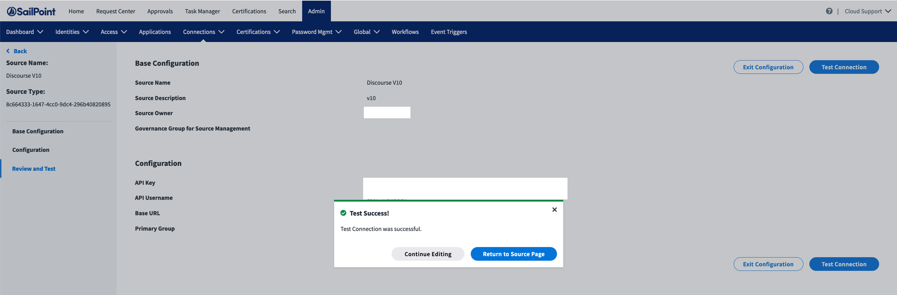

| Input/Output |        Data Type        |
| :----------- | :---------------------: |
| Input        |        undefined        |
| Output       | StdTestConnectionOutput |

### Example StdTestConnectionOutput

```javascript
{
}
```

## Summary

The test connection command ensures the connector can communicate with the target web service. It validates API credentials, host names, ports, and other configuration items. To implement this command, look for either a health endpoint or a simple GET endpoint. Some web services implement a health endpoint that returns status information about the service, which can be useful to test a connection. If no health endpoint exists, use a simple GET endpoint that takes few to no parameters to ensure the connector can make a successful call to the web service.

To use this command, you must specify this value in the `commands` array: `std:test-connection`

Use ‘Test Connection’ in the ISC UI after an admin has finished entering configuration information for a new instance of the connector.



## Implementation

In [index.ts](https://github.com/sailpoint-oss/airtable-example-connector/blob/main/src/index.ts), add the test connection function handler to your connector. Within this function, send a simple request to your web service to ensure the connection works. The web service this connector targets has a JavaScript SDK, so define your own function like the following example to test the connection:

```javascript
export const connector = async () => {

    // Get connector source config
    const config = await readConfig()

    // Use the vendor SDK, or implement own client as necessary, to initialize a client
    const airtable = new AirtableClient(config)

    return createConnector()
        .stdTestConnection(async (context: Context, input: undefined, res: Response<StdTestConnectionOutput>) => {
            res.send(await airtable.testConnection())
        })
        ...
        ...
}
```

To implement the `testConnection()` function, use the following function created in the web service client code, [airtable.ts](https://github.com/sailpoint-oss/airtable-example-connector/blob/main/src/airtable.ts).

```javascript
 /**
     * Test connection by listing users from the Airtable instance.
     * This will make sure the apiKey has the correct access.
     * @returns empty struct if response is 2XX
     */
    async testConnection(): Promise<any> {
        return this.airTableBase('Users').select({
            view: 'Grid view'
        }).firstPage().then(records => {
            return {}
        }).catch(err => {
            throw new ConnectorError('unable to connect')
        })
    }
```

This function calls an endpoint on the target web service to list all users. If the call is successful, the web service returns an empty object, which is okay because you do not need to do anything with the data. Your only goal is to ensure that you can make API calls with the provided configuration.
