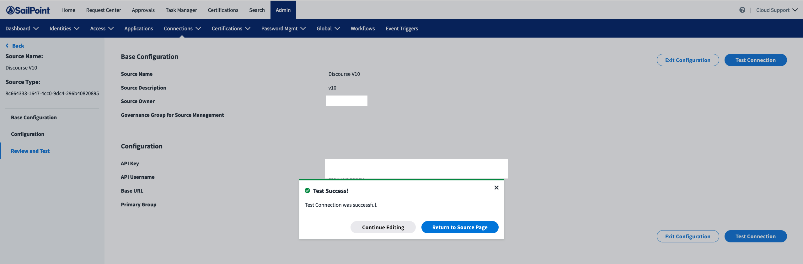

| Input/Output |        Data Type        |
| :----------- | :---------------------: |
| Input        |        undefined        |
| Output       | StdTestConnectionOutput |

### Example StdTestConnectionOutput

```javascript
{
}
```

## Summary

The test connection command ensures the connector can communicate with the target web service. It validates API credentials, host names, ports, and other configuration items. To implement this command, look for either a health endpoint or a simple GET endpoint. Some web services implement a health endpoint that returns status information about the service, which can be useful to test a connection. If no health endpoint exists, use a simple GET endpoint that takes few to no parameters to ensure the connector can make a successful call to the web service.

To use this command, you must specify this value in the `commands` array: `std:test-connection`

Use ‘Test Connection’ in the SHF UI after an admin has finished entering configuration information for a new instance of the connector.



## Implementation

### Validating configuration on startup

Before making any API calls, validate that all required configuration properties are present. Throw an `InvalidConfigurationError` (not a generic `ConnectorError`) so SHF surfaces a clear message to the administrator rather than a generic failure. Do this in your client class constructor:

```typescript
import { ConnectorError, createConnectorHttpClient } from '@sailpoint/connector-sdk'

export class MyClient {
    private httpClient

    constructor(config: any) {
        if (!config.baseUrl) {
            throw new ConnectorError('baseUrl must be provided from config')
        }
        if (!config.apiToken) {
            throw new ConnectorError('apiToken must be provided from config')
        }

        this.httpClient = createConnectorHttpClient({
            baseURL: config.baseUrl,
            auth: { type: 'bearer', token: config.apiToken },
        })
    }

    async testConnection(): Promise<void> {
        // Call a lightweight endpoint — a health check or a low-cost GET
        await this.httpClient.get('/users?limit=1')
    }
}
```

### Registering the handler

In [index.ts](https://github.com/sailpoint-oss/airtable-example-connector/blob/main/src/index.ts), register the test connection handler. The handler calls a lightweight API endpoint to confirm that credentials are valid and the source is reachable:

```typescript
export const connector = async () => {
    const config = await readConfig()
    const myClient = new MyClient(config)

    return createConnector()
        .stdTestConnection(async (context: Context, input: undefined, res: Response<StdTestConnectionOutput>) => {
            await myClient.testConnection()
            res.send({})
        })
        ...
}
```

### Choosing a test endpoint

Pick the cheapest available API call:

1. **A dedicated health/ping endpoint** — many APIs expose `/health` or `/ping`. Prefer these because they have no side effects and minimal cost.
2. **A low-cost read endpoint** — if no health endpoint exists, use a read that returns minimal data (e.g., `GET /users?limit=1`). You discard the response; you only care that the call succeeds.
3. **Avoid write endpoints** — never use a POST, PUT, PATCH, or DELETE for the test connection, as these have side effects.

### Using the Airtable example connector

The Airtable example connector implements `testConnection()` by listing one page of users using its vendor SDK:

```javascript
async testConnection(): Promise<any> {
    return this.airTableBase('Users').select({
        view: 'Grid view'
    }).firstPage().then(records => {
        return {}
    }).catch(err => {
        throw new ConnectorError('unable to connect')
    })
}
```

If the call succeeds, the connector returns an empty object. The result data is discarded — the only goal is confirming that the API credentials and base URL are correct.
