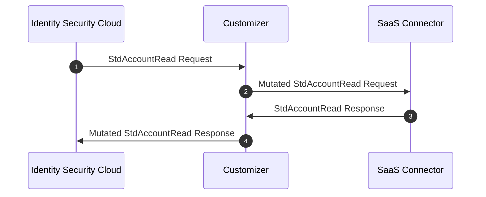

# Overview

SaaS Connectivity Customizers are cloud-based connector customizers that make customizing out of the box SaaS connectors possible. The customizers allow you to customize the out of the box connectors in a similar way to how you can use rules to customize VA (virtual appliance) based connectors. By using a customizer, you can change a connector's input before the connector ingests the data, or you can change the connector's output before to the output is sent to Identity Security Cloud.

<iframe width="560" height="315" src="https://www.youtube.com/embed/bYQakKlKilY?si=o9vtqKLvcyGkHVjS" title="YouTube video player" frameborder="0" allow="accelerometer; autoplay; clipboard-write; encrypted-media; gyroscope; picture-in-picture; web-share" allowfullscreen></iframe>

## How do they work?

SaaS Connectivity Customizers work by sitting in between Identity Security Cloud and the connector. They intercept calls from Identity Security Cloud to the connector and calls from the connector to Identity Security Cloud. When the customizer intercepts a call, it can call custom code to mutate the data in any way necessary to change the connector behavior.

This chart shows an example of this interception process - the `stdAccountRead` command is implemented with the customizer in place:

