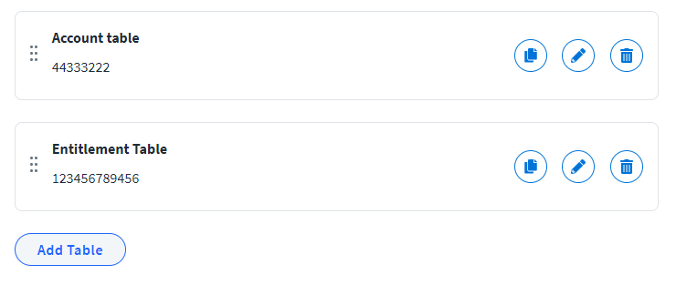
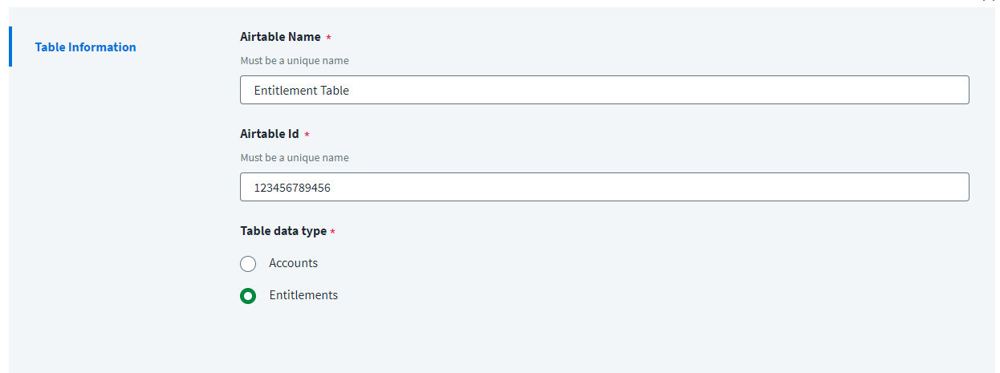

# Card

## How to use the card type in the connector spec

You can use the `cardList` type to let administrators configure a dynamic list of structured items — for example, multiple endpoint configurations, table mappings, or connection profiles. Each card appears in the UI with a title and subtitle derived from its fields, and administrators can add, copy, edit, and delete cards.

### Fields

| Property | Type | Required | Description |
|---|---|---|---|
| `key` | string | Yes | The config key used to access the card list array in connector code. |
| `label` | string | Yes | The label displayed for the card list section. |
| `type` | string | Yes | Must be `"cardList"`. |
| `titleKey` | string | Yes | The `key` of a `subMenus` item field whose value is displayed as the card's title. |
| `subtitleKey` | string | Yes | The `key` of a `subMenus` item field whose value is displayed as the card's subtitle. |
| `indexKey` | string | No | The `key` of a field used to store the card's order index for drag-and-drop sorting. |
| `buttonLabel` | string | No | The text on the button that opens the dialog to add a new card. Defaults to `"Add"`. |
| `addButton` | boolean | No | Show the add button. Defaults to `true`. |
| `editButton` | boolean | No | Show the edit button on each card. Defaults to `true`. |
| `deleteButton` | boolean | No | Show the delete button on each card. Defaults to `true`. |
| `copyButton` | boolean | No | Show the copy/duplicate button on each card. Defaults to `false`. |
| `dragNDropEnabled` | boolean | No | Allow administrators to reorder cards by dragging. Defaults to `false`. |
| `subMenus` | object[] | Yes | An array of sub-menu sections. Each sub-menu has a `label` and an `items` array of input fields (supports all standard field types: `text`, `radio`, `select`, etc.). |

When you create a card, you must specify the fields the `subMenus` will use to generate the `title` and `subtitle`, as shown in the following example. Clicking the button opens a dialog containing the `subMenus` fields.

### Example card item type

```javascript
{
    "key": "tableParameters",
    "label": "AddTable",
    "titleKey": "tableName",
    "subtitleKey": "tableId",
    "indexKey": "sequenceNumberForTable",
    "dragNDropEnabled": true,
    "deleteButton": true,
    "editButton": true,
    "addButton": true,
    "copyButton": true,
    "buttonLabel": "Add Table",
    "type": "cardList",
    "subMenus": [
        {
            "label": "Table Information",
            "items": [
                {
                    "key": "tableName",
                    "label": "Airtable Name",
                    "type": "text",
                    "required": true,
                    "helpKey": "Must be a unique name"
                },
                {
                    "key": "tableId",
                    "label": "Airtable Id",
                    "type": "text",
                    "required": true,
                    "helpKey": "Must be a unique name"
                },
                {
                    "key": "tableType",
                    "type": "radio",
                    "label": "Table data type",
                    "required": true,
                    "options": [
                        {
                            "label": "Accounts",
                            "value": "accounts"
                        },
                        {
                            "label": "Entitlements",
                            "value": "entitlements"
                        }
                    ]
                }
            ]
        }
    ]
}
```





### Reading cardList values in connector code

When an administrator adds cards, the config exposes them as an array of objects. Each object contains the keys defined in the `subMenus` items:

```typescript
interface TableConfig {
    tableName: string
    tableId: string
    tableType: 'accounts' | 'entitlements'
    sequenceNumberForTable?: number
}

constructor(config: any) {
    // config.tableParameters is an array of objects, one per card the admin created
    const tables: TableConfig[] = config.tableParameters ?? []

    this.accountTables = tables.filter(t => t.tableType === 'accounts')
    this.entitlementTables = tables.filter(t => t.tableType === 'entitlements')
}
```
