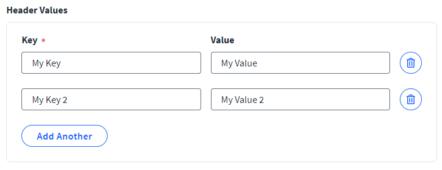

## How to use the key value type in the connector spec

You can use the `keyValue` type to allow users to enter multiple key value items in a single entry box.

This is an example implementation:

### Example key value item type

```javascript
{
    "key": "header",
    "label": "Header Values",
    "type": "keyValue",
    "keyValueKey": {
        "key": "key",
        "label": "Key",
        "type": "text",
        "required": true,
        "maxlength": "4096"
    },
    "keyValueValue": {
        "key": "value",
        "label": "Value",
        "type": "text",
        "required": true,
        "maxlength": "4096"
    }
}
```


