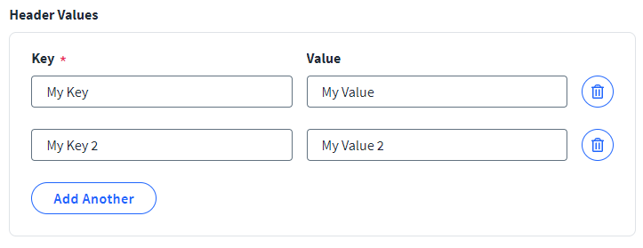

## How to use the key value type in the connector spec

You can use the `keyValue` type to allow users to enter multiple key-value pairs in a single entry box. This is useful for configuration such as custom HTTP headers, metadata attributes, or environment-specific mappings.

### Fields

| Property | Type | Required | Description |
|---|---|---|---|
| `key` | string | Yes | The config key used to access the key-value map in connector code. |
| `label` | string | Yes | The label displayed for the field in the SHF UI. |
| `type` | string | Yes | Must be `"keyValue"`. |
| `required` | boolean | No | Whether at least one entry is required before saving. Defaults to `false`. |
| `keyValueKey` | object | Yes | Defines the input field for the key side of each pair. Supports `key`, `label`, `type`, `required`, and `maxlength`. |
| `keyValueValue` | object | Yes | Defines the input field for the value side of each pair. Supports `key`, `label`, `type`, `required`, and `maxlength`. |

### Example key value item type

```javascript
{
    "key": "customHeaders",
    "label": "Custom Headers",
    "type": "keyValue",
    "keyValueKey": {
        "key": "key",
        "label": "Header Name",
        "type": "text",
        "required": true,
        "maxlength": "256"
    },
    "keyValueValue": {
        "key": "value",
        "label": "Header Value",
        "type": "text",
        "required": true,
        "maxlength": "4096"
    }
}
```



### Reading key-value values in connector code

When an administrator adds key-value pairs, the config exposes them as an array of objects, each containing `key` and `value` properties. Convert this to a plain object or `Map` for convenient access:

```typescript
constructor(config: any) {
    // config.customHeaders is an array like: [{ key: "X-Tenant-ID", value: "acme" }]
    const headerEntries: { key: string; value: string }[] = config.customHeaders ?? []

    // Convert to a plain object for use with Axios headers
    this.extraHeaders = Object.fromEntries(
        headerEntries.map(entry => [entry.key, entry.value])
    )
}
```
