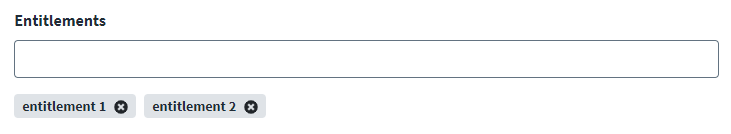

## How to use the list type in the connector spec

You can use the `list` type to allow users to enter multiple items in a single entry box. The user can add and remove items from the list individually.

### Fields

| Property | Type | Required | Description |
|---|---|---|---|
| `key` | string | Yes | The config key used to access the value in connector code. |
| `label` | string | Yes | The label displayed for the field in the SHF UI. |
| `type` | string | Yes | Must be `"list"`. |
| `required` | boolean | No | Whether the field must be populated before saving configuration. Defaults to `false`. |
| `helpKey` | string | No | Help text shown alongside the field to guide the administrator. |

### Example list item type

```javascript
{
    "key": "allowedDomains",
    "label": "Allowed Domains",
    "type": "list",
    "helpKey": "Enter each email domain that should be permitted access (e.g. example.com)"
}
```



### Reading list values in connector code

When an administrator saves one or more values in a `list` field, the config exposes the values as a JavaScript array of strings:

```typescript
export class MyClient {
    private readonly allowedDomains: string[]

    constructor(config: any) {
        // config.allowedDomains is an array of strings entered by the administrator
        this.allowedDomains = config.allowedDomains ?? []
    }
}
```

If the administrator leaves the list empty, the value is an empty array `[]`. Always provide a default (e.g., `?? []`) to avoid `undefined` errors.
