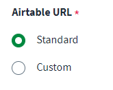

## How to use the radio type in the connector spec

You can use the `Rrdio` type to create radio buttons for users to interact with to select from a predefined set of values.

This is an example implementation:

### Example radio item type

```javascript
{
    "key": "airtableURL",
    "type": "radio",
    "label": "Airtable URL",
    "required": true,
    "options": [
        {
            "label": "Standard",
            "value": "standard"
        },
        {
            "label": "Custom",
            "value": "custom"
        }
    ]
}
```



You can also create dependencies on other fields so they are hidden until the selection is made. This same type of dependency can be built into any field and linked by using the parentKey/parentValue fields.

### Example dependency on earlier select field

```javascript
{
    "key": "baseUrl",
    "type": "text",
    "label": "Base URL",
    "parentKey": "airtableURL",
    "parentValue": "custom",
    "placeholder": "https://{your domain}",
    "required": true
}
```
