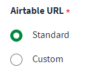

## How to use the radio type in the connector spec

You can use the `radio` type to create radio buttons for users to interact with to select from a predefined set of values. Only one option can be selected at a time.

### Fields

| Property | Type | Required | Description |
|---|---|---|---|
| `key` | string | Yes | The config key used to access the selected value in connector code. |
| `label` | string | Yes | The label displayed for the radio group in the SHF UI. |
| `type` | string | Yes | Must be `"radio"`. |
| `required` | boolean | No | Whether the user must select an option before saving. Defaults to `false`. |
| `options` | object[] | Yes | The list of radio options. Each option has a `label` (displayed text) and a `value` (the string stored in config). |

### Example radio item type

```javascript
{
    "key": "authMethod",
    "type": "radio",
    "label": "Authentication Method",
    "required": true,
    "options": [
        {
            "label": "API Key",
            "value": "apiKey"
        },
        {
            "label": "OAuth2",
            "value": "oauth2"
        }
    ]
}
```



### Reading radio values in connector code

The selected `value` string from the chosen option is exposed directly in config:

```typescript
constructor(config: any) {
    if (config.authMethod === 'apiKey') {
        // set up API key auth
    } else if (config.authMethod === 'oauth2') {
        // set up OAuth2 auth
    }
}
```

### Conditional field dependencies

You can show or hide other fields based on the radio selection by setting `parentKey` and `parentValue` on the dependent field. The dependent field is hidden until the parent radio (or select) has the expected value:

```javascript
{
    "key": "apiKeyValue",
    "type": "secret",
    "label": "API Key",
    "parentKey": "authMethod",
    "parentValue": "apiKey",
    "required": true
}
```

In the above example, the `apiKeyValue` secret field is only shown when the administrator has selected `"API Key"` from the `authMethod` radio group. The same `parentKey`/`parentValue` pattern works with any input type, not just `text` and `secret`.
