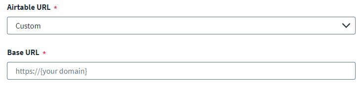

## How to use the Select type in the connector spec

You can use the `select` type to create a dropdown for users to select from a predefined set of values. Use `select` when there are three or more options, or when the options list might grow over time — prefer `radio` for two clearly distinct choices.

### Fields

| Property | Type | Required | Description |
|---|---|---|---|
| `key` | string | Yes | The config key used to access the selected value in connector code. |
| `label` | string | Yes | The label displayed for the dropdown in the SHF UI. |
| `type` | string | Yes | Must be `"select"`. |
| `required` | boolean | No | Whether the user must make a selection before saving. Defaults to `false`. |
| `options` | object[] | Yes | The list of dropdown options. Each option has a `label` (displayed text) and a `value` (the string stored in config). |

### Example select item type

```javascript
{
    "key": "region",
    "type": "select",
    "label": "API Region",
    "required": true,
    "options": [
        {
            "label": "US (us-east-1)",
            "value": "us-east-1"
        },
        {
            "label": "EU (eu-west-1)",
            "value": "eu-west-1"
        },
        {
            "label": "APAC (ap-southeast-1)",
            "value": "ap-southeast-1"
        }
    ]
}
```



### Reading select values in connector code

The selected `value` string is exposed directly in config:

```typescript
constructor(config: any) {
    const region = config.region ?? 'us-east-1'
    this.baseUrl = `https://api.example.com/${region}`
}
```

### Conditional field dependencies

You can show or hide other fields based on the selected value by setting `parentKey` and `parentValue` on the dependent field. The dependent field is hidden until the parent dropdown has the expected value:

```javascript
{
    "key": "customBaseUrl",
    "type": "url",
    "label": "Custom API URL",
    "parentKey": "region",
    "parentValue": "custom",
    "placeholder": "https://api.example.com",
    "required": true
}
```

In the above example, the `customBaseUrl` field is only shown when the administrator selects `"custom"` from the `region` dropdown. The `parentKey`/`parentValue` pattern works with any field type and any parent type (`select`, `radio`, or `toggle`).
