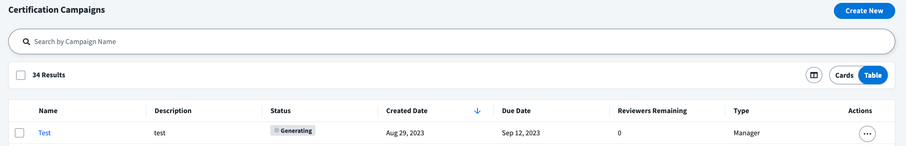
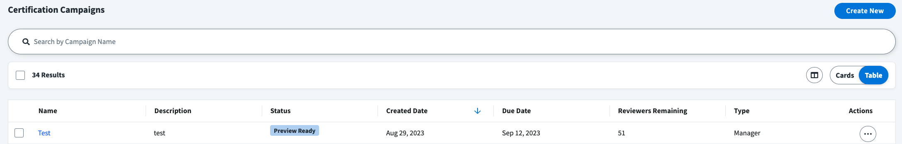

## Event Context

The Campaign Generated events occur when a campaign has finished generating and moves to the "Preview Ready" state, which is a step before activating the campaign.

When a new campaign is created, it will start in the "Generating" state.



Once the generation is complete, the campaign will move to the "Preview Ready" state, and this trigger will fire an event with the details of the campaign.



Some uses cases for this trigger include the following:

- Immediately activate a campaign as soon as it is ready

This is an example input from this trigger:

```json
{
  "campaign": {
    "id": "2c91808576f886190176f88cac5a0010",
    "name": "Manager Access Campaign",
    "description": "Audit access for all employees.",
    "created": "2021-02-16T03:04:45.815Z",
    "modified": null,
    "deadline": null,
    "type": "MANAGER",
    "campaignOwner": {
      "id": "37f080867702c1910177031320c40n27",
      "displayName": "William Wilson",
      "email": "william.wilson@example.com"
    },
    "status": "STAGED"
  }
}
```

## Additional Information and Links

- **Trigger Type**: [FIRE_AND_FORGET](../trigger-types.md#fire-and-forget)
