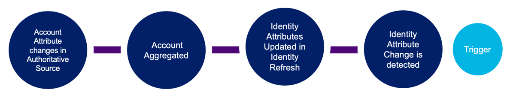

## Event Context



Identity Attribute Changed events occur when any attributes aggegrated from an authoritative source differ from the current attributes for an identity during an identity refresh. See [Configuring Correlation](https://community.sailpoint.com/t5/Connectors/Configuring-Correlation/ta-p/74045) for more information.

This event trigger provides a flexible way to extend Joiner-Mover-Leaver processes. This provides more proactive governance and ensures users can quickly get necessary access when they enter your organization.

:::warning

The `attribute` field in event payloads is limited to 450 characters. If an attribute value exceeds this limit, it will be truncated.

:::

:::info

This event trigger doesn't detect an identity's change in lifecycle state from 'null' to 'active', so it's recommended that you set an identity's lifecycle state when it's created. You can then use the [Identity Created](./identity-created.md) trigger to detect that change to 'active' for Joiners. 

:::


Some uses cases for this trigger include the following:

- Notify an administrator or system to take the appropriate provisioning actions as part of the Mover workflow.
- Notify a system to trigger another action, like triggering a certification campaign when an identity's manager changes, for example.

This is an example input from this trigger:

```json
{
  "identity": {
    "type": "IDENTITY",
    "id": "2c91808568c529c60168cca6f90c1313",
    "name": "William Wilson"
  },
  "changes": [
    {
      "attribute": "department",
      "oldValue": "sales",
      "newValue": "marketing"
    }
  ]
}
```

## Additional Information and Links

- **Trigger Type**: [FIRE_AND_FORGET](../trigger-types.md#fire-and-forget)
<!-- [Input schema](https://developer.sailpoint.com/apis/beta/#section/Identity-Attributes-Changed-Event-Trigger-Input) -->
