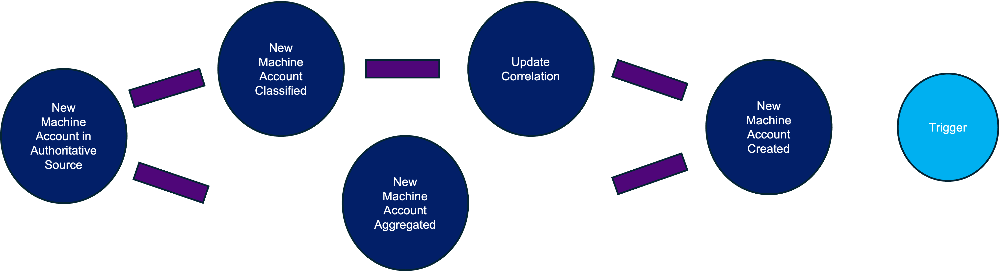

## Event Context



Machine Identity Updated events occur when a change in machine identity is detected during an aggregation and refresh from an authoritative source. New machine identities are detected when an account from the authoritative source is not correlated to an existing machine identity. For more information, see [Configuring Correlation](https://community.sailpoint.com/t5/Connectors/Configuring-Correlation/ta-p/74045). The Machine Identity Created event contains all the identity attributes as they are configured in the identity profile. For more information, see [Mapping Identity Profiles](https://community.sailpoint.com/t5/Admin-Help/Mapping-Identity-Profiles/ta-p/77877).


This event trigger provides a flexible way to extend Joiner-Mover-Leaver processes. This provides more proactive governance and ensures identities can quickly get necessary access when they gets updated.

Some uses cases for this trigger include the following:

- Notify an administrator or system to take the appropriate birthright provisioning actions as part of the Joiner-Mover-Leaver workflow.
- Notify a third party system to trigger another action.

This is an example input from this trigger:

```json
{
  "eventType": "MACHINE_IDENTITY_UPDATED",
  "machineIdentity": {
    "id": "8cd6c945-0057-4a6e-ad65-9cbf3b3c71b6",
    "name": "test",
    "created": "2025-08-08T12:42:21.491666Z",
    "modified": "2025-09-01T06:36:54.401476Z",
    "businessApplication": "MyBusinessApplication2",
    "description": "test description event",
    "attributes": {
      "status": "Inactive",
      "botUserId": "005KV00000BLoMCYA1",
      "createdAt": "2025-09-01T10:23:23.000+0000",
      "createdById": "0053k00000Am6MQAAZ",
      "systemModstamp": "2025-09-18T09:34:40.000+0000",
      "apiFriendlyName": "Agentforce_Service_Agent_90"
    },
    "subtype": "AI Agent",
    "owners": [
      {
        "type": "IDENTITY",
        "id": "84d8c1b819144608b8b8bc3b84ddbb7b",
        "name": "Jerrie admin3cf084",
        "isPrimary": true
      },
      {
        "type": "IDENTITY",
        "id": "b6c1506f7eaa48dbbe6bffab65aacb9e",
        "name": "Lorilee srcadm9d33",
        "isPrimary": false
      }
    ],
    "sourceId": "c0201251a6ce4d268aba536cdd60a7f2",
    "uuid": "f5dd23fe-3414-42b7-bb1c-869400ad7a10",
    "nativeIdentity": "abc:123:dddd1",
    "manuallyEdited": true,
    "manuallyCreated": true,
    "datasetId": "agentforce:agents",
    "source": {
      "type": "SOURCE",
      "id": "c0201251a6ce4d268aba536cdd60a7f2",
      "name": "IdentityNow"
    },
    "userEntitlements": [
      {
        "sourceId": "7443d0ffb1304bbcbdf4c07b5c09d4f2",
        "entitlementId": "2509f650c20a3ab5956be70f6f136fbc",
        "displayName": "CN=Engineering-test-org3,OU=megapod-useast1-test-org3,OU=org-data-service,DC=TestAutomationAD,DC=local",
        "source": {
          "type": "SOURCE",
          "id": "7443d0ffb1304bbcbdf4c07b5c09d4f2",
          "name": "ODS-AD-Source"
        }
      }
    ],
    "existsOnSource": "NOT_APPLICABLE"
  },
  "machineIdentityChangeTypes": [
    "ATTRIBUTES_CHANGED",
    "USER_ENTITLEMENTS_ADDED",
    "USER_ENTITLEMENTS_REMOVED",
    "OWNERS_ADDED",
    "OWNERS_REMOVED"
  ],
  "userEntitlementChanges": {
    "attributeName": "userEntitlements",
    "added": [
      {
        "sourceId": "7443d0ffb1304bbcbdf4c07b5c09d4f2",
        "entitlementId": "2509f650c20a3ab5956be70f6f136fbc",
        "displayName": "CN=Engineering-test-org3,OU=megapod-useast1-test-org3,OU=org-data-service,DC=TestAutomationAD,DC=local",
        "source": {
          "type": "SOURCE",
          "id": "7443d0ffb1304bbcbdf4c07b5c09d4f2",
          "name": "ODS-AD-Source"
        }
      }
    ],
    "removed": [
      {
        "sourceId": "c0201251a6ce4d268aba536cdd60a7f2",
        "entitlementId": "22c17d66217133369e0dedd93989d7b5",
        "displayName": "Config Hub Read Only",
        "source": {
          "type": "SOURCE",
          "id": "c0201251a6ce4d268aba536cdd60a7f2",
          "name": "IdentityNow"
        }
      }
    ]
  },
  "ownerChanges": {
    "attributeName": "owners",
    "added": [
      {
        "type": "IDENTITY",
        "id": "b6c1506f7eaa48dbbe6bffab65aacb9e",
        "name": "Lorilee srcadm9d33",
        "isPrimary": false
      }
    ],
    "removed": []
  },
  "singleValueAttributeChanges": [
    {
      "name": "description",
      "oldValue": "Old description",
      "newValue": "test description event"
    }
  ]
}
```

## Additional Information and Links

- **Trigger Type**: [FIRE_AND_FORGET](../trigger-types.md#fire-and-forget)
<!-- [Input schema](https://developer.sailpoint.com/apis/beta/#section/Identity-Created-Event-Trigger-Input) -->
