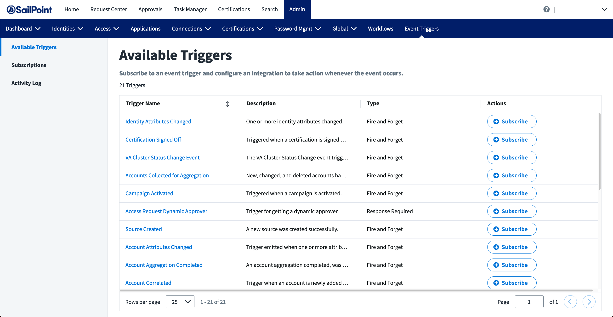

## View the Available Triggers

SailPoint is continuously developing new event triggers to satisfy different use cases. Some of these triggers are considered **early access** and are only available in an IDN tenant upon request. To see a list of available event triggers in your tenant, go to the **Event Triggers** tab in the **Admin** section of IdentityNow. The first page is a list of your tenant's available event triggers. You can select each trigger to learn more about its type, what causes it to fire, and what the payload will look like.

## Subscribe to a Trigger from the UI

Usually, you will subscribe to event triggers using the user interface in IDN. Refer to [subscribing to event triggers](https://documentation.sailpoint.com/saas/help/common/event_triggers.html#subscribing-to-event-triggers) to learn how to subscribe to an event trigger through the IDN UI.

## Subscribe to a Trigger from the API

Sometimes, you may need to use the API to subscribe to event triggers. This can occur when you want to programatically subscribe/unsubscribe from event triggers in a custom application or no-code solution that does not have a native integration with SailPoint.

If this is your first time calling a SailPoint API, refer to the [getting started guide](../../api/getting-started.md) to learn how to generate a token and call the APIs.

Start by reviewing the list of [available event triggers](/docs/api/beta/triggers#available-event-triggers), and take note of the **ID** of the trigger you want to subscribe to (ex `idn:access-request-dynamic-approver`). Use the [create subscription](/docs/api/beta/create-subscription) endpoint to subscribe to an event trigger of your choosing. See the API docs for the latest details about how to craft a subscription request.
