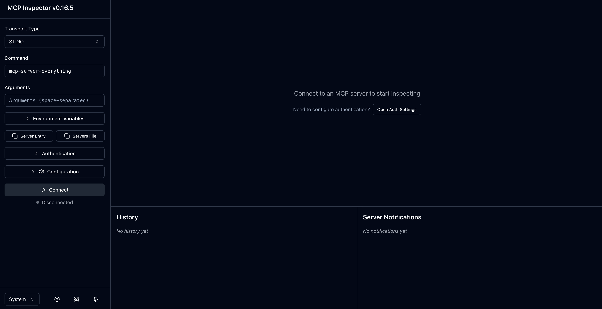
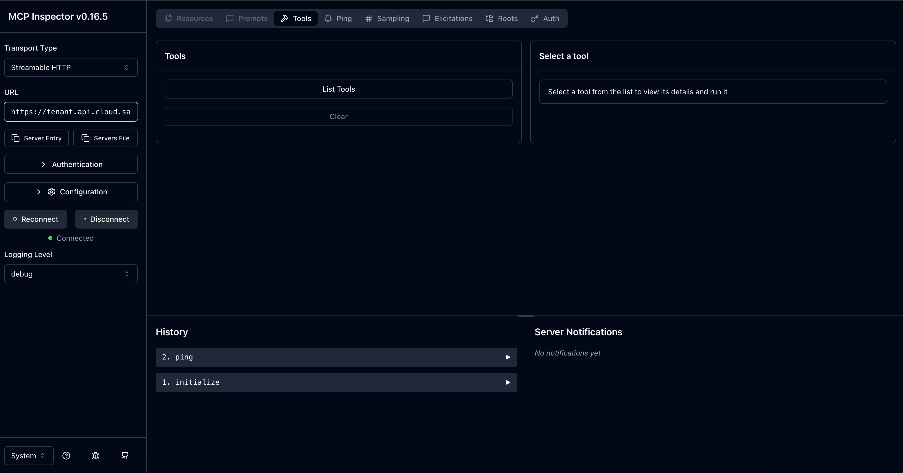
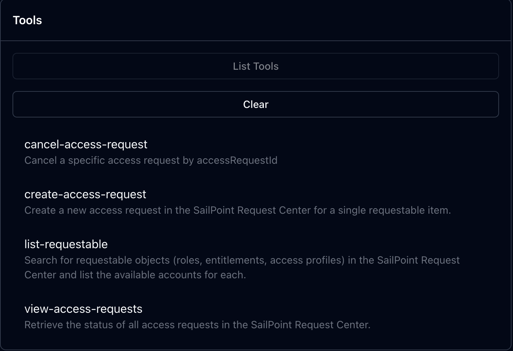

## Overview

The SailPoint MCP (Model Context Protocol) Server enables AI applications to interact with SailPoint's identity governance platform through a standardized interface. This guide walks you through setting up your first connection and testing the available tools.

**What you'll accomplish:**
- [Connect to the SailPoint MCP server using the MCP Inspector](#step-2-configure-the-connection)
- [Authenticate with your SailPoint tenant](#step-3-set-up-authentication)
- [List and explore available tools](#list-available-tools)

## Prerequisites

Before you begin, ensure you have:

- **Access to a SailPoint tenant** with API access enabled
- **Valid authentication credentials** - see our [Authentication documentation](../../api/v2025/authentication.md) for details
- **Internet connection** for accessing the web-based MCP Inspector
- **Modern web browser** (Chrome, Firefox, Safari, or Edge)

## Step 1: Launch the MCP Inspector

The MCP Inspector is a web-based tool that makes it easy to connect to and test MCP servers without writing code.

Run the following command in your terminal:

```bash
npx @modelcontextprotocol/inspector
```

**What happens next:**
- If this is your first time running the command, npm will ask to install the package - type `y` to confirm
- Your default web browser will automatically open to the MCP Inspector interface



## Step 2: Configure the Connection

### Set the Transport Type

In the MCP Inspector sidebar, locate the **Transport Type** dropdown and select `Streamable HTTP`.

### Enter Your Server URL

In the **URL field**, enter your SailPoint MCP server endpoint:

```
https://[tenant].api.identitynow.com/v2025/access-requests/mcp
```

**Replace `[tenant]` with your actual tenant name.** For example:
- If your SailPoint URL is `https://acme.identitynow.com`, use `acme`
- Full URL would be: `https://acme.api.identitynow.com/v2025/access-requests/mcp`

## Step 3: Set Up Authentication

### Prepare Your Access Token

You'll need a valid SailPoint API access token. If you don't have one yet:

1. Follow our [Authentication documentation](../../api/v2025/authentication.md) to generate a token
2. Ensure your token has the necessary permissions for MCP operations
3. Copy the token value - you'll need it in the next step

### Configure Authentication in MCP Inspector

1. Click on the **"Authentication"** tab in the MCP Inspector
2. Set the following values:
   - **Header Name**: `Authorization`
   - **Bearer Token**: Paste your access token (without the "Bearer " prefix)


### Connect to the Server

Click the **"Connect"** button to establish the connection.

**Success indicators:**
- The connection status should show as "Connected"
- You'll see the main MCP Inspector interface
- No error messages appear in the console



## Step 4: Test Your Connection

### List Available Tools

Click the **"List Tools"** button to retrieve all available MCP tools from the SailPoint server.

**If successful, you should see:**
- A list of available tools with descriptions
- Tool names, parameters, and usage information
- No error messages or timeouts



The SailPoint MCP server currently provides four core tools, with additional tools being added regularly to expand functionality.


## Test the connection by listing the available tools

Click `List Tools` to see the available tools. If the connection is successful, you will see a list of tools like this:


The SailPoint MCP server provides four tools today and is expected to grow in the future.

## Next Steps

Now that you have a working connection, you can:

- **Explore available tools** - Learn about each tool's capabilities in our [Available Tools](./available-tools.mdx) guide
- **Test tool execution** - Try running tools with different parameters to understand their behavior
- **Build integrations** - Use the MCP protocol in your AI applications to automate SailPoint operations