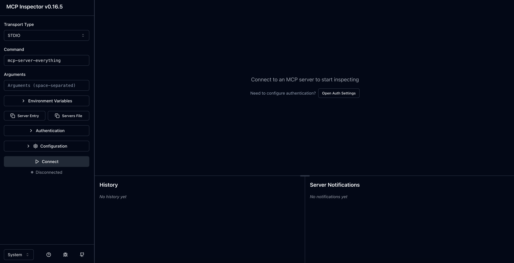
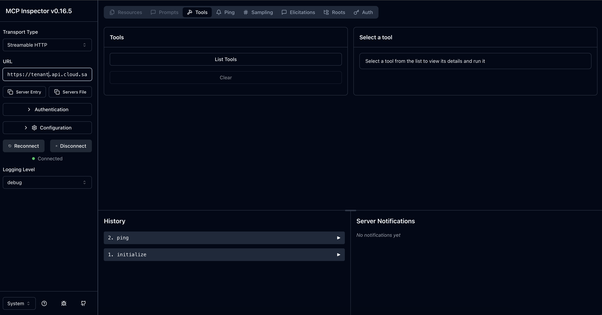
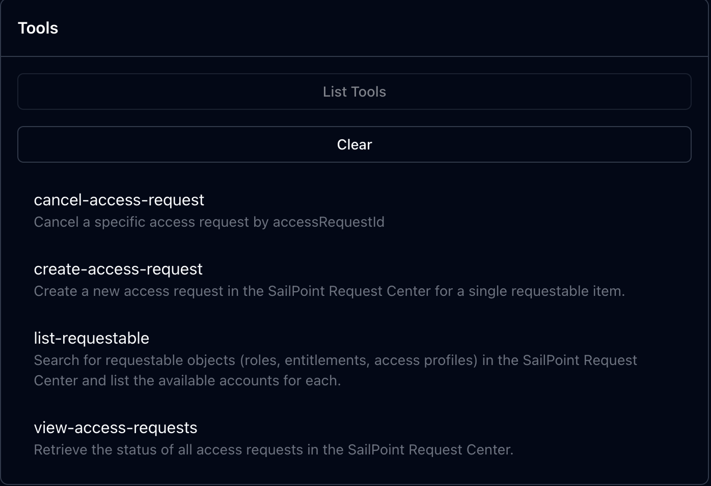

## Overview

The SailPoint MCP (Model Context Protocol) Server enables AI applications to interact with SailPoint's identity governance platform through a standardized interface. This guide walks you through setting up your first connection and testing the available tools.

**What you'll accomplish:**
- [Connect to the SailPoint MCP server using the MCP Inspector](#step-2-configure-the-connection)
- [Authenticate with your SailPoint tenant](#step-3-set-up-authentication)
- [List and explore available tools](#list-available-tools)

## Prerequisites

Before you begin, ensure you have:

- **Access to a SailPoint tenant** with API access enabled
- **Valid authentication credentials** - refer to our [Authentication documentation](../../api/authentication.md) for details
- **Internet connection** for accessing the web-based MCP Inspector
- **Modern web browser** (Chrome, Firefox, Safari, or Edge)

## Step 1: Launch the MCP Inspector

The MCP Inspector is a web-based tool that makes it easy to connect to and test MCP servers without writing code.

Run the following command in your terminal:

```bash
npx @modelcontextprotocol/inspector
```

**What happens next:**
- If this is your first time running the command, npm will ask to install the package - enter `y` to confirm
- Your default web browser will automatically open the MCP Inspector interface



## Step 2: Configure the Connection

### Set the Transport Type

In the MCP Inspector sidebar, locate the **Transport Type** dropdown menu and select `Streamable HTTP`.

### Enter Your Server URL

SailPoint provides two MCP URL options:

**Global URL (recommended):**

```
https://mcp.sailpoint.com/latest/access-requests/mcp
```

This URL works for all tenants without any tenant-specific configuration. It is the recommended entry point for AI client integration.

**Tenant-specific URL:**

```
https://[tenant].api.identitynow.com/latest/access-requests/mcp
```

Replace `[tenant]` with your actual tenant name. For example, if your SailPoint URL is `https://acme.identitynow.com`, the full URL would be `https://acme.api.identitynow.com/latest/access-requests/mcp`.

:::note FedRAMP and data sovereignty
Customers with FedRAMP or data sovereignty requirements should continue using the tenant-specific URL instead of the global URL.
:::

## Step 3: Set Up Authentication

### Using the Global URL (OAuth Discovery)

AI clients that support OAuth discovery via `.well-known` endpoints will **automatically discover** the authorization and token endpoints from the global MCP URL — no manual endpoint configuration is needed.

If your AI client cannot determine the tenant from your client ID, you will be prompted to enter your tenant name during the OAuth flow.

If you need to configure OAuth endpoints manually, use these global URLs:

| Endpoint | URL |
|---|---|
| Authorization | `https://login.sailpoint.com/oauth/authorize` |
| Token | `https://api.identitynow.com/oauth/token` |

### Using the Tenant-Specific URL (Bearer Token)

If you are using the tenant-specific URL, you can authenticate with a bearer token directly:

1. Follow our [Authentication documentation](../../api/authentication.md) to generate an access token
2. Ensure your token has the necessary permissions for MCP operations

In the MCP Inspector:

1. Select the **Authentication** tab
2. Set the following values:
   - **Header Name**: `Authorization`
   - **Bearer Token**: Paste your access token (include the "Bearer " prefix)

### Connect to the Server

Select **Connect** to establish the connection.

**Success indicators:**
- The connection status should show as "Connected"
- You'll see the main MCP Inspector interface
- No error messages appear in the console



## Step 4: Test Your Connection

### List Available Tools

Select **List Tools** to retrieve available MCP tools from the SailPoint server.

**If successful, you will see:**
- A list of available tools with descriptions
- Tool names, parameters, and usage information
- No error messages or timeouts

The SailPoint MCP server currently provides four core tools.



## Next Steps

Now that you have a working connection, you can:

- **Explore available tools** - Learn about each tool's capabilities in our [Available Tools](./available-tools.mdx) guide
- **Test tool execution** - Try running tools with different parameters to understand their behavior
- **Build integrations** - Use the MCP protocol in your AI applications to automate SailPoint operations