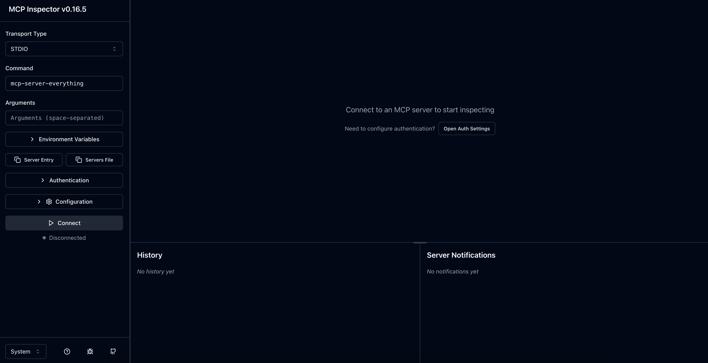
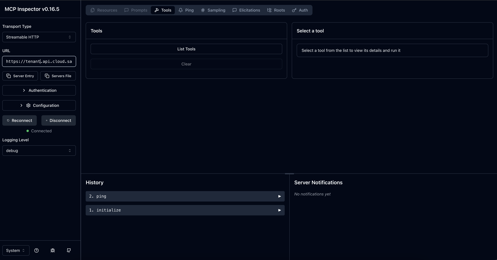
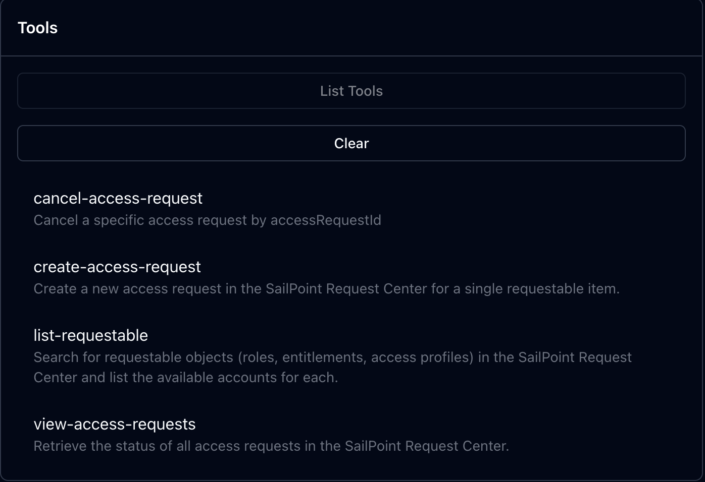

## Overview

The SailPoint MCP (Model Context Protocol) Server enables AI applications to interact with SailPoint's identity governance platform through a standardized interface. This guide walks you through setting up your first connection and testing the available tools.

**What you'll accomplish:**
- [Connect to the SailPoint MCP server using the MCP Inspector](#step-2-add-the-sailpoint-mcp-server)
- [Authenticate with your SailPoint tenant](#step-3-set-up-authentication)
- [List and explore available tools](#list-available-tools)

## Prerequisites

Before you begin, ensure you have:

- **Access to a SailPoint tenant** with API access enabled
- **Valid authentication credentials** - refer to our [Authentication documentation](../../api/authentication.md) for details
- **Internet connection** for accessing the web-based MCP Inspector
- **Modern web browser** (Chrome, Firefox, Safari, or Edge)

## Step 1: Launch the MCP Inspector

The MCP Inspector is a web-based tool that makes it easy to connect to and test MCP servers without writing code.

Run the following command in your terminal:

```bash
npx @modelcontextprotocol/inspector
```

**What happens next:**
- If this is your first time running the command, npm will ask to install the package - enter `y` to confirm
- Your default web browser will automatically open the MCP Inspector interface

When the Inspector opens, you'll see the **Servers** dashboard. It ships with a couple of sample servers (`filesystem-server-default` and `everything-server-default`) and an **Add Servers** button in the top-right corner for adding your own.



## Step 2: Add the SailPoint MCP Server

You can add the SailPoint MCP server two ways. **Option A** is the fastest — it imports a ready-made configuration so you don't have to type anything. **Option B** walks through adding it by hand.

### Option A: Import the SailPoint configuration (recommended)

1. Download the ready-made Inspector config: [sailpoint-mcp-inspector.json](pathname:///files/sailpoint-mcp-inspector.json). It contains:

    ```json
    {
      "mcpServers": {
        "sailpoint-access-requests": {
          "type": "streamable-http",
          "url": "https://mcp.sailpoint.com/latest/access-requests/mcp"
        }
      }
    }
    ```

2. In the Inspector, select **Add Servers ▾** in the top-right corner, then choose **client config**.
3. Select the `sailpoint-mcp-inspector.json` file you downloaded. The Inspector adds a `sailpoint-access-requests` server with the Streamable HTTP transport and global URL already filled in.

Alternatively, you can launch the Inspector with the config pre-loaded and connect in one step:

```bash
npx @modelcontextprotocol/inspector --config sailpoint-mcp-inspector.json --server sailpoint-access-requests
```

This uses the **Global URL**, which works for all tenants without any tenant-specific configuration and is the recommended entry point. Continue to [Step 3](#step-3-set-up-authentication) to authenticate.

### Option B: Add the server manually

1. In the Inspector, select **Add Servers ▾** in the top-right corner, then choose **Add manually**.
2. Set the **Transport Type** to `Streamable HTTP`.
3. Enter your server **URL**. SailPoint provides two options:

**Global URL (recommended):**

```
https://mcp.sailpoint.com/latest/access-requests/mcp
```

This URL works for all tenants without any tenant-specific configuration. It is the recommended entry point for AI client integration.

**Tenant-specific URL:**

```
https://[tenant].api.identitynow.com/latest/access-requests/mcp
```

Replace `[tenant]` with your actual tenant name. For example, if your SailPoint URL is `https://acme.identitynow.com`, the full URL would be `https://acme.api.identitynow.com/latest/access-requests/mcp`.

:::note FedRAMP and data sovereignty
Customers with FedRAMP or data sovereignty requirements should continue using the tenant-specific URL instead of the global URL.
:::

## Step 3: Set Up Authentication

### Using the Global URL (OAuth Discovery)

:::danger Known issue: OAuth discovery currently fails in strict clients
SailPoint's authorization server metadata (`https://login.sailpoint.com/.well-known/oauth-authorization-server`) returns an `issuer` of `https://www.sailpoint.com`, which does not match the host the metadata is served from (`https://login.sailpoint.com`). This violates [RFC 8414 §3.3](https://www.rfc-editor.org/rfc/rfc8414#section-3.3), so strict MCP clients — including the MCP Inspector — reject the metadata with an "Issuer mismatch" error and cannot complete the OAuth flow. Until this is resolved, connect the Inspector using the [tenant-specific URL with a bearer token](#using-the-tenant-specific-url-bearer-token) instead.
:::

When you connect to the global MCP URL, the MCP Inspector automatically discovers SailPoint's authorization and token endpoints from the server's `.well-known` metadata — you don't need to configure those endpoints by hand.

:::warning Pre-registered Client ID required
SailPoint's authorization server does **not** support Dynamic Client Registration. You must supply a **pre-registered Client ID**. Without one, the OAuth flow stops immediately after endpoint discovery and the connection fails with a `401` auth challenge.
:::

#### Create an API client in ISC

In ISC, go to **Admin > Security Settings > API Management** and create a new API client:

1. Set the client type to **Public**.
2. Enable the **Authorization Code** and **Refresh Token** grant types.
3. Set the **Redirect URL** to `http://localhost:6274/oauth/callback` (the MCP Inspector's OAuth callback).
4. Set the **Scope** to `sp:scopes:all`.

Save the client and copy the **Client ID**.

#### Provide the Client ID to the Inspector

On the SailPoint server card, open **Settings** and expand **OAuth Settings**, then set:

- **Client ID**: the Client ID you copied
- **Client Secret**: leave blank (the ISC client is a public client that uses PKCE)
- **Scopes**: `sp:scopes:all` (space-separated, no commas)

Leave **Enterprise-managed authorization** unchecked. Entering a Client ID here pre-registers the client so the Inspector skips Dynamic Client Registration.

When you connect, the Inspector opens a browser window so you can log in with your ISC credentials and approve the consent screen. If the tenant cannot be determined from your Client ID, you will be prompted to enter your tenant name during the OAuth flow. Tokens refresh automatically after you sign in.

:::note
If you need to configure the OAuth endpoints manually, use these global URLs:

| Endpoint | URL |
|---|---|
| Authorization | `https://login.sailpoint.com/oauth/authorize` |
| Token | `https://api.identitynow.com/oauth/token` |
:::

### Using the Tenant-Specific URL (Bearer Token)

If you are using the tenant-specific URL, you can authenticate with a bearer token directly:

1. Follow our [Authentication documentation](../../api/authentication.md) to generate an access token
2. Ensure your token has the necessary permissions for MCP operations

Then provide the token in one of two ways:

**Add it to the server's authentication settings.** Open the server's **Edit** (or **Settings**) panel in the Inspector and, under **Authentication**, set:
   - **Header Name**: `Authorization`
   - **Bearer Token**: Paste your access token (include the "Bearer " prefix)

**Or include it in the config.** If you added the server via a config file (Option A), add a `headers` block with your token:

```json
{
  "mcpServers": {
    "sailpoint-access-requests": {
      "type": "streamable-http",
      "url": "https://[tenant].api.identitynow.com/latest/access-requests/mcp",
      "headers": {
        "Authorization": "Bearer YOUR_ACCESS_TOKEN"
      }
    }
  }
}
```

### Connect to the Server

On the **Servers** dashboard, toggle the switch on the SailPoint server card (or select **Connect**) to establish the connection.

**Success indicators:**
- The server card status changes from "Disconnected" to "Connected"
- You'll see the main MCP Inspector interface
- No error messages appear in the console



## Step 4: Test Your Connection

### List Available Tools

Select **List Tools** to retrieve available MCP tools from the SailPoint server.

**If successful, you will see:**
- A list of available tools with descriptions
- Tool names, parameters, and usage information
- No error messages or timeouts

The SailPoint MCP server currently provides four core tools.



## Next Steps

Now that you have a working connection, you can:

- **Explore available tools** - Learn about each tool's capabilities in our [Available Tools](./available-tools.mdx) guide
- **Test tool execution** - Try running tools with different parameters to understand their behavior
- **Build integrations** - Use the MCP protocol in your AI applications to automate SailPoint operations