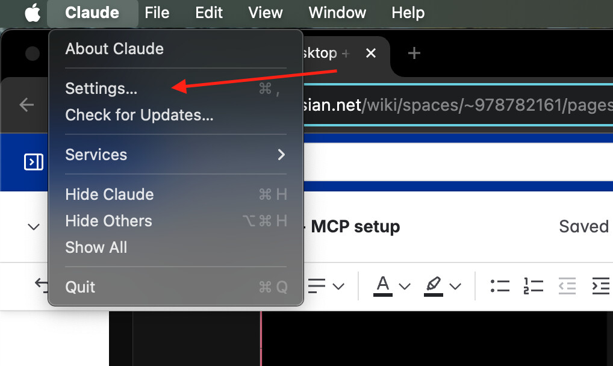
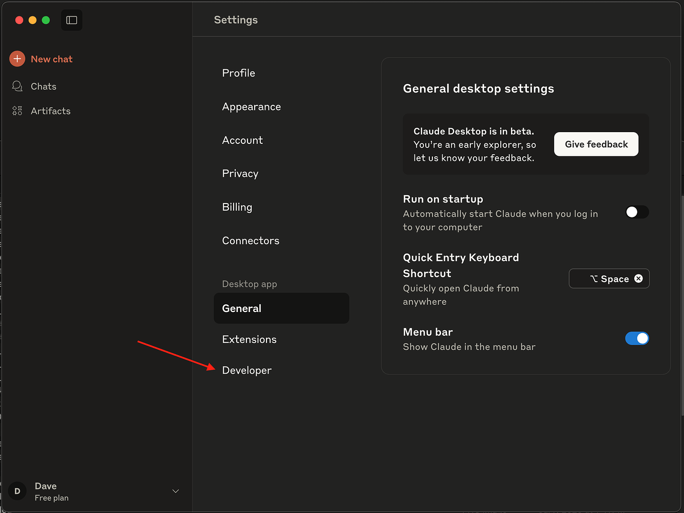
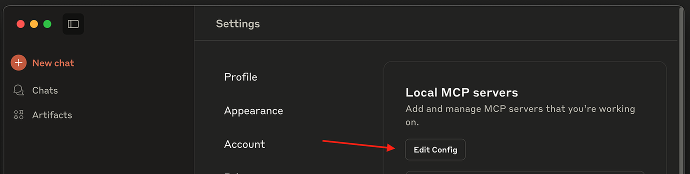

This guide will walk you through the process of connecting the SailPoint MCP server using Claude Desktop.

## Prerequisites

Before you begin, ensure you have the following:

- [Claude Desktop](https://claude.ai/download) installed and configured on your system
- Access credentials for your MCP server

## Step 1: Open claude desktop

Open Claude Desktop and click through the normal setup. You will then be presented with the following screen:


## Step 2: Open claude desktop developer settings

Click `Claude` in your menu bar, then click `Settings`



Then click on `Developer`



Finally click on `edit config`



This will take you to the claude desktop config file in your filesystem `claude_desktop_config.json`. Open this file in your preferred editor.

Copy and paste the following snippet.

**Replace `[tenant]` with your actual tenant name.** For example:

- If your SailPoint URL is `https://acme.identitynow.com`, use `acme`
- Full URL would be: `https://acme.api.identitynow.com/v2025/access-requests/mcp`

**Replace `your_auth_token_here` with your authorization token**

```json
{
  "mcpServers": {
    "SailPoint MCP": {
      "command": "npx",
      "args": [
        "mcp-remote@latest",
        "https://[tenant].api.cloud.sailpoint.com/v2025/access-requests/mcp",
        "--debug",
        "--header",
        "Authorization: Bearer ${AUTH_TOKEN}"
      ],
      "env": {
        "AUTH_TOKEN": "your_auth_token_here"
      }
    }
  }
}
```

## **Restart Claude and check for MCP tools**

1. Quit Claude, then **re-launch** Claude, this is required to pick up the new config

2. Click the Tools button at the bottom of the new chat UI. You will see SailPoint MCP among the tools listed:

    

3. Ensure all four tools are enabled like so:

    

## **Try it out!**

You can now ask Claude things like "What can I request access to?” or “What is the status of my access request?” or “Cancel access request XYZ”

For more information about the tools, refer to the [SailPoint MCP tool documentation](../available-tools.mdx).
