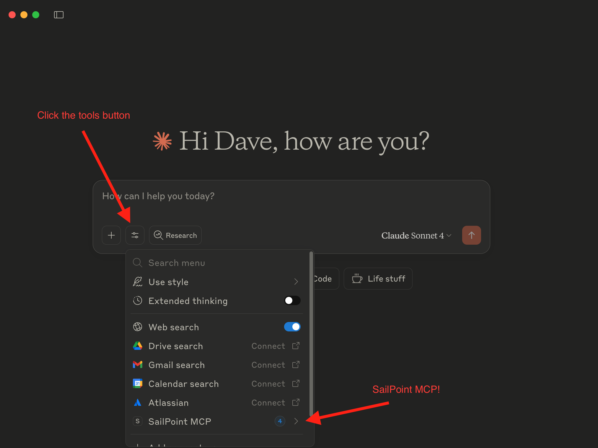
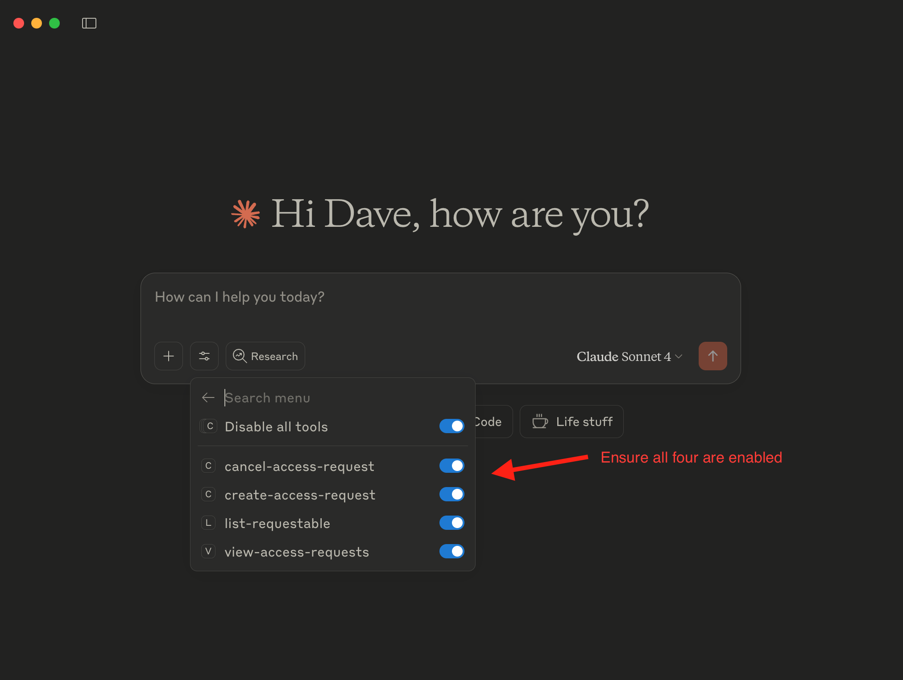

This guide will walk you through the process of connecting the SailPoint MCP server using Claude Desktop.

Claude Desktop connects to the SailPoint MCP Server as a custom connector using OAuth 2.1 with PKCE, so you no longer need to generate or paste in an authentication token. Instead, you supply a Client ID and Claude handles the login and consent flow for you.

:::warning
Before configuring this integration, please confirm with your organization's administrator whether the integration is allowed with this AI provider. SailPoint does not bear any responsibility in this regard.
:::

## Prerequisites

Before you begin, ensure you have the following:

- [Claude Desktop](https://claude.ai/download) installed and configured on your system
- A Claude Pro, Max, Team, or Enterprise plan (custom connectors are not available on the free plan)
- An ISC tenant with the MCP Access Requests feature enabled
- Permission to create an API client in ISC, or a Client ID provided by your administrator

:::note
The global MCP URL is not available for FedRAMP tenants or tenants with data sovereignty requirements. Those environments should continue to use their tenant-specific URL.
:::

## Step 1: Create an API client in ISC

In ISC, go to **Admin > Security Settings > API Management** and create a new API client:

1. Set the client type to **Public**.
2. Enable the **Authorization Code** and **Refresh Token** grant types.
3. Set the **Redirect URL** to `https://claude.ai/api/mcp/auth_callback`.
4. Set the **Scope** to `sp:scopes:all`.

Save the client and copy the **Client ID** — you will need it in the next step.

## Step 2: Add the SailPoint MCP Server as a custom connector

1. Open Claude Desktop and go to **Settings > Connectors**.
2. Select **Add custom connector** at the bottom of the Connectors section.
3. Enter a name (for example, `SailPoint MCP`) and the global MCP URL:

    ```
    https://mcp.sailpoint.com/latest/access-requests/mcp
    ```

    The global MCP URL works for all tenants without any tenant-specific changes. Your tenant is identified automatically during authentication. If the tenant name cannot be detected, you will be prompted to enter it on first connect.
4. Expand **Advanced settings** and enter the **OAuth Client ID** from Step 1. Leave the **OAuth Client Secret** blank — the SailPoint API client is a public client.
5. Select **Add** to save the connector.

## Step 3: Connect and authenticate

1. In **Settings > Connectors**, find the SailPoint MCP connector and select **Connect**.
2. Claude opens a browser window to complete the OAuth flow:
    1. Log in with your ISC credentials (SSO is supported if it is configured for your tenant).
    2. Approve the consent screen.
    3. You are connected — tokens refresh automatically, so you will not need to re-enter your credentials mid-session.

## **Check for MCP tools**

Select the Tools icon at the bottom of the new chat UI. You will see SailPoint MCP among the tools listed:



Ensure the SailPoint access request tools are enabled:



## **Try it out!**

You can now ask Claude questions like "What can I request access to?” or “What is the status of my access request?” or “Cancel access request XYZ”

For more information about the tools, refer to the [SailPoint MCP tool documentation](../available-tools.mdx).
