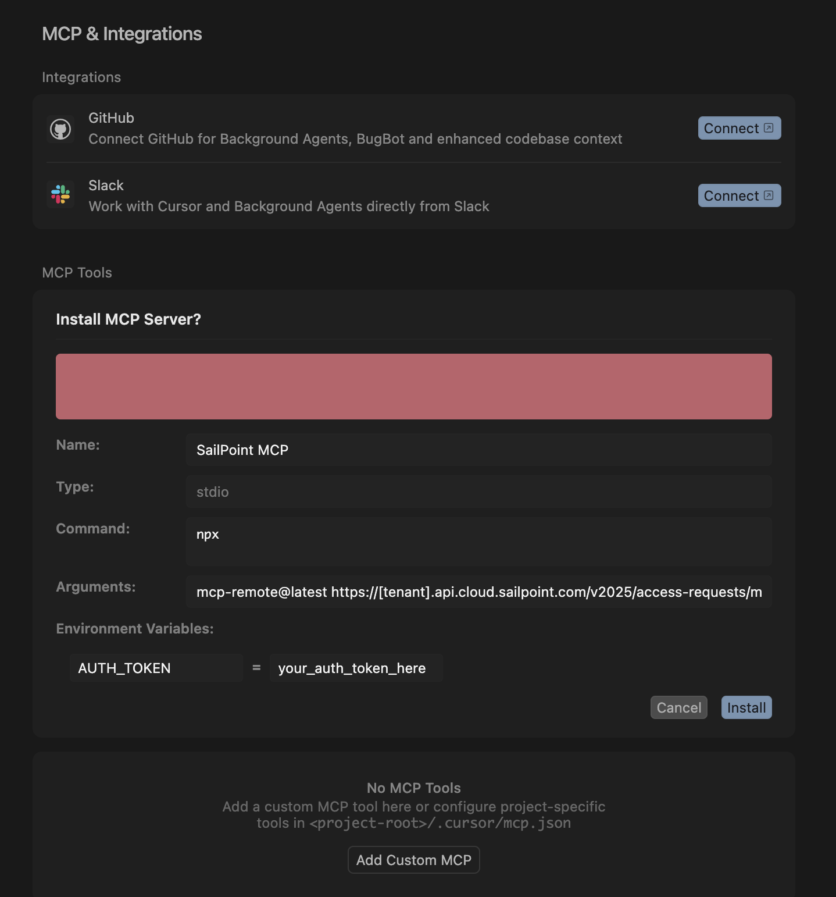

This guide will walk you through configuring Cursor to connect with the SailPoint Model Context Protocol (MCP) Server using the `mcp.json` configuration file.

## Prerequisites

- [Cursor](https://cursor.com/downloads) installed
- Node.js and npm installed
- Access to a valid SailPoint MCP Server endpoint and an authentication token

## Step 1: Create `mcp.json`

Cursor allows for deep links into its configuration. By clicking the button below, you will be asked to open the link in Cursor. This will take you to the MCP Server configuration with most of the configuration filled out for you.

Once in Cursor, you will see that it asks you to install the SailPoint MCP server. Click install to continue.

## Step 2: Add your tenant details

Click the edit icon next to the newly installed SailPoint MCP server. This will bring up the `mcp.json` file in the editor.

**Replace `[tenant]` with your actual tenant name.** For example:

- If your SailPoint URL is `https://acme.identitynow.com`, use `acme`
- Full URL would be: `https://acme.api.identitynow.com/v2025/access-requests/mcp`

**Replace `your_auth_token_here` with your authorization token**

Save the file.

### Step 3: Verify the Connection

Go back to the Cursor settings tab.

1. Open the Command Palette (`Cmd+Shift+P` on macOS or `Ctrl+Shift+P` on Windows/Linux).
2. Search for and select `View: Open MCP Settings`.

You will see that Cursor is connected and has four tools available.

## **Try it out!**

You can now ask Cursor questions like "What can I request access to?", "What is the status of my access request?", or "Cancel access request XYZ."

For more information about the tools, refer to the [SailPoint MCP tool documentation](../available-tools.mdx).
