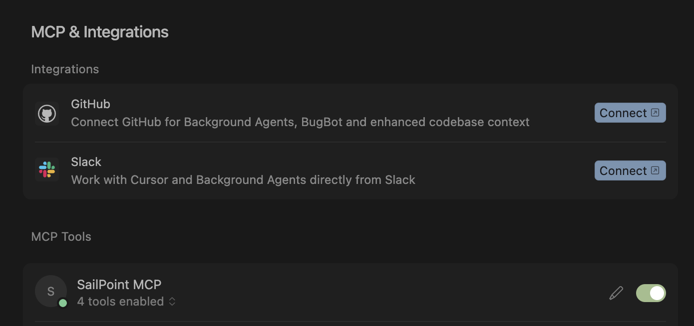

This guide will walk you through configuring Cursor to connect with the SailPoint Model Context Protocol (MCP) Server using the `mcp.json` configuration file.

Cursor connects to the SailPoint MCP Server natively using OAuth 2.1 with PKCE, so you no longer need to generate or paste in an authentication token. Instead, you supply a Client ID and Cursor handles the entire login and consent flow for you.

:::warning
Before configuring this integration, please confirm with your organization's administrator whether the integration is allowed with this AI provider. SailPoint does not bear any responsibility in this regard.
:::

## Prerequisites

- [Cursor](https://cursor.com/downloads) (v0.44+) installed
- An ISC tenant with the MCP Access Requests feature enabled
- Permission to create an API client in ISC, or a Client ID provided by your administrator

:::note
The global MCP URL is not available for FedRAMP tenants or tenants with data sovereignty requirements. Those environments should continue to use their tenant-specific URL.
:::

## Step 1: Create an API client in ISC

In ISC, go to **Admin > Security Settings > API Management** and create a new API client:

1. Set the client type to **Public**.
2. Enable the **Authorization Code** and **Refresh Token** grant types.
3. Set the **Redirect URL**:
    - Cursor 3.11 and later: `http://localhost:8787/callback`
    - Earlier versions: `cursor://anysphere.cursor-mcp/oauth/callback`
4. Set the **Scope** to `sp:scopes:all`.

Save the client and copy the **Client ID** — you will need it in the next step.

## Step 2: Add the SailPoint MCP Server to `mcp.json`

Open `~/.cursor/mcp.json` (or use **Cursor Settings > MCP > Add**) and add the configuration below.

The configuration uses the global MCP URL (`https://mcp.sailpoint.com/latest/access-requests/mcp`), which works for all tenants without any tenant-specific changes. Your tenant is identified automatically during authentication. If the tenant name cannot be detected, you will be prompted to enter it on first connect.

```json
{
  "mcpServers": {
    "sailpoint-access-requests": {
      // highlight-next-line
      "url": "https://mcp.sailpoint.com/latest/access-requests/mcp",
      "auth": {
        // highlight-next-line
        "CLIENT_ID": "your-client-id",
        "scopes": ["sp:scopes:all"]
      }
    }
  }
}
```

**Replace `your-client-id` with the Client ID from Step 1**, then save the file.

## Step 3: Connect and authenticate

Open **Cursor Settings > MCP** and click **Connect** next to the SailPoint MCP server. Cursor handles the entire OAuth flow:

1. A browser window opens.
2. Log in with your ISC credentials (SSO is supported if it is configured for your tenant).
3. Approve the consent screen.
4. You are connected — tokens refresh automatically, so you will not need to re-enter your credentials mid-session.

### Step 4: Verify the Connection

Go back to the Cursor settings tab.

1. Open the Command Palette (`Cmd+Shift+P` on macOS or `Ctrl+Shift+P` on Windows/Linux).
2. Search for and select `View: Open MCP Settings`.

You will see that Cursor is connected and has the SailPoint access request tools available.



## **Try it out!**

You can now ask Cursor questions like "What can I request access to?", "What is the status of my access request?", or "Cancel access request XYZ."

For more information about the tools, refer to the [SailPoint MCP tool documentation](../available-tools.mdx).
