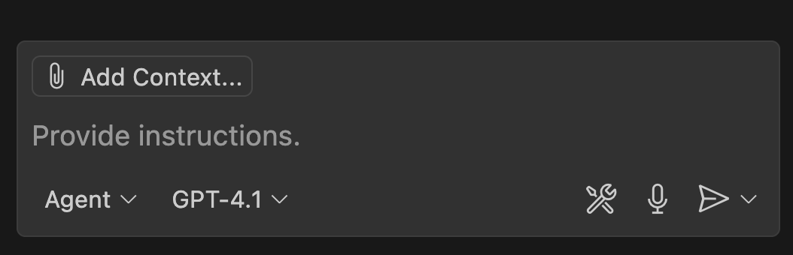

This guide will walk you through configuring Visual Studio Code to connect with the SailPoint Model Context Protocol (MCP) Server using the `mcp.json` configuration file.

:::warning
Before configuring this integration, please confirm with your organization's administrator whether the integration is allowed with this AI provider. SailPoint does not bear any responsibility in this regard.
:::

## Prerequisites

- [Visual Studio Code](https://code.visualstudio.com/) installed
- [GitHub Copilot](https://marketplace.visualstudio.com/items?itemName=GitHub.copilot) extension installed and enabled
- Node.js and npm installed
- Access to a valid SailPoint MCP Server endpoint and an authentication token

## Step 1: Enable MCP Support in VS Code

Before configuring the server, make sure MCP support is enabled in your VS Code settings:

1. Open the Command Palette (`Cmd+Shift+P` on macOS or `Ctrl+Shift+P` on Windows/Linux).
2. Search for and select `Preferences: Open Settings (JSON)`.
3. Add the following line to your settings if it is not already present:

```json
"chat.mcp.discovery.enabled": true
```

This setting allows VS Code to discover and connect to MCP servers defined in your `mcp.json` file.

## Step 2: Create or Update `mcp.json`

1. Open VS Code.
2. Open the Command Palette (`Cmd+Shift+P` on macOS or `Ctrl+Shift+P` on Windows/Linux).
3. Search for and select `MCP: Open User Configuration`.
4. Add the following configuration to `mcp.json`:

```json
{
  "servers": {
    "SailPoint MCP": {
      "command": "npx",
      "args": [
        "mcp-remote@latest",
        // highlight-next-line
        "https://[tenant].api.cloud.sailpoint.com/v2025/access-requests/mcp",
        "--debug",
        "--header",
        "Authorization: Bearer ${input:AUTH_TOKEN}"
      ]
    }
  },
  "inputs": [
    {
      "type": "promptString",
      "id": "AUTH_TOKEN",
      "description": "Enter your AUTH TOKEN:",
      "password": true
    }
  ]
}
```

**Replace `[tenant]` with your tenant name.** For example:

- If your SailPoint URL is `https://acme.identitynow.com`, use `acme`
- Full URL would be: `https://acme.api.identitynow.com/v2025/access-requests/mcp`

## Step 3: Connect to the MCP Server

1. Open the Command Palette.
2. Search for and select `MCP: Open User Configuration`
3. Select `Start` above the configuration for "SailPoint MCP".
    
4. When prompted, enter your authentication token.

### Step 4: Verify the Connection

Once connected, you should be able to interact with the SailPoint MCP Server directly from VS Code.

Begin a new VS Code chat and select the Tools icon.



This will bring up the Tools menu. You should see the SailPoint MCP Server and the available tools listed:


## **Try it out!**

You can now ask VS Code things like "What can I request access to?” or “What is the status of my access request?” or “Cancel access request XYZ”

For more information about the tools, refer to the [SailPoint MCP tool documentation](../available-tools.mdx).
