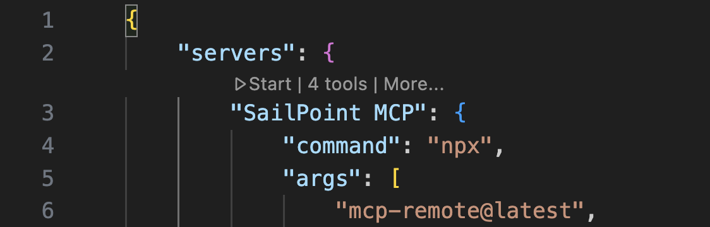
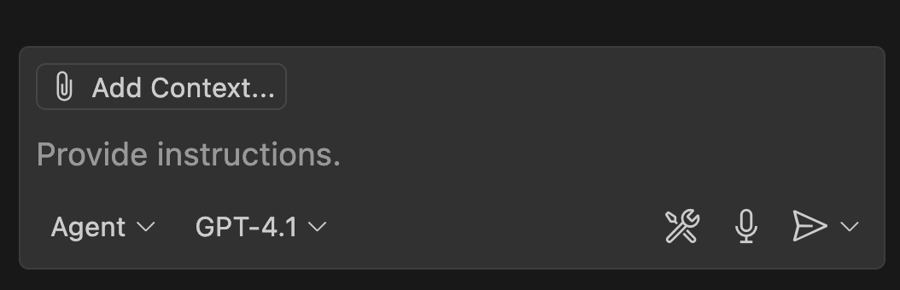
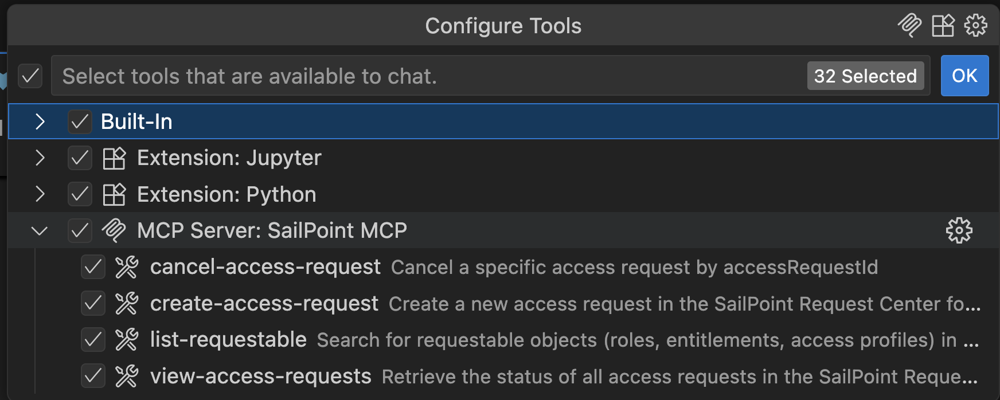

This guide will walk you through configuring Visual Studio Code to connect with the SailPoint Model Context Protocol (MCP) Server using the `mcp.json` configuration file.

VS Code connects to the SailPoint MCP Server using OAuth 2.1 with PKCE, so you no longer need to generate or paste in an authentication token. Instead, you supply a Client ID and VS Code handles the login and consent flow for you.

:::warning
Before configuring this integration, please confirm with your organization's administrator whether the integration is allowed with this AI provider. SailPoint does not bear any responsibility in this regard.
:::

## Prerequisites

- [Visual Studio Code](https://code.visualstudio.com/) (v1.101+) installed
- [GitHub Copilot](https://marketplace.visualstudio.com/items?itemName=GitHub.copilot) extension installed and enabled
- An ISC tenant with the MCP Access Requests feature enabled
- Permission to create an API client in ISC, or a Client ID provided by your administrator

:::note
The global MCP URL is not available for FedRAMP tenants or tenants with data sovereignty requirements. Those environments should continue to use their tenant-specific URL.
:::

## Step 1: Create an API client in ISC

In ISC, go to **Admin > Security Settings > API Management** and create a new API client:

1. Set the client type to **Public**.
2. Enable the **Authorization Code** and **Refresh Token** grant types.
3. Set the **Redirect URLs** to both of the URLs VS Code uses for its OAuth callback:
    - `http://127.0.0.1:33418`
    - `https://vscode.dev/redirect`
4. Set the **Scope** to `sp:scopes:all`.

Save the client and copy the **Client ID** — you will need it in Step 3.

:::note
VS Code uses the loopback port `33418` for its OAuth callback by default. If that port is unavailable, VS Code may fall back to a different port and authentication can fail with a redirect URI mismatch. If you hit this, set a fixed `callbackPort` in the server's `oauth` configuration and register the matching redirect URL on the API client.
:::

## Step 2: Enable MCP Support in VS Code

Before configuring the server, make sure MCP support is enabled in your VS Code settings:

1. Open the Command Palette (`Cmd+Shift+P` on macOS or `Ctrl+Shift+P` on Windows/Linux).
2. Search for and select `Preferences: Open Settings (JSON)`.
3. Add the following line to your settings if it is not already present:

```json
"chat.mcp.discovery.enabled": true
```

This setting allows VS Code to discover and connect to MCP servers defined in your `mcp.json` file.

## Step 3: Add the SailPoint MCP Server to `mcp.json`

1. Open the Command Palette (`Cmd+Shift+P` on macOS or `Ctrl+Shift+P` on Windows/Linux).
2. Search for and select `MCP: Open User Configuration`.
3. Add the following configuration to `mcp.json`:

The configuration uses the global MCP URL (`https://mcp.sailpoint.com/latest/access-requests/mcp`), which works for all tenants without any tenant-specific changes. Your tenant is identified automatically during authentication. If the tenant name cannot be detected, you will be prompted to enter it on first connect.

```json
{
  "servers": {
    "sailpoint-access-requests": {
      "type": "http",
      // highlight-next-line
      "url": "https://mcp.sailpoint.com/latest/access-requests/mcp",
      "oauth": {
        // highlight-next-line
        "clientId": "your-client-id"
      }
    }
  }
}
```

**Replace `your-client-id` with the Client ID from Step 1**, then save the file.

## Step 4: Connect and authenticate

1. Open the Command Palette.
2. Search for and select `MCP: Open User Configuration`.
3. Select `Start` above the configuration for "sailpoint-access-requests".
    
4. VS Code opens a browser window to complete the OAuth flow:
    1. Log in with your ISC credentials (SSO is supported if it is configured for your tenant).
    2. Approve the consent screen.
    3. You are connected — tokens refresh automatically, so you will not need to re-enter your credentials mid-session.

### Step 5: Verify the Connection

Once connected, you should be able to interact with the SailPoint MCP Server directly from VS Code.

Begin a new VS Code chat and select the Tools icon.



This will bring up the Tools menu. You should see the SailPoint MCP Server and the available tools listed:



## **Try it out!**

You can now ask VS Code things like "What can I request access to?” or “What is the status of my access request?” or “Cancel access request XYZ”

For more information about the tools, refer to the [SailPoint MCP tool documentation](../available-tools.mdx).
