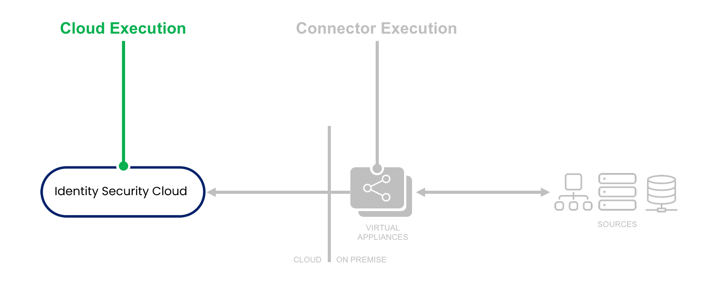

# BuildMap Rule

## Overview

This rule manipulates raw input data provided by the rows and columns in a file and builds a map from the incoming data. Use this rule to create a new value by combining two columns together. For example, if one column was `access` and another `permissions` you could combine these together to create an entitlement `admin-read`.

:::info 

This rule runs in the cloud, but it's really a connector rule because it executes against the DelimitedFileConnector. 

:::

## Execution

- **Cloud Execution** - This rule executes in the Identity Security Cloud cloud, and has read-only access to the records from the Delimited File being imported. However, it doesn't have access to on-premise sources or connectors.
- **Logging** - Logging statements are currently only visible to SailPoint personnel.



## Input

| Argument | Type | Purpose |
| --- | --- | --- |
| cols | java.util.List | Ordered list of the column names from the file’s header records or specified columns list. |
| record | java.util.List | Ordered list of the values for the current record, parsed based on the specified delimiter. |
| application | System.Collections.Hashtable | Map of the application configuration. |
| schema | sailpoint.object.Schema | Reference to the schema object for the delimited file source being read. |

## Connector Rule JSON Template
This template is used for the connector rule development process which is supported for the delimited file connector. Note the BeanShell code is escaped in the $.sourceCode.script attribute. The example, unescaped and formatted for readability, follows.

```JSON
{
    "name": "Sample BuildMapRule",
    "type": "BuildMap",
    "signature": {
        "input": [
            {
                "name": "cols",
                "description": "An ordered list of the column names from the file’s header record or specified Columns list.",
                "type": null
            },
            {
                "name": "record",
                "description": "An ordered list of the values for the current record (parsed based on the specified delimiter)",
                "type": null
            },
            {
                "name": "application",
                "description": "The source object sent to the connector from IdentityNow.",
                "type": null
            },
            {
                "name": "schema",
                "description": "A reference to the Schema object for the Delimited File source being read.",
                "type": null
            }
        ],
        "output": null
    },
    "sourceCode": {
        "version": "1.0",
        "script": "import sailpoint.connector.DelimitedFileConnector;\n\nMap map = DelimitedFileConnector.defaultBuildMap( cols, record );\nString access = (String) map.get( \"access\" );\nString permission = (String) map.get( \"permission\" );\n\nif ( access != null && permission != null ) {\n     map.remove(\"access\");\n     map.remove(\"permission\");\n     map.put(\"access\", access + \" - \" + permission);\n}\nreturn map;"
    },
    "attributes": {
        "sourceVersion": "1.0"
    },
    "description": "This basic rule performs the combines 2 values into a single attribute."
}
```
## Connector Rule Example
This is the unescaped BeanShell code from the $.sourceCode.script attribute above.
```java
 import sailpoint.connector.DelimitedFileConnector;

 Map map = DelimitedFileConnector.defaultBuildMap( cols, record );
 String access = (String) map.get( "access" );
 String permission = (String) map.get( "permission" );

 if ( access != null && permission != null ) {
      map.remove("access");
      map.remove("permission");
      map.put("access", access + " - " + permission);
 }
 return map;
```
## Cloud Rule XML Template
This template is used for the cloud rule deployement process which is NOT requried for buildmap rules but is still supported. 

```xml
<?xml version='1.0' encoding='UTF-8'?>
<!DOCTYPE Rule PUBLIC "sailpoint.dtd" "sailpoint.dtd">
<Rule name="Example Rule" type="BuildMap">
  <Description>Describe your rule here.</Description>
  <Signature>
    <Inputs>
      <Argument name="log"/>
      <Argument name="cols" type="List"/>
      <Argument name="record" type="List"/>
      <Argument name="application"/>
      <Argument name="schema"/>
    </Inputs>
  </Signature>
  <Source><![CDATA[

  // Add your logic here.

  ]]></Source>
</Rule>
```

## Cloud Rule Example

```java
<?xml version='1.0' encoding='UTF-8'?>
<!DOCTYPE Rule PUBLIC "sailpoint.dtd" "sailpoint.dtd">
<Rule name="Example Rule" type="BuildMap">
  <Description>This basic rule performs the combines 2 values into a single attribute.</Description>
  <Signature>
    <Inputs>
      <Argument name="log"/>
      <Argument name="cols" type="List"/>
      <Argument name="record" type="List"/>
      <Argument name="application"/>
      <Argument name="schema"/>
    </Inputs>
  </Signature>
  <Source><![CDATA[

     import sailpoint.connector.DelimitedFileConnector;

     Map map = DelimitedFileConnector.defaultBuildMap( cols, record );
     String access = (String) map.get( "access" );
     String permission = (String) map.get( "permission" );

     if ( access != null && permission != null ) {
          map.remove("access");
          map.remove("permission");
          map.put("access", access + " - " + permission);
     }
     return map;

  ]]></Source>
</Rule>
```
