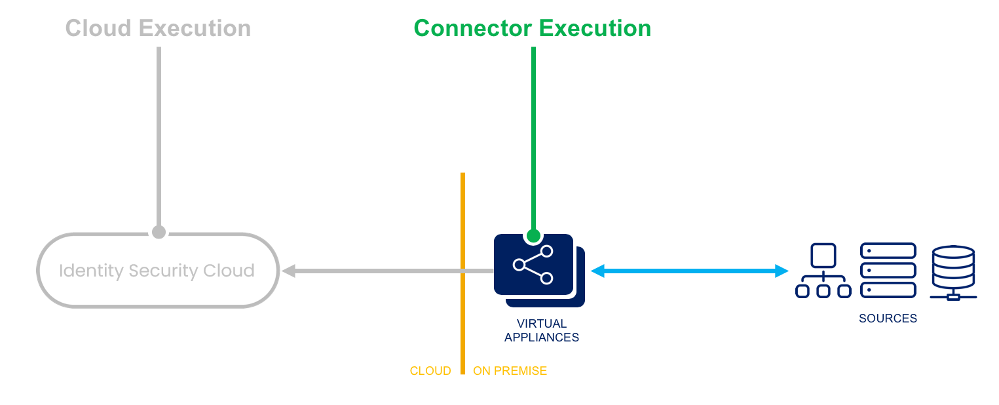

# Before and after operations on source account Rule

## Overview

This rule executes PowerShell commands on the IQService component after a source account has an operation performed on it.

The following operations can be performed on a source:

| Rule Name | Rule Type | Source Type(s) | Purpose |
| --- | --- | --- | --- |
| Before Creation Rule | ConnectorBeforeCreate | Active Directory, Azure Active Directory | Executes PowerShell commands on the IQService component before a source account is created. |
| Before Modify Rule | ConnectorBeforeModify | Active Directory, Azure Active Directory | Executes PowerShell commands on the IQService component before a source account is modified. |
| Before Delete Rule | ConnectorBeforeDelete | Active Directory, Azure Active Directory | Executes PowerShell commands on the IQService component before a source account is deleted. |
| After Creation Rule | ConnectorAfterCreate | Active Directory, Azure Active Directory | Executes PowerShell commands on the IQService component after a source account is created. |
| After Modify Rule | ConnectorAfterModify | Active Directory, Azure Active Directory | Executes PowerShell commands on the IQService component after a source account is modified. |
| After Delete Rule | ConnectorAfterDelete | Active Directory, Azure Active Directory | Executes PowerShell commands on the IQService component after a source account is deleted. |

## Execution

- **Connector Execution** - This rule executes within the virtual appliance. It may offer special abilities to perform connector-related functions, and it may offer managed connections to sources.
- **Logging** - Logging statements are viewable within the ccg.log on the virtual appliance, and they are viewable by SailPoint personnel.



## Input

| Argument | Type | Purpose |
| --- | --- | --- |
| Application | System.Collections.Hashtable | Map of the application configuration. |
| Request | SailPoint.Utils.objects.AccountRequest | Reference to the account request provisioning instructions. |
| Result | SailPoint.Utils.objects.ServiceResult | Reference to the provisioning result that can be manipulated if necessary. |

## Architecture best practices

For supportability, it is recommended that you write these operation rules with only the most basic logic necessary to trigger a PowerShell script and shift the bulk of the downstream events and/or modifications to the PowerShell script itself. This script would reside on the client's servers and can therefore be easily maintained or modified by the client as needed. It also allows the client to implement changes to the PowerShell scripted functionality without requiring code review by SailPoint because the code runs outside of the Identity Security Cloud platform.

## Rule template

This example triggers on the BeforeCreate operation. If you want to use another operation, replace `BeforeCreate` in the name and `ConnectorBeforeCreate` in the type with one of the other operations described earlier in the [Overview](#overview) section.

```xml
<?xml version='1.0' encoding='UTF-8'?>
<!DOCTYPE Rule PUBLIC "sailpoint.dtd" "sailpoint.dtd">
 <Rule language="beanshell" name="SampleSource BeforeCreate" type="ConnectorBeforeCreate">
  <Attributes>
   <Map>
    <entry key="ObjectOrientedScript" value="true" />
    <entry key="disabled" value="false" />
    <entry key="extension" value=".ps1" />
    <entry key="program" value="powershell.exe" />
    <entry key="timeout" value="300" />
   </Map>
  </Attributes>
  <Description>
   This is an IQService afterScript - On a successful provisioning event, this before script should be used as the starting point to
            initiate a separate PowerShell script residing on the client's IQService server.

            Configuration tasks include the following:
             - Set a proper location for the $logFile variable.
             - Set the proper script location and name for the $command variable.
             - Set the $enableDebug flag to $true or $false to toggle debug mode.
  </Description>
  <Source>
<![CDATA[

$logDate = Get-Date -UFormat "%Y%m%d"
$logFile = "c:\SailPoint\Scripts\Logs\ConnectorAfterCreate_$logDate.log"
$command = "c:\SailPoint\Scripts\SampleSource-AfterCreate.ps1"
$enableDebug = $false

#====================-------Helper functions-------====================
function LogToFile([String] $info) {
    $info | Out-File $logFile -Append
}

#====================-------Get the request object-------====================
Try{
    if($enableDebug) {
        LogToFile("Entering SailPoint rule")
    }

    Add-type -path utils.dll;
 $sReader = New-Object System.IO.StringReader([System.String]$env:Request);
 $xmlReader = [System.xml.XmlTextReader]([sailpoint.utils.xml.XmlUtil]::getReader($sReader));
 $requestObject = New-Object Sailpoint.Utils.objects.AccountRequest($xmlReader);
    $requestAsString = $env:Request

    if($enableDebug) {
        LogToFile("Request as XML object is: $requestAsString")
    }

    #Call the client script
    & $command -requestString $requestAsString

}Catch{
 $ErrorMessage = $_.Exception.Message
   $ErrorItem = $_.Exception.ItemName
   LogToFile("Error: Item = $ErrorItem -> Message = $ErrorMessage")
}

if($enableDebug) {
    LogToFile("Exiting SailPoint rule")
}

]]>
  </Source>
 </Rule>
```

## Powershell script template

You can also use the following Powershell script template for each operation in the [Overview](#overview) section. Be sure to update the `$logFile` variable with the operation you use to ensure you are logging to a file with the correct operation name.

```powershell
###############################################################################################################################
# SETUP
# Instructions (for each IQService host that could run the script):
#   - Update the path to Utils.dll (can be an unqualified path like "Utils.dll" since script is copied to IQService folder for execution)
#   - Make sure Utils.dll is in the specified folder on each IQService host
#   - Be sure the account that runs IQService has appropriate permissions to create directories and set permissions on them
#   - Be sure to set the "run as" account for the IQService in Windows Service to the above-specified account instead of just the "logged on" user
#   - Set a proper location for the $logFile variable
#   - Set the $enableDebug flag to $true or $false to toggle debug mode
###############################################################################################################################

param (
 [Parameter(Mandatory=$true)][System.String]$requestString
)

#include SailPoint library
Add-Type -Path "c:\SailPoint\IQService\Utils.dll";

#import AD cmdlets
Import-Module activeDirectory

#log file info
$logDate = Get-Date -UFormat "%Y%m%d"
$logFile = "c:\SailPoint\Scripts\Logs\SampleSourceBeforeCreateScript_$logDate.log"
$enableDebug = $false

###############################################################################################################################
# HELPER FUNCTIONS
###############################################################################################################################

#save logging files to a separate txt file
function LogToFile([String] $info) {
    $info | Out-File $logFile -Append
}

#if we have a non-null account request, get our value; otherwise return nothing
function Get-AttributeValueFromAccountRequest([sailpoint.Utils.objects.AccountRequest] $request, [String] $targetAttribute) {
    $value = $null;

    if ($request) {
        foreach ($attrib in $request.AttributeRequests) {
            if ($attrib.Name -eq $targetAttribute) {
                $value = $attrib.Value;
                break;
            }
        }
    } else {
        LogToFile("Account request object was null");
    }
    return $value;
}


###############################################################################################################################
# BODY
###############################################################################################################################
if($enableDebug) {
    LogToFile("Entering beforeScript")
}

try {

    ##########################
    # Begin SailPoint protected code -- do not modify this code block
    #
        $sReader = New-Object System.IO.StringReader([System.String]$env:Request);
        $xmlReader = [System.xml.XmlTextReader]([sailpoint.utils.xml.XmlUtil]::getReader($sReader));
        $requestObject = New-Object Sailpoint.Utils.objects.AccountRequest($xmlReader);

        #debug line for testing
        if($enableDebug) {
            LogToFile("Request object contents:")
            LogToFile($requestObject | Out-String)
        }
    #
    # End SailPoint protected code
    ##########################


    ##########################
    # Begin Client-provided code

    #get the necessary info we need from the accountRequest object
    #as an example: $nativeIdentity = $requestObject.nativeIdentity

    #do whatever work needs to be done here

    #
    # End Client-provided code
}
catch {
    $ErrorMessage = $_.Exception.Message
   $ErrorItem = $_.Exception.ItemName
   LogToFile("Error: Item = $ErrorItem -> Message = $ErrorMessage")
}

if($enableDebug) {
    LogToFile("Exiting beforeScript")
}
```

## Attach to source

Refer to [Attaching Connector-Related Rules to Sources](./index.md#aftercreate-aftermodify-afterdelete-beforecreate-beforemodify-beforedelete-rules) for details on how to attach your rule to your source.
