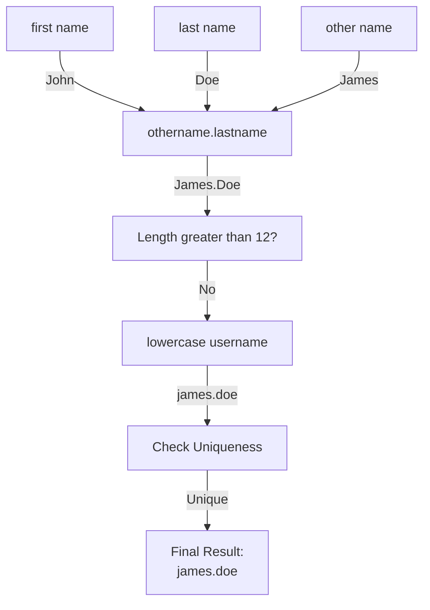
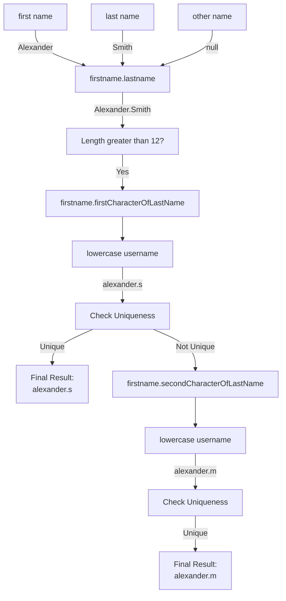

## Overview

In this guide you'll learn the end to end process of writing a cloud rule to generate a username for use in account creation.

- [Attribute generator rule overview](#attribute-generator-rule)
- [Username requirements](#username-requirements)
- [Writing the rule](#writing-the-rule)
- [Validating the rule](#validate-the-rule)
- [Submitting for rule review](#submitting-for-rule-review)

## Attribute Generator Rule

This rule generates complex account attribute values during provisioning, e.g. when creating an account. You would typically use this rule when you are creating an account to generate attributes like usernames.

This rule executes in the Identity Security Cloud (ISC) cloud, and it has read-only access to ISC data models, but it doesn't have access to on-premise sources or connectors.

Refer to [Attribute Generator Rule](../cloud-rules/account_profile_attribute_generator.md) to learn more about the inputs available to you during the rule execution.

## Username Requirements

With this rule you'll be able to generate a unique username and check for uniqueness for an Active Directory source.

The unique username will be generated as follows.

- Retrieve the first name, last name and other name of the user.
- If the other name is not available, use the first name.
- First, check the length of (othername | firstname).lastname. If it is greater than 12 then use the first 12 letters of the first name, add a period `.` and append the first character of the last name. Convert to lowercase. Check for uniqueness.
- If it is not unique then use the first 12 characters of the first name and add a period `.` and append the second character of the last name. Convert to lowercase. Check for uniqueness.
- Follow this pattern until a unique username is found. If all characters of the last name are exhausted, return null.

### Example Outputs

The following example shows the output if the other name is not null, the othername.lastname is less than 12 characters and the username `james.doe` after being lowercased is unique.

<div style={{textAlign: 'center'}}>



</div>

The next example shows the case where the other name if null, the firstname.lastname is greater than 12 characters and the firstname.firstCharacterOfLastName lowercased `alexander.s` is not unique. The rule will then use the firstname.secondCharacterOfLastName lowercased `alexander.m`.

<div style={{textAlign: 'center'}}>



</div>

## Write the Rule

Create a new xml file with this naming scheme [rule file naming](/docs/extensibility/rules/cloud-rules#review-guidelines).

Open that file in your preferred editor.

For the attribute generator rule, you can begin with this template:

```xml
<?xml version='1.0' encoding='UTF-8'?>
<!DOCTYPE Rule PUBLIC "sailpoint.dtd" "sailpoint.dtd">
<Rule name="Example Rule" type="AttributeGenerator">
  <Description>Describe your rule here.</Description>
  <Source><![CDATA[

  // Add your logic here.

  ]]></Source>
</Rule>
```

### Add Imports and generateUsername Function

Add a description and the necessary imports for your rule. This rule will need `Identity` and `Application` from `sailpoint.object`, as well as a few other classes for working with strings. Also add the global constant, `MAX_USERNAME_LENGTH` - in this example, this rule will use the value of 12.

```java
<?xml version='1.0' encoding='UTF-8'?>
<!DOCTYPE Rule PUBLIC "sailpoint.dtd" "sailpoint.dtd">
<Rule name="ADUserNameGenerator" type="AttributeGenerator">
  <Description>This will generate a unique username for active directory</Description>
  <Source><![CDATA[
        import sailpoint.tools.GeneralException;
        import sailpoint.object.*;
        import java.util.ArrayList;
        import sailpoint.api.*;
        import java.util.List;
        import org.apache.commons.lang.StringUtils;

        //Global constant
        int MAX_USERNAME_LENGTH = 12;

        public String generateUsername(String firstName, String lastName) {

        }
  ]]></Source>
</Rule>
```

### Get the firstName, lastName, and otherName Attributes and Sanitize Input

```java
<?xml version='1.0' encoding='UTF-8'?>
<!DOCTYPE Rule PUBLIC "sailpoint.dtd" "sailpoint.dtd">
<Rule name="Example Rule" type="AttributeGenerator">
  <Description>This will generate a unique username for active directory</Description>
  <Source><![CDATA[
        import sailpoint.tools.GeneralException;
        import sailpoint.object.*;
        import java.util.ArrayList;
        import sailpoint.api.*;
        import java.util.List;
        import org.apache.commons.lang.StringUtils;

        //Global constant
        int MAX_USERNAME_LENGTH = 12;

        public String generateUsername(String firstName, String lastName) {
            firstName = StringUtils.trimToNull( firstName );
            lastName = StringUtils.trimToNull( lastName );
            otherName = identity.getStringAttribute("otherName");

            if(firstName != null){
                firstName = firstName.replaceAll("[^a-zA-Z0-9]", "");
            }

            if(lastName != null){
                lastName = lastName.replaceAll("[^a-zA-Z0-9]", "");
            }

            if(otherName != null){
                otherName = otherName.replaceAll("[^a-zA-Z0-9]", "");
            }

            if ( ( firstName == null ) || ( lastName == null ) ){
                log.debug( "AD Create User Name | Exit from generateADUsername method. No last name and other name for user" );
                return null;
            }
            // If other name is available then we are using firstname as other name
            if( !StringUtils.isEmpty(otherName) )
                firstName = otherName;

            // This will hold the final username;
            String username = null;

            log.debug( "AD Create User Name | Final first name and last name for user: " +firstName + " " +lastName );
            // This will hold the final username;
            String finalUserName = null;
            String fullName = firstName + "." + lastName;
            String newUsername = lastName;
        }
  ]]></Source>
</Rule>
```

### Logic if the Proposed Username Exceeds the Max Length

If the full name exceeds the `MAX_USERNAME_LENGTH` the rule will check whether the length of the first name is greater than the MAX_USERNAME_LENGTH minus 2 (in the case below 10) characters of the first name - this allows for the period `.` and the first character of the last name to take up the remaining two characters. If the first name is less than the `MAX_USERNAME_LENGTH` the rule will use the full first name for the username with the period `.` and the first character of the last name appended. After the username is determined, a call to `isUnique( username )` is made. This uses the ISCRuleUtil class to check Active Directory if the username exists. You will add in that function shortly.

```java
if(fullName.length() > MAX_USERNAME_LENGTH) {

        int firstNameLength = firstName.length();

        //Checking if the firstname length is more than the MAX minus 2 chars. 
        //If firstname is more then the MAX minus 2 we are picking MAX minus 2 characters from the firstname. 
        if(firstNameLength > (MAX_USERNAME_LENGTH - 2)){
            //lastNameLength represents the current pointer of lastlength.
            for(int lastNameLength = 0 ; lastNameLength < lastName.length() ; lastNameLength++){
                username = firstName.substring(0,(MAX_USERNAME_LENGTH-2)) + "." + lastName.charAt(lastNameLength);
                username = username.toLowerCase();
                if( isUnique( username )) {
                        log.debug( "AD Create User Name | Unique username generated: " +username);
                        log.debug( "AD Create User Name | Exit from the  GenerateADUsername Method" );
                        finalUserName = username;
                        return username;
                }
            }    
        }
        //If firstname is less than or equal to the MAX minus 2 chars then we are considering full firstname for username generation.
        else{
            //lastNameLength represents the current pointer of lastlength.
            for(int lastNameLength = 0 ; lastNameLength < lastName.length() ; lastNameLength++){
                username = firstName + "." + lastName.charAt(lastNameLength);
                username = username.toLowerCase();
                if( isUnique( username )) {
                        log.debug( "AD Create User Name | Unique username generated: " +username);
                        log.debug( "AD Create User Name | Exit from the  GenerateADUsername Method" );
                        finalUserName = username;
                        return username;
                }
            }   
        }      
}
```

### Logic if the Proposed User Name Is Within the Max Length

If the username firstname.lastname is less than or equal to the `MAX_USERNAME_LENGTH`, check it for uniqueness against active directory. If it is not unique, check uniqueness with firstname.firstLetterOfLastName, firstname.secondLetterOfLastName, etc...

```java
//The full name is less than MAX_USERNAME_LENGTH minus 2 chars directly assign username to full name.
username = fullName;
username = username.toLowerCase();
if( isUnique( username ) ) {
        log.debug( "AD Create User Name | Unique username generated: " +username);
        log.debug( "AD Create User Name | Exit from the  GenerateADUsername Method" );
        finalUserName = username;
        return username;
}
else{
    //If the username was not unique with firstname.last name we then check uniqueness 
    // with firstname.firstLetterOfLastName, firstname.secondLetterOfLastName e.t.c...
    for(int lastNameLength = 0 ; lastNameLength < lastName.length() ; lastNameLength++){
        username = firstName + "." + lastName.charAt(lastNameLength);
        username = username.toLowerCase();
        if( isUnique( username ) ) {
                log.debug( "AD Create User Name | Unique username generated: " +username);
                log.debug( "AD Create User Name | Exit from the  GenerateADUsername Method" );
                finalUserName = username;
                return username;
        }
    }
}
```

### Add Function `isUnique()` To Check Active Directory for Username

The `isUnique()` function takes the username as a string and uses the `accountExistsByDisplayName()` function from the ISCRuleUtil class to search Active Directory and return a true or false result, depending on whether the username is taken. The function takes an application name and username to test against. The variables `idn` and `application` are included as inputs to the attribute generator rule and are already initialized. Refer to [inputs](../cloud-rules/account_profile_attribute_generator.md#input) to see all inputs available to attribute generator rules.

```java
public boolean isUnique ( String username ) throws GeneralException {
    return !idn.accountExistsByDisplayName(application.getName(), username);
}
```

### Invoke `generateUsername()` With the Identity's First and Last Name

This is the final part of the rule. Call the `generateUsername()` function, passing in the identity's first and last name.
The `identity` variable is already initialized and included as input to our attribute generator rule.

```java
return generateUsername( identity.getFirstname(), identity.getLastname() );
```

## The Complete Rule

```java
<?xml version='1.0' encoding='UTF-8'?>
<!DOCTYPE Rule PUBLIC "sailpoint.dtd" "sailpoint.dtd">
<Rule name="ADUserNameGenerator" type="AttributeGenerator">
  <Description>This will generate a unique username for active directory</Description>
  <Source><![CDATA[
        import sailpoint.tools.GeneralException;
        import sailpoint.object.*;
        import java.util.ArrayList;
        import sailpoint.api.*;
        import java.util.List;
        import org.apache.commons.lang.StringUtils;

        //Global constant
        int MAX_USERNAME_LENGTH = 12;

        public String generateUsername(String firstName, String lastName) {

            firstName = StringUtils.trimToNull( firstName );
            lastName = StringUtils.trimToNull( lastName );
            String otherName = identity.getStringAttribute("otherName");

            if(firstName != null){
                firstName = firstName.replaceAll("[^a-zA-Z0-9]", "");
            }

            if(lastName != null){
                lastName = lastName.replaceAll("[^a-zA-Z0-9]", "");
            }

            if(otherName != null){
                otherName = otherName.replaceAll("[^a-zA-Z0-9]", "");
            }

            if ( ( firstName == null ) || ( lastName == null ) ){
                log.debug( "AD Create User Name | Exit from generateADUsername method. No last name and other name for user" );
                return null;
            }
            // If other name is available then we are using firstname as other name
            if( !StringUtils.isEmpty(otherName) )
                firstName = otherName;

            // This will hold the final username;
            String username = null;

            log.debug( "AD Create User Name | Final first name and last name for user: " +firstName + " " +lastName );
            // This will hold the final username;
            String finalUserName = null;
            String fullName = firstName + "." + lastName;
            String newUsername = lastName;

            if(fullName.length() > MAX_USERNAME_LENGTH) {

                int firstNameLength = firstName.length();

                //Checking if the firstname length is more than the MAX minus 2 chars. 
                //If firstname is more then the MAX minus 2 we are picking MAX minus 2 characters from the firstname. 
                if(firstNameLength > (MAX_USERNAME_LENGTH - 2)){
                    //lastNameLength represents the current pointer of lastlength.
                    for(int lastNameLength = 0 ; lastNameLength < lastName.length() ; lastNameLength++){
                        username = firstName.substring(0,(MAX_USERNAME_LENGTH-2)) + "." + lastName.charAt(lastNameLength);
                        username = username.toLowerCase();
                        if( isUnique( username )) {
                                log.debug( "AD Create User Name | Unique username generated: " +username);
                                log.debug( "AD Create User Name | Exit from the  GenerateADUsername Method" );
                                finalUserName = username;
                                return username;
                        }
                    }    
                }
                //If firstname is less than or equal to the MAX minus 2 chars then we are considering full firstname for username generation.
                else{
                    //lastNameLength represents the current pointer of lastlength.
                    for(int lastNameLength = 0 ; lastNameLength < lastName.length() ; lastNameLength++){
                        username = firstName + "." + lastName.charAt(lastNameLength);
                        username = username.toLowerCase();
                        if( isUnique( username )) {
                                log.debug( "AD Create User Name | Unique username generated: " +username);
                                log.debug( "AD Create User Name | Exit from the  GenerateADUsername Method" );
                                finalUserName = username;
                                return username;
                        }
                    }   
                }      
            } else {
                //The full name is less than MAX_USERNAME_LENGTH minus 2 chars directly assign username to full name.
                username = fullName;
                username = username.toLowerCase();
                if( isUnique( username ) ) {
                        log.debug( "AD Create User Name | Unique username generated: " +username);
                        log.debug( "AD Create User Name | Exit from the  GenerateADUsername Method" );
                        finalUserName = username;
                        return username;
                }
                else{
                    //If the username was not unique with firstname.last name we then check uniqueness 
                    // with firstname.firstLetterOfLastName, firstname.secondLetterOfLastName e.t.c...
                    for(int lastNameLength = 0 ; lastNameLength < lastName.length() ; lastNameLength++){
                        username = firstName + "." + lastName.charAt(lastNameLength);
                        username = username.toLowerCase();
                        if( isUnique( username ) ) {
                                log.debug( "AD Create User Name | Unique username generated: " +username);
                                log.debug( "AD Create User Name | Exit from the  GenerateADUsername Method" );
                                finalUserName = username;
                                return username;
                        }
                    }
                }
            }

            if( finalUserName == null ) {
                log.debug( "AD Create User Name | Exit from the  GenerateADUsername Method without generating username" );return null;
            }
            log.debug( "AD Create User Name | Exit from the  GenerateADUsername Method" );
        }

        public boolean isUnique ( String username ) throws GeneralException {
            return !idn.accountExistsByDisplayName(application.getName(), username);
        }
        
        return generateUsername( identity.getFirstname(), identity.getLastname() );
  ]]></Source>
</Rule>
```

## Validate the Rule

Before you send the rule to the professional services team to upload your rule to your tenant for use, you can send it through the rule validator to check for any errors.

Refer to [Rule Validator](https://community.sailpoint.com/t5/Professional-Services/IdentityNow-Rule-Validator/ta-p/166116) for installation.

Run the rule validator against your newly written rule.

```bash
sp-rv --file ~/rules/Rule - AttributeGenerator - ADUserNameGenerator.xml

________________________________________________________________________________
SailPoint SaaS Rule Validator v3.0.26
By the SaaS Acceleration Team

(c)2022-23 SailPoint Technologies Inc

Command line arguments:
   --file {-f} = "/Users/tyler.mairose/development/identitynow-services-config/devrel/devrel.identitynow.com/rules/Rule - AttributeGenerator - ADUserNameGenerator.xml"

Executed from: /Users/tyler.mairose/Downloads/sailpoint-saas-rule-validator-3.0.26
Jar location : /Users/tyler.mairose/Downloads/sailpoint-saas-rule-validator-3.0.26
________________________________________________________________________________
File name    : /Users/tyler.mairose/development/identitynow-services-config/devrel/devrel.identitynow.com/rules/Rule - AttributeGenerator - ADUserNameGenerator.xml
Rule name    : ADUserNameGenerator
Process date : Thu Jun 08 17:22:53 EDT 2023


________________________________________________________________________________

No errors found.

Warnings: (3)

  Line 55 - [LintValidatorForStatement(31)] For statement detected: for ( int lastNameLength = 0 ; .  .  "For Loops" can cause issues when looping with incorrect exit conditions. Ensure Looping exit conditions are correct. 
    55: for ( int lastNameLength = 0 ; lastNameLength < lastName .length ( ) ; lastNameLength ++ ) { 

  Line 70 - [LintValidatorForStatement(31)] For statement detected: for ( int lastNameLength = 0 ; .  .  "For Loops" can cause issues when looping with incorrect exit conditions. Ensure Looping exit conditions are correct. 
    70: for ( int lastNameLength = 0 ; lastNameLength < lastName .length ( ) ; lastNameLength ++ ) { 

  Line 95 - [LintValidatorForStatement(31)] For statement detected: for ( int lastNameLength = 0 ; .  .  "For Loops" can cause issues when looping with incorrect exit conditions. Ensure Looping exit conditions are correct. 
    95: for ( int lastNameLength = 0 ; lastNameLength < lastName .length ( ) ; lastNameLength ++ ) { 


________________________________________________________________________________
  Runtime stats:
    Started validation at Thu Jun 08 17:22:53 EDT 2023
    1 Rules Analyzed
    0 Errors
    3 Warnings

    Finished validation at:  Thu Jun 08 17:22:53 EDT 2023
    Process completed in 1 second.
________________________________________________________________________________
Validation status: SUCCESS
________________________________________________________________________________
```

## Submit for Rule Review

To submit your Cloud Rule for review, approval, and inclusion in the SailPoint platform, submit a [SailPoint support portal request](https://support.sailpoint.com/csm) or send an email to <support@sailpoint.com>. Attach the rule, validator output, tenant name (e.g., acme-sb.identitynow.com for sandbox or acme.identitynow.com for production) and approval for expert services to proceed. If you need assistance writing and testing rules, Expert Services can assist in that process as well. Make sure your contact information is up to date so the review team can contact you if they need to.

## Add Rule To Account Creation

Log into your ISC tenant and navigate to **Admin** -> **Connections** -> **Sources** -> **{Source Name}** -> **Accounts** -> **Create Account**. Scroll to the attribute you wish to use the rule for generating the username. Check the generator radio button and pick your new rule from the drop down.


Now you can trigger an account creation and the attribute chosen will have its value generated by your rule.
