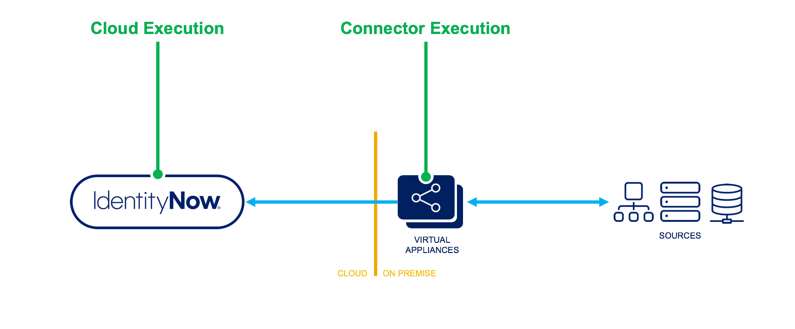

## Overview

In SailPoint solutions, rules serve as a flexible configuration framework implementers can leverage to preform complex or advanced configurations. Though rules allow some advanced flexibility, you must take special considerations when you are deciding to implement rules.

## Java Beanshell

Rules in Identity Security Cloud are written in Java Beanshell, a lightweight scripting language that allows you to define custom logic and behavior within the rules. Java Beanshell provides a familiar syntax similar to Java, making it easier for implementers to create and maintain rule configurations.

For more information about Java Beanshell, you can refer to the [Java Beanshell Documentation](https://github.com/beanshell/beanshell/wiki).

## Rule execution

Identity Security Cloud (ISC) is a multi-tenant cloud solution, and its architecture varies differently from other SailPoint products like IdentityIQ (IIQ). Therefore, the way rules execute within ISC reflects the architectural design considerations the platform was built on. These considerations determine the rule's limitations.

There are two primary places where you can execute rules:

- **Cloud Execution** - These rules are executed in the ISC multi-tenant cloud.
- **Connector Execution** - These rules are executed on the on-premise ISC virtual appliance.



**Cloud-Executed Rules** or **Cloud Rules** typically only perform a specific function, such as calculating attribute values. Many of these rules may be able to query the ISC data-model in a read-only fashion, but they do not have the ability to commit transactions, save objects, etc.

Because these rules execute in a multi-tenant cloud environment, they have a restricted context, and they are closely scrutinized to ensure that they execute in an efficient and secure manner.

For more details, see [Cloud Rules](./cloud-rules/index.md).

**Connector-Executed Rules** or **Connector Rules** are rules executed in the ISC virtual appliance, and they are often an extension connector itself. The rules are commonly used for performing complex connector-related functions, so they are specific to only certain connectors. Because these rules execute in the virtual appliance, they do not have access to query the ISC data model or fetch information from ISC. They rely instead on contextual information sent from ISC. Connector-executed rules may also have managed connections supplied in their contexts to support querying end systems or sources. Though you may use these managed connections, you cannot make making additional connections or call-outs.

For more details, see the [Connector Rules](./connector-rules/index.md).

## Support considerations

Though ISC shares some common functionality with other SailPoint products like IIQ, the same rules are not necessarily supported, nor do they necessarily execute the same way or with the same context and variables. SailPoint recommends that you become familiar with which rules execute with which products, as well as the nuances in their execution contexts.

From a SailPoint support perspective, rules are considered configurations. SailPoint supports the underlying platform but not the rule configurations themselves. Any problems with the way rules are implemented or run over time are the responsibilities the customer or implementer must manage. SailPoint's ISC Expert Services need hours to cover any rule configuration work (e.g., creating rules, best practices reviews, application to your ISC environment, and promotion between sandbox & prod environments). Contact your Customer Success Manager with any questions. While rules allow some advanced flexibility, you must consider these support implications when you are deciding whether to implement rules. Consider rule usage a last resort, and use Identity Security Cloud features instead whenever you can.

## Best practices for Rule deployments

SailPoint ISC deployments often require the deployment of rules to the client’s ISC tenants. Because ISC is a multi-tenant solution, rules that are poorly written can have negative performance implications on other tenants in the same cloud. As such, SailPoint requires all rules to be reviewed prior to deployment. The time to complete these reviews requires an expert services contract to leverage billable hours.

This article covers common topics around this process including best practices, rule review expectations, and more.

### SLAs for Rule review

SailPoint has a 24 hour SLA on rule deployments for rules submitted over weekdays and next business day for rules submitted over the weekend.

However, around 65% of rule reviews are completed in less 4 business hours, with the average turnaround time of 3-6 hours after ticket has been assigned. If a specific deployment window is required, you must alert SailPoint at least 48 hours in advance so that the time for the reviewer and deployment expert may be reserved.

### Go live expectations

SailPoint rule review team members work from 9am-5pm Monday-Friday in their local time zones, excluding holidays. For clients planning to go live on a weekend, we recommend having rules deployed in the sandbox environment prior to go live so that they can be promoted to production without SailPoint involvement. See the section below entitled [Promoting Rules from Sandbox to Production](#promote-rules-from-sandbox-to-production).

Note that even for clients who purchase Weekend Go-Live Support, rule deploys are not covered in the Weekend Go Live service as there are multiple teams involved in the rule deploy process.

### Rule deployments

SailPoint recommends only submitting one rule at a time or only rules that should be deployed together.

Typical rule reviews are billed at 15-30 minutes per rule. However, this can vary based on the complexity of the rule or if the rule is rejected and must be resubmitted for review.

In the case of rejection, we recommend submitting a new ticket to avoid a scenario where a case owner is out of the office.

## Promote Rules from sandbox to production

A rule that has been approved in a sandbox tenant through the SailPoint rule review process, like an IdentityAttribute, Correlation or ManagerCorrelation rule or any other rule type, for example, can be migrated to the production ISC tenant.

This applies to all rule types, as the signature has been approved/verified during the SailPoint rule review process, the sp-config API allows you to import ANY ‘approved’ tenant rules. (this includes cloud rules!)

For more details on the sp-config API see [sp-config](/docs/api/beta/export-sp-config)

## Rule guidelines

- **Supported Rules**

  - You must use one of the Supported Rules defined in [Supported Cloud Rules](./cloud-rules/index.md#supported-cloud-rules) and [Supported Connector Rules](./connector-rules/index.md#supported-connector-rules). You must also annotate the rule with the correct type.

  - Adhere to the rule's purpose as defined in Supported Rules. Don't use the rule differently from its intended purpose.

  - The rules must use only available SailPoint product features, and they must not make unsupported API calls.

- **Logging**

  - Use logging statements sparingly but informatively. Do not make unnecessary logging calls.

  - Do not use `System.out` statements to output data. Internal log aggregators don't pick up these statements.

  - If you want rules to log statements, use `log.debug()`, `log.info()`, `log.warn()`, or `log.error()` statements.
    - It is appropriate and expected that you use a combination of logging levels depending on the severity of the message being reported. However, you should not use `log.error()` for messages which are purely informational. Information that is helpful for debugging should use `log.debug()`,  informational messages indicating that the code is running normally should make use of `log.info()`, and messages indicating a possible non-critical issue should leverage `log.warn()`. The `log.error()` should ONLY be used to capture a log message indicating an unexpected error or critical failure in your code.
    - For additional information on best practices, you can refer to: [https://betterstack.com/community/guides/logging/how-to-start-logging-with-java/#3-use-the-most-appropriate-log-level](https://www.tutorialspoint.com/log4j/log4j_logging_levels.htm).

  - When you are logging, do not log full object serialization to logs. Calls to `.toXml()` or similar methods are prohibited.

  - Logging of sensitive data is prohibited.

  - Do not declare your own loggers in the rule.

- **Execution**

  - Do not spawn any additional threads in the rule.

  - Connections to systems other than through provided connection contexts are strictly prohibited.

  - Do not call out to external sources, files, services, APIs, etc. unless that is a connector’s purpose. Avoid using file system object manipulation like opening temp files or spooling to text or CSV files. This can cause unforeseen issues when connections are leaked or improperly used.

  - When you are using conditional execution, do not leave any dead or inaccessible code. All methods that return values should be able to return a value.

- **Error Handling**

  - Use proper error handling including `try { ... }` , `catch { ... }` and `finally { ... }` blocks to allow exceptions to propagate as intended. This is especially true of connector-executed rules.
  - Do not assume that objects are always available. They can be null. Make sure that you have proper null checks to prevent Null Pointer Exceptions (NPEs).

- **Security**

  - Implement appropriate security measures in rules to ensure proper handling of user information and prevent its unauthorized use, disclosure, or access by third parties.
  - Logging of sensitive data is prohibited, and it will cause the rule to be rejected.
  - Do not include test values, passwords, keys, or sensitive values in the rule code.

- **Performance**
  - Rules should be as performant as possible to achieve the task at hand.
  - Be careful with iterative rules execution. Heavily iterative rules will have greater performance scrutiny.
  - Do not iterate over lists of objects like accounts or identities. Doing so causes cache bloat. Use a projection query wherever possible to find the data you need, and then return the values you want. If you are unsure, ask [SailPoint Expert Services](https://www.sailpoint.com/services/professional/#contact-form).

## Rule code restrictions

The following code fragments are not allowed in any SailPoint [Cloud Rules](./cloud-rules/index.md) or [Connector Rules](./connector-rules/index.md). Any usage of these will be blocked in the system.

```java
context.
.prepare()
.getJdbcConnection()
.getConnection()
.isClosed()
.setUserName()
.getUserName()
.impersonate()
.setScopeResults()
.getScopeResults()
.getConfiguration()
.encrypt()
.decrypt()
.authenticate()
.sendEmailNotification()
.runRule()
.runScript()
.startTransaction()
.commitTransaction()
.rollbackTransaction()
.getObjectById()
.getObjectByName()
.getObject()
.lockObjectById()
.lockObjectByName()
.lockObject()
.unlockObject()
.getUniqueObject()
.getObjects()
.search()
.update()
.countObjects()
.removeObjects()
.attach()
.decache()
.clearHighLevelCache()
.getReferencedObject()
.enableStatistics()
.printStatistics()
.reconnect()
.setPersistenceOptions()
.getPersistenceOptions()
.setProperty()
.importObject()
.notify()
.notifyAll()
.reconnect()
.removeObject()
SailpointFactory
.toXml()
System.out.
System.err.
Runnable
Thread
public static
.printStackTrace
XMLObjectFactory
Log4j
Logger.getLogger​
System.exit
Runtime.
server(
ServerSocket
ProcessBuilder
exec(
exit(
rm(
getRuntime
shutdownOnExit
bg(
cp(
desktop(
getBshPrompt
mv(
run(
pathToFile
editor(
addClassPath
bind(
browseClass
cat(
cd(
classBrowser
dir(
dirname(
frame(
importCommands
load(
makeWorkspace
pwd(
reloadClasses
setClassPath
source(
sourceRelative
```

Note that the earlier code fragments are not allowed within [connector-executed rules](./connector-rules/index.md#supported-connector-rules) because they are not valid at the connector level. They will, for a short time, still be allowed for pre-existing [cloud-executed rules](./cloud-rules/index.md) as a review exception. However, any new rules using these constructs will be returned to the submitter, and the submitter will be asked to rewrite the rule, using the [ISC Rule Utility](./idn_rule_utility.md) helper methods instead:

- context
- .getObjectById()
- .getObjectByName()
- .getObject()
- .search()
- .countObjects()

## Other Rules

While ISC shares some common functionality with other SailPoint products like IIQ, the same rules are not necessarily supported, nor do they necessarily execute the same way. SailPoint recommends that you become familiar with which rules execute with which products, as well as the nuances in their execution contexts. ISC considers any other rules not mentioned in the Cloud-Executed Rules or Connector-Executed Rules sections to be unsupported.

## Deprecated Rules

The following rules have been deprecated in ISC. SailPoint recommends using supported product functionality instead of these rules:

- **Certification Exclusion Rules** - Use configurable certification campaign filters instead.
- **Identity Selector Rules** - Use role standard assignment criteria instead.
- **Integration Rules** - Use [Before Provisioning](./cloud-rules/before_provisioning_rule.md) rules instead.
