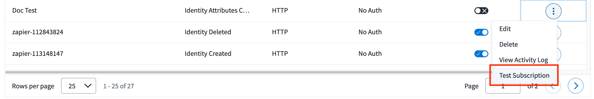

# Testing Triggers

It is important to test your trigger subscription configuration with your actual subscribing service (i.e. not a test site like [webhook.site](https://webhook.site)) before enabling your subscription for production use. Testing subscriptions ensures that your subscribing service can successfully receive events and that you are receiving the correct events based on the filter you have provided.

## Sending test invocations

The easiest way to send a test event to your subscribing service is to use the **Test Subscription** command.  Navigate to your subscription in the Event Trigger UI, click the options button to the right of it, and select **Test Subscription**.



This will send a test event to your subscribing service using the default example payload for the specific trigger you are subscribing to.  This is an easy way to validate that your service can receive events, but it lacks the ability to modify the event payload to test your filter against different payloads.  Fortunately, there is an API endpoint that allows you to modify the test payload.

If you want to control the test input to validate your filter against a more robust set of data, then you can use the [test invocation](https://developer.sailpoint.com/apis/beta/#operation/startTestInvocation) API endpoint.  This API allows you to send an input payload with any values that you want.  An example invocation of this API is as follows:

POST `https://{tenant}.api.identitynow.com/beta/trigger-invocations/test`

```json
{
  "triggerId": "idn:access-request-pre-approval",
  "input": {
    "accessRequestId": "2c91808b6ef1d43e016efba0ce470904",
    "requestedFor": {
        "type": "IDENTITY",
        "id": "2c91808568c529c60168cca6f90c1313",
        "name": "William Wilson"
    },
    "requestedItems": [
        {
        "id": "2c91808b6ef1d43e016efba0ce470904",
        "name": "Engineering Access",
        "description": "Access to engineering database",
        "type": "ACCESS_PROFILE",
        "operation": "Add",
        "comment": "William needs this access to do his job."
        }
    ],
    "requestedBy": {
        "type": "IDENTITY",
        "id": "2c91808568c529c60168cca6f90c1314",
        "name": "Rob Robertson"
    }
    },
  "contentJson": {}
}
```

## Troubleshooting

### Trigger service issues

If your subscribing service isn't receiving your test invocations, then you have a couple of options to debug the issue.  Start by viewing the activity log for the subscription in the UI to make sure your test events are actually being sent.  


Check the **Created** date with the time you sent the test events.  If they are being sent, check the details of the event.  Look for any errors being reported, and make sure your subscribing service's subscription ID is in the `subcriptionId` that the event was sent to.


You can also view the activity log using the [list latest invocation statuses](https://developer.sailpoint.com/apis/beta/#operation/listInvocationStatus) endpoint.

### Filter issues

If you don't see your events in the activity log, then it could be a filtering issue.  If the filter you configured on the subscription isn't matching the test event data, then no event will be sent.  Double check your filter expression with the test payload in a JSONpath editor to make sure the filter is valid and matching your data.  See [Filtering Events](./event-triggers-filtering-events.md) for more information.

### Misconfigured subscription

Double check that your subscription configuration is correct.  

- Make sure the URL you provided is reachable from the public internet.  If your subscribing service is hosted internally in your company's intranet, then you may be able to reach it from your computer but the trigger service might not be able to.
- Check that the authentication details are correct.  Verify that the username/password or bearer token is valid.
