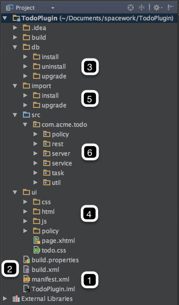

# Overview

Introduced with IdentityIQ 7.1, the plugin framework provides the infrastructure and tools to enable developers to extend the Open Identity Platform to meet a variety of specialized use cases that one might encounter in a non-standard deployment. The plugin framework allows developers to create packaged functionality that integrates with IdentityIQ, in an upgrade safe and isolated manner. It gives implementers a safe option for creating UI (user interface) extensions, REST services, custom SailPoint configuration objects, and more. This guide will walk you through the basics of plugin development and installation.

The first iteration of the plugin framework was released as an add-on to IdentityIQ 7.0 - the development process for this legacy version is slightly different and is not the subject of this document. However, [Appendix B](../appendix-b/index.md) discusses the differences between versions, and the strategy for migrating a plugin developed for the 7.0 frameworks to the 7.1 framework.

Developing a plugin requires a fairly robust knowledge of IdentityIQ and its object model, Java, JavaScript, CSS, and SQL. This document is designed to provide development guidance at a high level - it goes over what the components of a plugin are, which components are required, and how those objects interact. Language specific tutorials are beyond its scope. Throughout this document, examples will be taken and discussed from the 'TodoPlugin'.

*A quick note about plugin loading...*

Before getting into the structure of a plugin project and why it is important, it may be helpful to understand how a plugin is represented in IdentityIQ once installed. IdentityIQ stores the '.zip' archive file of the plugin in the IdentityIQ database in a data LONGBLOB in the 'spt_file_bucket' table. The data in the 'spt_file_bucket' table is referenced (by 'id') to an entry in the 'spt_persisted_file' table as shown below.

Plugins load from this .zip file after installation or an application server restart. The .zip file is extracted, and all important (html, css, js, etc) files are cached for later use. The plugin framework in 7.1 has several accessor methods to reference the cached files, but they can basically be referenced by the url prefix `<hostname>:8080/identityiq/plugin/{pluginName}` followed by the path found in the build structure. Compiled java classes are loaded (and cached) from the .zip archive via the 'PluginClassLoader' class - more on this later.

## Plugin Object Model

A plugin is defined in IdentityIQ by the 'Plugin' XML object. This object defines the parameters of the plugin, such as REST resources, snippets, settings, etc. This 'Plugin' object is defined in the 'manifest.xml' file. The plugin object is an XML object that defines the features of the plugin. This object tells IdentityIQ which features will be in your plugin by defining them as attributes of a plugin object. In the plugin object, you'll define the name of your plugin, the rights required for using your plugin, version, snippets, REST resources, etc.

**Plugin Model Attributes**

|**Attribute Name**|**Description**|
| --- | --- |
|name|Unique Name of the Plugin|
|installDate|Date when plugin was installed|
|displayName|Plugin's display name|
|certificationLevel|Plugin's certification level|
|disabled|Plugin's status|
|rightRequired|SPRIGHT required for this plugin|
|position|TBD|
|version|Plugin's version|
|minSystemVersion|Minimum IdentityIQ version the plugin will run on|
|maxSystemVersion|Maximum IdentityIQ version the plugin will run on|
|attributes|List of configurable attributes|
|file|Reference to the persisted file in the database|

## Plugin Structure

A basic plugin will consist of a manifest file, database scripts, IdentityIQ objects, REST endpoints, UI elements (.css, xhtml, javascript, etc.) and compiled java classes. Not all these components are required for a simple plugin - the process can be as simple as creating the manifest and some javascript/xhtml pages. To understand how a plugin operates and how best to create one, it is important to understand what each of these components does, and how they interact.

These are the main build components: 

1. Manifest file
2. Build file(s)
3. Database Scripts
4. UI Elements
5. XML Artifacts
6. Java Classes

Each build component is described in more detail in each chapter of this guide.