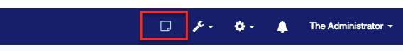

# Manifest File

A plugin is defined in IdentityIQ by the 'Plugin' XML object that defines the parameters of the plugin. Features such as REST resources, snippets, settings, etc. are defined in these parameters. The 'Plugin' object is defined in the 'manifest.xml' file. This is a required artifact. The 'Todo' plugin manifest will be examined:

```xml
<?xml version='1.0' encoding='UTF-8'?>
<!DOCTYPE Plugin PUBLIC "sailpoint.dtd" "sailpoint.dtd">
<Plugin certificationLevel="None" displayName="Todo Plugin" minSystemVersion="7.1" name="TodoPlugin" version="2.0">
 <Attributes>
   <Map>
     <entry key="minUpgradableVersion" value="1.0" />
     <entry key="fullPage">
       <value>
         <FullPage title="Todo List" />
       </value>
     </entry>
     <entry key="restResources">
       <value>
         <List>
           <String>com.acme.todo.rest.TodoResource</String>
           <String>com.acme.todo.rest.FlaggedUserResource</String>
           <String>com.acme.todo.rest.PageConfigResource</String>
         </List>
       </value>
     </entry>
     <entry key="serviceExecutors">
       <value>
         <List>
           <String>com.acme.todo.server.TodoFlaggingService</String>
         </List>
       </value>
     </entry>
     <entry key="settings">
       <value>
         <List>
           <Setting dataType="boolean" helpText="Indicates whether or not todos can be deleted" label="Delete Allowed" name="canDelete" defaultValue="true"/>
           <Setting dataType="string" helpText="The default name for a todo" label="Default Name" name="defaultName" defaultValue="My Todo"/>
           <Setting dataType="int" helpText="The default time in minutes for a todo" label="Default Time" name="defaultTime" defaultValue="30"/>
           <Setting dataType="int" helpText="The maximum numer of active todos a user is allowed to have before being flagged" label="Max Active Todos" name="maxUntilFlagged" defaultValue="10"/>
         </List>
       </value>
     </entry>
     <entry key="snippets">
       <value>
         <List>
           <Snippet regexPattern=".*" rightRequired="ViewTodoPluginIcon">
             <Scripts>
               <String>ui/js/snippets/header.js</String>
             </Scripts>
             <StyleSheets>
               <String>ui/css/todo.css</String>
             </StyleSheets>
           </Snippet>
         </List>
       </value>
     </entry>
   </Map>
 </Attributes>
</Plugin>
```

- **Line 3** - contains the plugin's metadata. This is where you will define the object name of your plugin (name value), the name displayed in the UI for your plugin (`displayName`), and the minimum system version (`minSystemVersion`).
- **Line 6** - `minUpgradeableVersion` specifies which version of this plugin has to be installed in order to upgrade to the version specified in the manifest file's metadata.
- **Line 7** - `fullPage` indicates whether this plugin will have a full page element available in the IdentityIQ UI - see the 'page.xhtml' section of this document under 'UI elements'.
- **Line 12-20** - specifies the compiled Java classes, by package, that include the REST web service endpoints that you have written - see REST section of this document under 'Java Classes'.
- **Line 21-27** - specifies the compiled Java classes, by package, that contain the service executors for your plugin - see the Service Executors section of this document under 'Java Classes'.
- **Line 28-37** - specifies the settings that are end-user configurable for this plugin.
- **Line 38-51** - lists the various snippets that can be injected into IdentityIQ pages, the match criteria, and the content and style of the snippet.

## Settings

Plugin settings are attributes that are available for the end-user/system administrator to modify as part of their installation. The example from the 'Todo' plugin has four settings available that control default values for certain elements, as well as whether or not 'Todo' entries can be deleted in the UI. Settings appear to the end user when they click the 'Configure' button for the specific plugin on the 'Plugins' dashboard.

Settings from the manifest file will be listed in order on the plugin settings page. Also present on the plugin settings page is a visual representation of the meta data in the manifest file (name, version, certification level).

One concept not shown in the 'Todo' plugin example, the concept of 'allowed values', can be very useful. This concept allows the developer to provide a predefined list of values that a field can adopt. The dataType 'boolean' does this automatically. In the earlier screenshot, there is a dropdown element available on the 'Delete Allowed' setting - the dropdown has two elements: 'True' and 'False'.

Each `Setting` tag describes one element on the settings/configuration page for a Plugin, visible to Plugin administrators in the IIQ system.

| Attribute Name | Description                                    |
| -------------- | ---------------------------------------------- |
| name           | Name of the current setting                    |
| dataType       | Setting type ( Ex. string or int or boolean)   |
| value          | Value for the setting                          |
| label          | Display label for the setting                  |
| helpText       | Associated help text for the setting           |
| allowedValues  | List of allowed values for dropdown population |
| defaultValue   | The default value for the setting              |

## Snippets

Snippets are small, configurable pieces of code that can be injected into the rendering of normal IdentityIQ UI pages. A snippet contains four equally important components:

| **Attribute Name** | **Description** |
| --- | --- |
| regexPattern | Regular expression pattern run against the current URL in the browser - if the URL matches the pattern, the snippet will attempt to display. |
| rightRequired | Determines the scope of users allowed to view the snippet element - this should reference an IdentityIQ 'SPRight' object. |
| scripts | List of scripts to run when a particular URL matches the `regexPattern`. Normally this will consist of injecting an element into the DOM of the page. The 'Todo' example's 'hearder.js' file uses JQuery for this purpose. |
| styleSheets | list of any css files that are required by Snippet Scripts |

The 'Todo' plugin snippet creates a new top level icon on every page of the IdentityIQ UI, which is visible to someone with the `ViewTodoPluginIcon` SPRight.

```xml
     <entry key="snippets">
       <value>
         <List>
           <Snippet regexPattern=".*" rightRequired="ViewTodoPluginIcon">
             <Scripts>
               <String>ui/js/snippets/header.js</String>
             </Scripts>
             <StyleSheets>
               <String>ui/css/todo.css</String>
             </StyleSheets>
           </Snippet>
         </List>
       </value>
     </entry>
```

The script, `header.js` looks for `ul.navbar-right li:first`. Then, using the JQuery operation `.before()`, the script injects an icon link pointing to the fullPage (/plugins/pluginPage.jsf?pn=TodoPlugin) of the 'Todo' plugin.

```javascript
var url = SailPoint.CONTEXT_PATH + '/plugins/pluginPage.jsf?pn=TodoPlugin';

jQuery(document).ready(function () {
  jQuery('ul.navbar-right li:first').before(
    '<li class="dropdown">' +
      ' <a href="' +
      url +
      '" tabindex="0" role="menuitem" title="View your Todo list">' +
      ' <i role="presenation" class="fa fa-sticky-note-o fa-lg example"></i>' +
      ' </a>' +
      '</li>',
  );
});
```

For reference, if you were to inspect any page of the IdentityIQ UI using a utility like Google Chrome's developer tools, you could figure out where to potentially have JQuery inject your snippet scripts.

The end result of this snippet is shown here, with the icon properly inserted before the other items in the `navbar-right` list:


