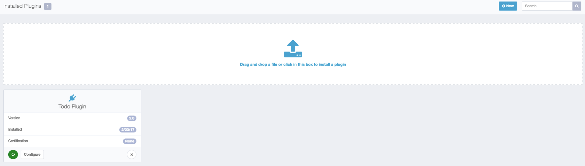
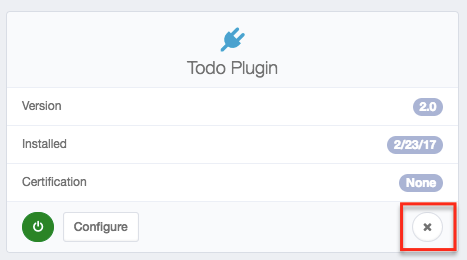

# Plugin Installation

Plugin installation is simple in IdentityIQ 7.1. Navigate to Settings -> Plugins, and then click the 'New' button.

Doing so will create a view with a large element that allows for drag and drop installation. Drag your plugin's .zip archive to this element, and the plugin will install. If any errors occur during this process, check the 'SyslogEvent' table for more information.

But wait, where do I get the .zip archive? If you have downloaded a published plugin from SailPoint, the .zip file should be included with the download. If you have developed the plugin yourself, the .zip file will be the result of executing the build process against your project. Using the build file outlined in this guide as an example, the .zip archive will be created in your project directory under 'build/<your plugin name/>/dist' after executing the 'ant build' command.

When a plugin is installed, the database scripts from the 'db/install' folder run, creating any necessary tables for the plugin, importing the XML configuration files into the IdentityIQ database from the 'import/install' folder, loading any compiled classes into the unique plugin classloader, and importing the manifest file - this process creates the plugin object.

Uninstallation follows a similar path. You can launch uninstallation by clicking the small 'X' icon on the appropriate plugin card in the 'Settings->Plugin' interface. Database scripts responsible for cleaning up data run from the 'db/uninstall' folder, and the manifest file (the plugin object) is removed. Remember that the other XML objects created during installation are currently _not_ uninstalled when a plugin is removed.

