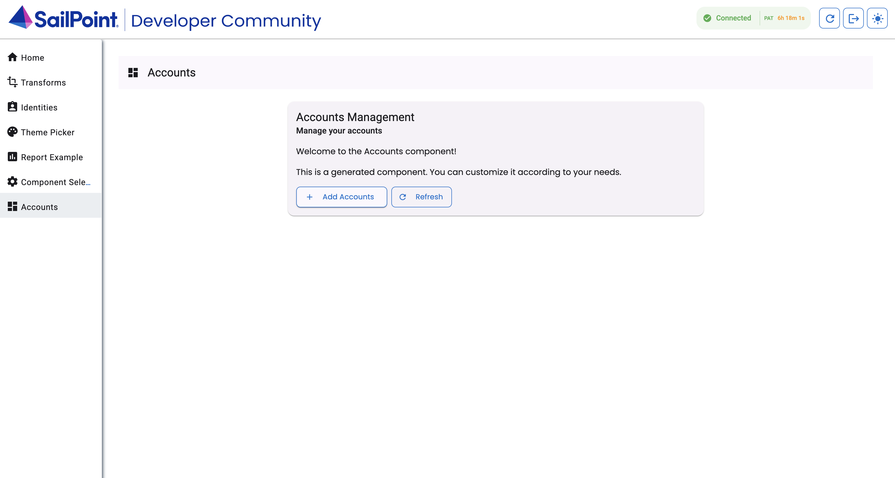

## Overview

This guide will walk you through the process of implementing a new component that lists all the accounts in your tenant. This serves as an example you can use to learn how to implement many different types of custom UI pages. 

This guide is a continuation of [Getting Started](./getting-started). At the end of this guide you will be able to do the following:

- List all accounts in your tenant
- Paginate accounts by page limits of 10, 25, 50, 100
- Click through each page of results
- View the JSON response of the account from your tenant
- Sort the results, using the sort syntax on the [List Accounts endpoint](https://developer.sailpoint.com/docs/api/v3/list-accounts).
- Filter the results, using the filter syntax on the [List Accounts endpoint](https://developer.sailpoint.com/docs/api/v3/list-accounts).


## Create the accounts component

Create the accounts component by running the following command in the root of the project:

```bash
npm run generate:component accounts
```
This command will create a new folder in the `projects/sailpoint-components/src/lib` directory with the name `accounts`. It will also create the following files:

- `accounts.component.html`
- `accounts.component.ts`
- `accounts.component.scss`
- `accounts.component.spec.ts`

The output will look similar to this:

```bash
tyler.mairose ~/development/ui-development-kit [main] $ npm run generate:component accounts

> sailpoint-ui-development-kit@1.0.0 generate:component
> node scripts/generate-component.js accounts

🚀 Generating component: accounts
✅ Created directory: /Users/tyler.mairose/development/ui-development-kit/projects/sailpoint-components/src/lib/accounts
✅ Created: accounts.component.ts
✅ Created: accounts.component.html
✅ Created: accounts.component.scss
✅ Created: accounts.component.spec.ts
✅ Updated: component-selector.service.ts
✅ Updated: app.routes.ts
✅ Updated: app.component.html
✅ Updated: public-api.ts
🎉 Component 'accounts' generated successfully!
📝 Next steps:
   1. Build the project: npm run start
   2. Enable the component in the component selector
   3. Implement your component logic in: /Users/tyler.mairose/development/ui-development-kit/projects/sailpoint-components/src/lib/accounts
```

## Enable the accounts component

To enable the accounts component, open the component selector and toggle the accounts component on. You can do this by clicking on the "Component Selector" tab in the sidebar.


You will see the accounts component in the list of available components. Toggle the accounts component on to enable it.

Once enabled you will see the accounts component in the sidebar. You can click on it to navigate to the accounts page.



## Get account data

The first thing your new component needs to do is get the account data to show. You can implement this by using the [List Accounts endpoint](https://developer.sailpoint.com/docs/api/v2025/list-accounts).

To do so, add this logic to the typescript file at `projects/sailpoint-components/src/lib/accounts/accounts.component.ts`:

```typescript
import { CommonModule } from '@angular/common';
import { Component, OnInit } from '@angular/core';
import { MatButtonModule } from '@angular/material/button';
import { MatCardModule } from '@angular/material/card';
import { MatIconModule } from '@angular/material/icon';
import { MatTableModule } from '@angular/material/table';
import { MatToolbarModule } from '@angular/material/toolbar';
import { SailPointSDKService } from '../sailpoint-sdk.service';

@Component({
  selector: 'app-accounts',
  standalone: true,
  imports: [
    CommonModule,
    MatButtonModule,
    MatCardModule,
    MatIconModule,
    MatTableModule,
    MatToolbarModule,
  ],
  templateUrl: './accounts.component.html',
  styleUrl: './accounts.component.scss',
})
export class AccountsComponent implements OnInit {
  title = 'Accounts';

  constructor(private sdk: SailPointSDKService) {}

  ngOnInit() {
    // Load initial data
    void this.loadAccounts();
  }

  private async loadAccounts() {
    try {
      const accounts = await this.sdk.listAccounts();
      console.log('Loaded accounts:', accounts);
    } catch (error) {
      console.error('Error loading accounts:', error);
    }
  }
}

```

Return to your accounts list page. In the electron app, click View -> Toggle Developer Tools, you will see the response containing the accounts in the console after the page loads.

Now that you have your account data, you need to display the data. You can add a table to the UI and display your results.

To do so, add this code to `src/routes/accounts/account-list/+page.svelte`:

<details>

<summary>Show code</summary>

```html
<script lang="ts">
	import Progress from '$lib/Components/Progress.svelte';
	import {
		TriggerCodeModal,
		formatDate
	} from '$lib/Utils.js';
	import { getModalStore } from '@skeletonlabs/skeleton';

	export let data;

	const modalStore = getModalStore();

</script>

<div class="flex justify-center flex-col align-middle gap-2">
	<div class="card p-4">
		<p class="text-2xl text-center">List of all accounts</p> <!-- Page title -->
	</div>
	{#await data.accountData}
		<div class="grid h-full place-content-center p-8">
			<Progress width="w-[100px]" />
		</div>
	{:then accountData}
    <!-- If there is no account data show a message to the user -->
		{#if accountData.length === 0} 
			<div class="card p-4">
				<p class=" text-center text-success-500">No Accounts found</p>
			</div>
		{:else}
			<div class="table-container">
				<table class="table">
					<thead class="table-head"> <!-- Table headers -->
						<th> Name </th>
						<th> Native Identity </th>
						<th> Source </th>
						<th> Created </th>
						<th> Modified </th>
						<th> Authoritative </th>
						<th> Features </th>
						<th> Has Entitlements </th>
						<th></th>
					</thead>
					<tbody class="table-body">
						{#each accountData as account} <!-- Create a table row for each account -->
							<tr>
								<td>
									{account.name}
								</td>
								<td>
									{account.nativeIdentity}
								</td>
								<td>
									{account.sourceName}
								</td>
								<td>
									{formatDate(account.created)}
								</td>
								<td>
									{formatDate(account.modified)}
								</td>
								<td>
									{account.authoritative}
								</td>
								<td>
									{account.features}
								</td>
								<td>
									{account.hasEntitlements}
								</td>
								<td>
									<div class="flex flex-col justify-center gap-1">
                                        <!-- Trigger code modal view to see raw account data -->
										<button
											on:click={() => TriggerCodeModal(account, modalStore)}
											class="btn btn-sm variant-filled-primary text-sm !text-white"
										>
											View
										</button>
									</div>
								</td>
							</tr>
						{/each}
					</tbody>
				</table>
			</div>
		{/if}
	{/await}
</div>
```

</details>

Save the `+page.svelte` file and return to the accounts list page. You will see up to 250 accounts in the table.

## Pagination

You will likely have more than 250 accounts in your tenant. To handle more than 250 accounts, you must implement pagination on your front end page. 
Pagination is the process of paging through your records. With pagination, you can handle 1000 accounts in 4 pages of 250, for example. 

To implement pagination, add the following code. This code allows you to paginate accounts in groups of 5, 10, 50, 100 and 250, depending on your requirement:

The highlighted portions of the code are the changes made to the previous code to allow pagination.

import TabItem from '@theme/TabItem';
import Tabs from '@theme/Tabs';

<Tabs>
<TabItem value="accounts_page" label="account-list/+page.svelte" default>

```html
<script lang="ts">
	// highlight-next-line
	import Paginator from '$lib/Components/Paginator.svelte';
    import Progress from '$lib/Components/Progress.svelte';
	import {
		TriggerCodeModal,
		formatDate,
		// highlight-start
        createOnPageChange,
        createOnAmountChange
		// highlight-end
	} from '$lib/Utils.js';
	import { getModalStore } from '@skeletonlabs/skeleton';

	export let data;

	const modalStore = getModalStore();

	// highlight-start
    $: onPageChange = createOnPageChange(
		{ ...data.params, filters: '', sorters: ''},
		'/accounts/account-list'
	);
	$: onAmountChange = createOnAmountChange(
		{ ...data.params, filters: '', sorters: ''},
		'/accounts/account-list'
	);
	// highlight-end

</script>

<div class="flex justify-center flex-col align-middle gap-2">
	<div class="card p-4">
		<p class="text-2xl text-center">List of all accounts</p>
	</div>
	{#await data.accountData}
		<div class="grid h-full place-content-center p-8">
			<Progress width="w-[100px]" />
		</div>
	{:then accountData}
	<!-- highlight-start -->
        {#await data.totalCount then totalCount}
            {#if totalCount > 250 || Number(data.params.limit) < totalCount}
                <div class="card p-4">
                    <Paginator
                        {onAmountChange}
                        {onPageChange}
                        settings={{
                            page: Number(data.params.page),
                            limit: Number(data.params.limit),
                            size: totalCount,
                            amounts: [5, 10, 50, 100, 250]
                        }}
                        {totalCount}
                    />
                </div>
            {/if}
        {/await}
		<!-- highlight-end -->
		{#if accountData.length === 0}
			<div class="card p-4">
				<p class=" text-center text-success-500">No Accounts found</p>
			</div>
		{:else}
			<div class="table-container">
				<table class="table">
					<thead class="table-head">
						<th> Name </th>
						<th> Native Identity </th>
						<th> Source </th>
						<th> Created </th>
						<th> Modified </th>
						<th> Authoritative </th>
						<th> Features </th>
						<th> Has Entitlements </th>
						<th></th>
					</thead>
					<tbody class="table-body">
						{#each accountData as account}
							<tr>
								<td>
									{account.name}
								</td>
								<td>
									{account.nativeIdentity}
								</td>
								<td>
									{account.sourceName}
								</td>
								<td>
									{formatDate(account.created)}
								</td>
								<td>
									{formatDate(account.modified)}
								</td>
								<td>
									{account.authoritative}
								</td>
								<td>
									{account.features}
								</td>
								<td>
									{account.hasEntitlements}
								</td>
								<td>
									<div class="flex flex-col justify-center gap-1">
										<button
											on:click={() => TriggerCodeModal(account, modalStore)}
											class="btn btn-sm variant-filled-primary text-sm !text-white"
										>
											View
										</button>
									</div>
								</td>
							</tr>
						{/each}
					</tbody>
				</table>
			</div>
		{/if}
	{/await}
</div>
```

</TabItem>
<TabItem value="accounts_list_server" label="accounts-list/+page.server.ts">

```typescript
import { createConfiguration } from '$lib/sailpoint/sdk.js';
// highlight-next-line
import { getLimit, getPage } from '$lib/Utils.js';
import type { Account } from 'sailpoint-api-client';
import { AccountsApi } from 'sailpoint-api-client';

export const load = async ({ url, locals }) => {
    const config = createConfiguration(locals.session!.baseUrl, locals.idnSession!.access_token);
	const api = new AccountsApi(config);

	// highlight-start
    const page = getPage(url);
	const limit = getLimit(url);
	// highlight-end

	// highlight-next-line
    const reportResp = api.listAccounts({count: true, limit: Number(limit), offset: Number(page) * Number(limit)});

	const totalCount = new Promise<number>((resolve) => {
		reportResp.then((response) => {
			resolve(response.headers['x-total-count']);
		});
	});

	const accountData = new Promise<Account[]>((resolve) => {
		reportResp.then((response) => {
			resolve(response.data);
		});
	});

	// highlight-next-line
	return { accountData, totalCount, params: {page, limit}};
};

```

</TabItem>
</Tabs>

Return to the accounts list page. You will see the paginator at the top of the page. You can now paginate through the accounts in your tenant.

## Sort and filter

To better view and organize the data displayed in your accounts list page, you may want to implement sorting and filtering. 
Sorting is the process of organizing the data. You may want to provide users with a way to sort the data in ascending or descending alphabetical order based on the account name, for example. 
Filtering is the process of limiting the displayed data based on specified details. You may want to provide users with a way to filter the data to only include accounts associated with one source, for example. 

To implement sorting and filtering, add the following highlighted code. It allows you to sort and filter the accounts in your tenant:

With this implementation, once a user types in a filter or sorter and clicks the 'Go' button, the UI Development Kit calls the `onCreateGo` function and reloads the page with the new sorters and filters.

On the server side, the kit uses the `getFilters` and `getSorters` functions to get the filters and sorters from the URL. 
The kit then passes these functions to the [List Accounts endpoint](https://developer.sailpoint.com/docs/api/v3/list-accounts) to filter and sort the accounts.

<Tabs>
<TabItem value="accounts_page" label="account-list/+page.svelte" default>

```typescript
<script lang="ts">
    import Paginator from '$lib/Components/Paginator.svelte';
    import Progress from '$lib/Components/Progress.svelte';
    import {
        TriggerCodeModal,
        formatDate,
        createOnPageChange,
        createOnAmountChange,
		// highlight-next-line
        createOnGo
    } from '$lib/Utils.js';
    import { getModalStore } from '@skeletonlabs/skeleton';

    export let data;

    const modalStore = getModalStore();

    $: onPageChange = createOnPageChange(
        { ...data.params, filters, sorters},
        '/accounts/account-list'
    );
    $: onAmountChange = createOnAmountChange(
        { ...data.params, filters, sorters},
        '/accounts/account-list'
    );
	// highlight-start
    $: onGo = createOnGo(
		{ ...data.params, filters, sorters },
		'/accounts/account-list'
	);

    let filters = data.params.filters || '';
	let sorters = data.params.sorters || '';
	// highlight-end
</script>

<div class="flex justify-center flex-col align-middle gap-2">
    <div class="card p-4">
        <p class="text-2xl text-center">List of all accounts</p>
    </div>
    {#await data.accountData}
        <div class="grid h-full place-content-center p-8">
            <Progress width="w-[100px]" />
        </div>
    {:then accountData}
        {#await data.totalCount then totalCount}
            {#if totalCount > 250 || Number(data.params.limit) < totalCount}
                <div class="card p-4">
                    <Paginator
                        {onAmountChange}
						// highlight-next-line
                        {onGo}
                        {onPageChange}
                        settings={{
                            page: Number(data.params.page),
                            limit: Number(data.params.limit),
                            size: totalCount,
                            amounts: [5, 10, 50, 100, 250]
                        }}
						// highlight-start
                        bind:sorters
                        bind:filters
						// highlight-end
                        {totalCount}
                    />
                </div>
            {/if}
        {/await}
        {#if accountData.length === 0}
            <div class="card p-4">
                <p class=" text-center text-success-500">No Accounts found</p>
            </div>
        {:else}
            <div class="table-container">
                <table class="table">
                    <thead class="table-head">
                        <th> Name </th>
                        <th> Native Identity </th>
                        <th> Source </th>
                        <th> Created </th>
                        <th> Modified </th>
                        <th> Authoritative </th>
                        <th> Features </th>
                        <th> Has Entitlements </th>
                        <th></th>
                    </thead>
                    <tbody class="table-body">
                        {#each accountData as account}
                            <tr>
                                <td>
                                    {account.name}
                                </td>
                                <td>
                                    {account.nativeIdentity}
                                </td>
                                <td>
                                    {account.sourceName}
                                </td>
                                <td>
                                    {formatDate(account.created)}
                                </td>
                                <td>
                                    {formatDate(account.modified)}
                                </td>
                                <td>
                                    {account.authoritative}
                                </td>
                                <td>
                                    {account.features}
                                </td>
                                <td>
                                    {account.hasEntitlements}
                                </td>
                                <td>
                                    <div class="flex flex-col justify-center gap-1">
                                        <button
                                            on:click={() => TriggerCodeModal(account, modalStore)}
                                            class="btn btn-sm variant-filled-primary text-sm !text-white"
                                        >
                                            View
                                        </button>
                                    </div>
                                </td>
                            </tr>
                        {/each}
                    </tbody>
                </table>
            </div>
        {/if}
    {/await}
</div>
```

</TabItem>
<TabItem value="accounts_list_server" label="accounts-list/+page.server.ts">

```typescript
import { createConfiguration } from '$lib/sailpoint/sdk.js';
// highlight-next-line
import { getFilters, getLimit, getPage, getSorters } from '$lib/Utils.js';
import type { Account } from 'sailpoint-api-client';
import { AccountsApi } from 'sailpoint-api-client';

export const load = async ({ url, locals }) => {
    const config = createConfiguration(locals.session!.baseUrl, locals.idnSession!.access_token);
    const api = new AccountsApi(config);

    const page = getPage(url);
    const limit = getLimit(url);
	// highlight-start
    const sorters = getSorters(url);
    const filters = getFilters(url);
	// highlight-end

	// highlight-next-line
    const reportResp = api.listAccounts({count: true, sorters: sorters, filters: filters, limit: Number(limit), offset: Number(page) * Number(limit)});

    const totalCount = new Promise<number>((resolve) => {
        reportResp.then((response) => {
            resolve(response.headers['x-total-count']);
        });
    });

    const accountData = new Promise<Account[]>((resolve) => {
        reportResp.then((response) => {
            resolve(response.data);
        });
    });

	// highlight-next-line
    return { accountData, totalCount, params: {page, limit, sorters, filters}};
};
```

</TabItem>
</Tabs>

## Error handling

You have now implemented a new page that lists all the accounts in your tenant, and you can now paginate, sort and filter the accounts in your tenant. 

Ideally, everything in your custom UIs will work smoothly, but you will likely encounter errors at some point when you're implementing a page. If you provide an invalid filter or sorter, the list accounts endpoint will return a 400 error, for example. 
You can handle this error by adding a `try catch` block to the server side of the accounts list page.

To learn more about handling errors in your UI, refer to [Error Handling](./error-handling). 

## Discuss 

The most valuable resource for ISC developers is the SailPoint Developer Community itself, where ISC users and experts all over the world come together to ask questions and provide solutions. 

To learn more about the ISC UI Development Kit and discuss it with SailPoint Developer Community members, go to the [SailPoint Developer Community Forum](https://developer.sailpoint.com/discuss/c/identity-security-cloud/6). 