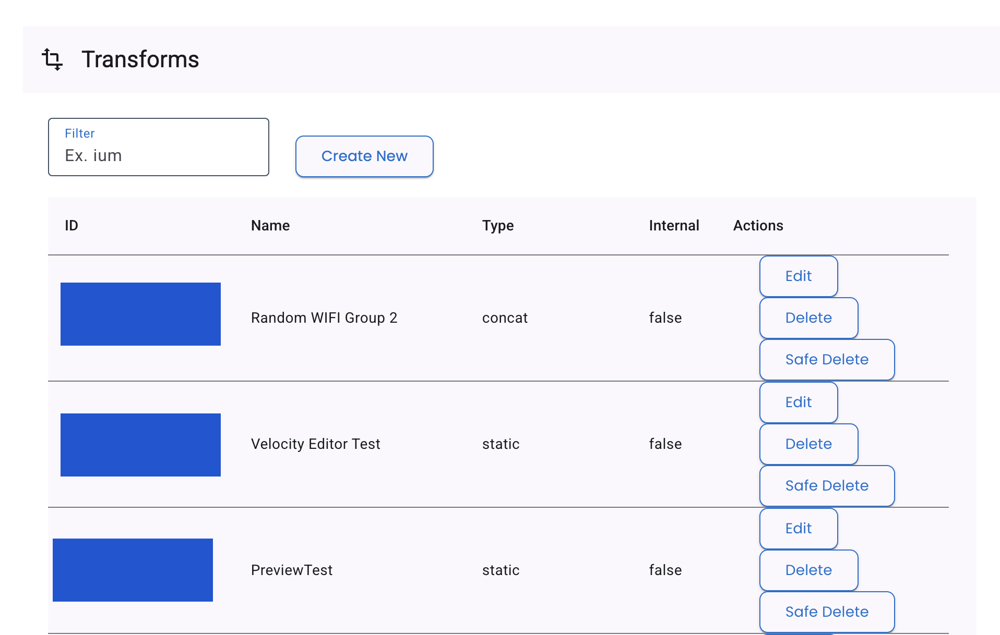
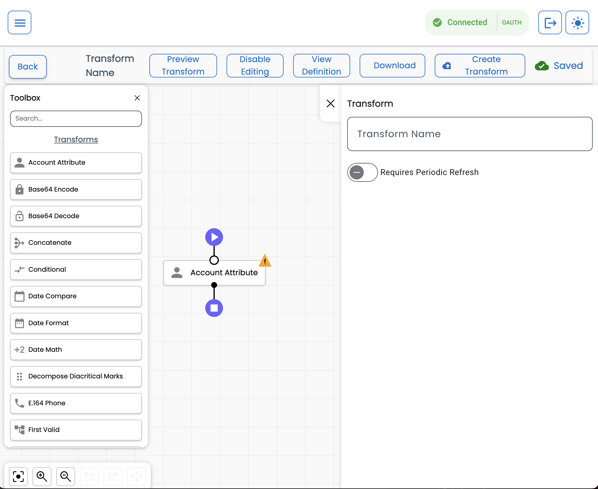
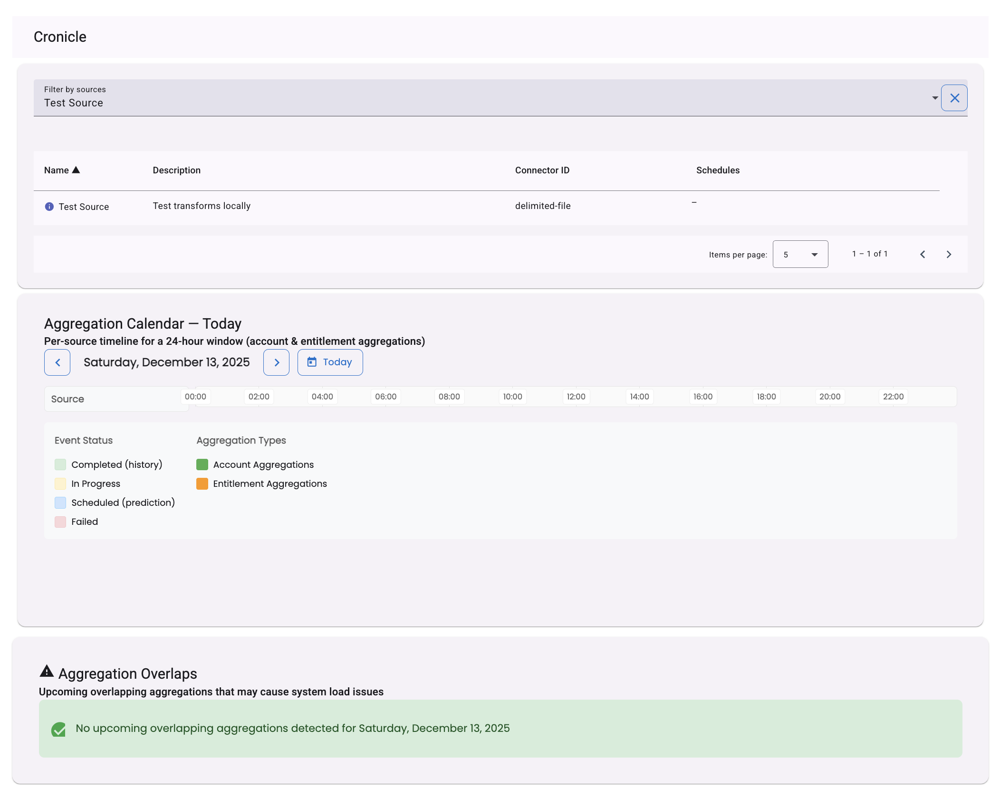

:::note
The new UI Development Kit is ALSO the Community Toolbox! You can download the Toolbox [here](https://github.com/sailpoint-oss/ui-development-kit/releases) and get started [here](https://developer.sailpoint.com/docs/tools/ui-development-kit/getting-started)!
:::

## Overview 

The SailPoint UI Development Kit is a project you can use to develop custom user interfaces that interact with Identity Security Cloud (ISC).

The UI Development Kit provides you with a framework you can use to build your own applications or processes on the ISC platform.

This document provides an overview of the main components in the UI Development Kit. 

You can find all the project's code in the UI Development Kit GitHub repository [here](https://github.com/sailpoint-oss/ui-development-kit) and the getting started guide [here](https://developer.sailpoint.com/docs/tools/ui-development-kit/getting-started). 

## Components

Component Selector

The Component Selector is a discovery and visualization tool. It allows you to expose available UI components in the main sidebar and explains how they are configured and rendred.

Transforms

The Transforms component lets you create and visualize [data transformations for Sailpoint](https://developer.sailpoint.com/docs/extensibility/transforms/). It allows data to be formatted, combined, filtered, and mapped into a UI-friendly format without embedding transformation logic directly into components. 

Theme Picker

The Theme Picker allows you to reate a custom theme for your deployment. See the Theming docs page [here](https://developer.sailpoint.com/docs/tools/ui-development-kit/theming) to learn how to theme your UI Development Kit.

Report Example

The Report Example visualizes analytics based on identity data. It shows statis distributions, manager distributions, and lifecycle states based on your dataset.

Identities

The Identities component lists all the users in your tenant. You can customize and view more inforation about each user with customizable columns.

Accounts

The Accounts component allows you to list all the accounts in your tenant. See the Accounts component docs page [here](https://developer.sailpoint.com/docs/tools/ui-development-kit/accounts-list) for more information about setting up this tool.

Cronicle

Cronicle visualizes scheduled, in progress, completed, and failed jobs based on the sources in your tenant.

Certification Management <em>(Community Developed)</em>

The Certification Management component allows you to visualize overviews of all campaigns and their progress, as well as view and manage all certifications.

Owner Graph

The Owner Graph component is a summary list of identities with the highest ownership count as well as identity and access analytics.

