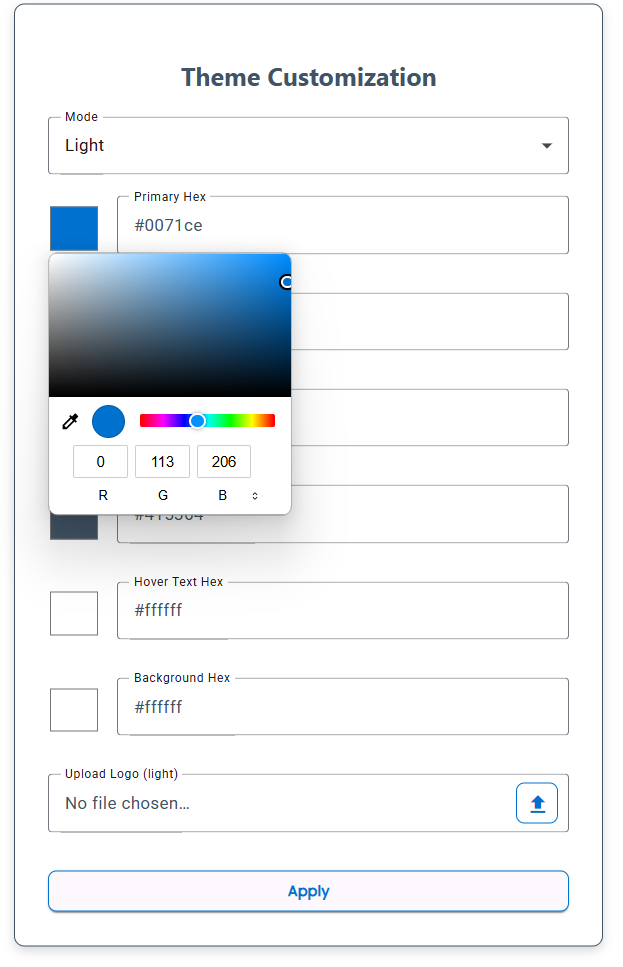

To create a custom theme for your deployment, use the config file and the theme config component:

## Using the theme component

Using the theme component, you can select colors for all the main objects on the UI such as the primary and secondary colors, as well as pick which logos will appear for dark and light mode. Once you have these changes made, the settings will be saved in your `appData/Roaming/sailpoint-ui-development-kit` and the app can be deployed with these settings deployed along with the app by using the [deployment guide](./deploying).

## Example Theme Component

