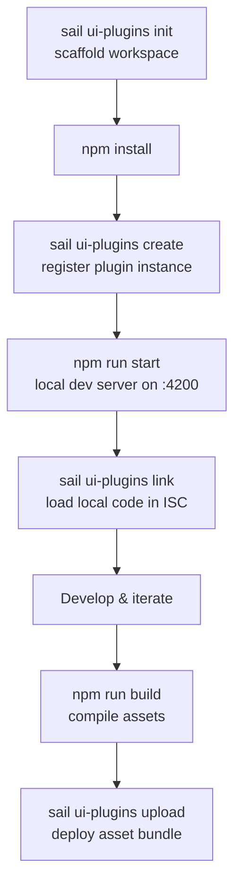

:::info Experimental feature

UI Plugins are an experimental capability that is under active development. The `sail ui-plugins` command group is hidden by default and must be enabled explicitly:

```bash
export SAIL_EXPERIMENTAL_UI_PLUGINS=1
```

Command behavior, the workspace manifest (`sp-ui-plugin.json`), and the backend API may change before general availability.

:::

## Overview

UI Plugins let you extend the Identity Security Cloud (ISC) user interface with your own custom web applications. Rather than building a separate app that lives outside the platform, a UI plugin is a micro-frontend that ISC loads directly into designated **slots** in its UI — so your custom experience runs inside ISC, using the tenant's session and honoring its security model.

A UI plugin is built with a standard web framework (the SailPoint starter template uses [Angular](https://angular.dev/)), compiled to static assets, and deployed to your tenant with the [SailPoint CLI](/docs/tools/cli). Once deployed, the plugin's assets are hosted immutably behind a CDN and rendered by ISC's plugin renderer (`sp-renderer`) in the slot the plugin declares.

```mdx-code-block
import DocCardList from '@theme/DocCardList';
import {useCurrentSidebarCategory} from '@docusaurus/theme-common';

<DocCardList items={useCurrentSidebarCategory().items}/>
```

## Key concepts

- **Plugin workspace** — a local project scaffolded by `sail ui-plugins init`. It contains your framework application plus a `sp-ui-plugin.json` manifest that describes the plugin to ISC.
- **Plugin instance** — the registration of your plugin in a tenant, created with `sail ui-plugins create`. Each instance has a tenant-unique **alias** and a generated **plugin instance ID** (a UUID).
- **Alias** — the tenant-unique, human-readable key for a plugin (for example, `access-request-plugin`). The alias is the deterministic lookup key the CLI uses to deploy to whichever tenant you are currently authenticated against, so the same commands can target staging and production without tracking environment-specific IDs.
- **Slot** — a designated extension point in the ISC UI that a plugin occupies (for example, `full-page`). A plugin declares the slots it fills in its manifest.
- **Asset bundle** — a set of compiled assets uploaded to a plugin instance with `sail ui-plugins upload`. The most recently uploaded bundle becomes the instance's active deployment.
- **Local dev link** — a per-developer override, created with `sail ui-plugins link`, that tells ISC to load your locally running dev server instead of the deployed assets. It affects only your own session.

## Development workflow

At a high level, building and deploying a UI plugin follows this lifecycle:



The [Create a plugin instance](/docs/ui-plugins/create-a-plugin-instance) walkthrough steps through this workflow end to end.

## Discuss

The most valuable resource for ISC developers is the SailPoint Developer Community itself, where ISC users and experts all over the world come together to ask questions and provide solutions.

To learn more about ISC extensibility and discuss it with SailPoint Developer Community members, go to the [SailPoint Developer Community Forum](https://developer.sailpoint.com/discuss/c/isc/6).
