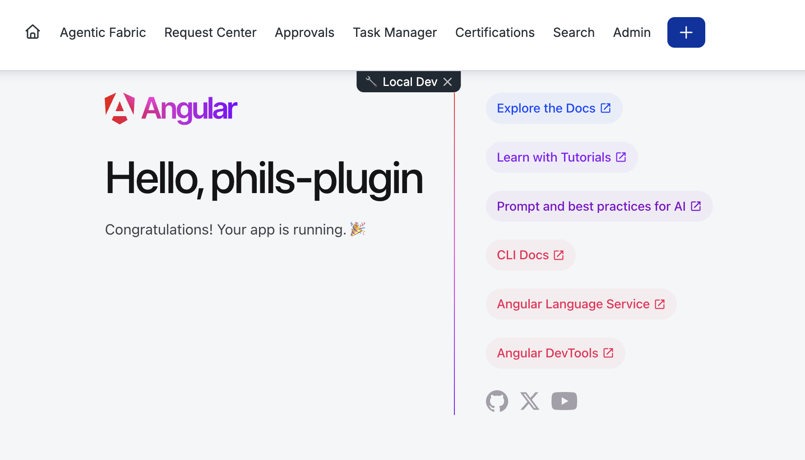
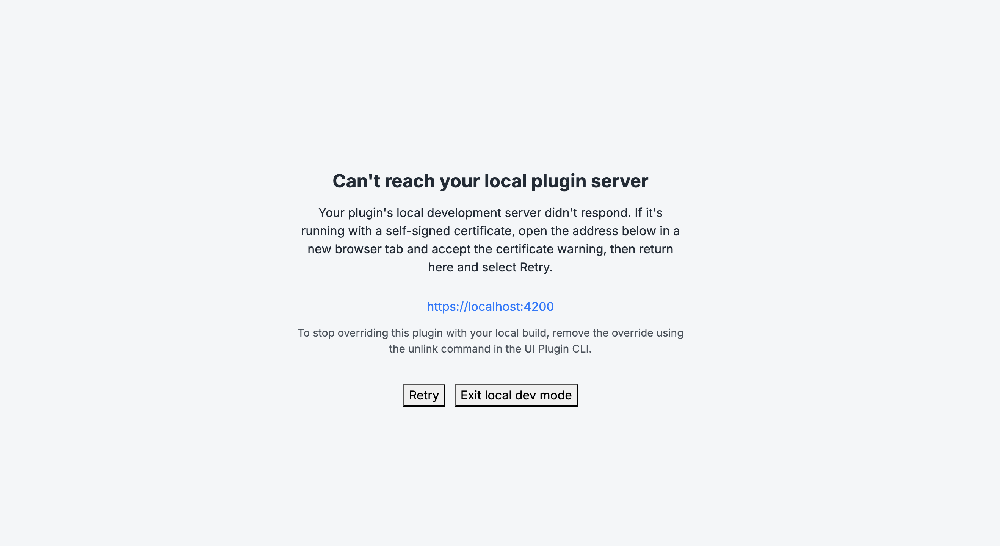
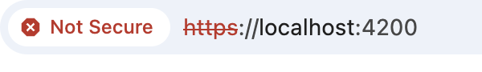
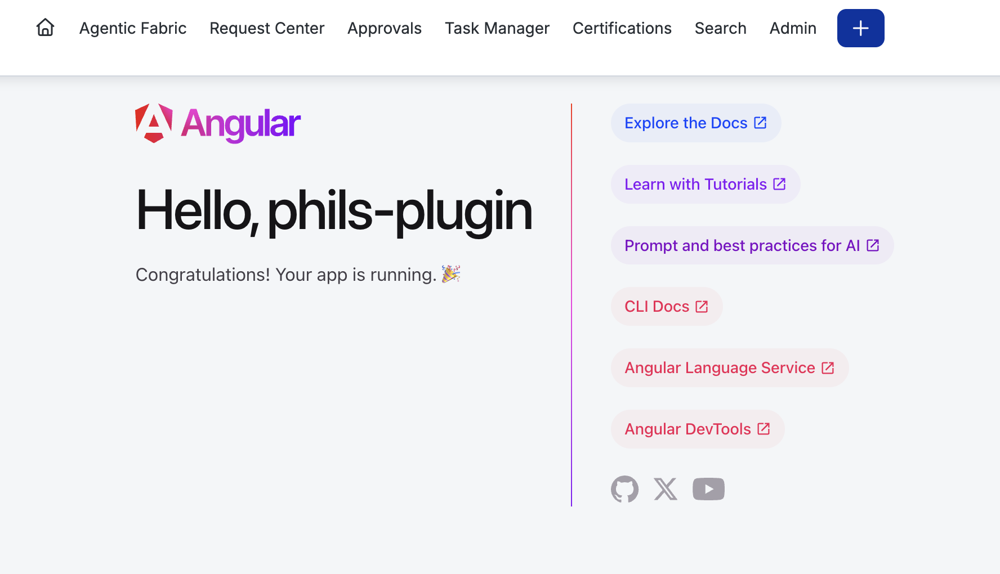

This walkthrough takes you from an empty directory to a UI plugin running in your Identity Security Cloud (ISC) tenant. You will scaffold a workspace, register a plugin instance, load your locally running code inside ISC, and finally deploy compiled assets.

Make sure you have completed the [prerequisites](/docs/ui-plugins/prerequisites), including enabling the experimental command group:

```bash
export SAIL_EXPERIMENTAL_UI_PLUGINS=1
```

:::note

Every command below assumes `SAIL_EXPERIMENTAL_UI_PLUGINS=1` is set in your shell. If it is not, the CLI reports that the command group is experimental and currently disabled.

:::

## Step 1: Scaffold a workspace with `init`

Run `init` to scaffold a new Angular plugin workspace from the SailPoint UI plugin templates. The command prompts for a display name and a tenant-unique alias (the alias defaults to a slug of the name), validates the alias against your tenant, then extracts the starter template into a new directory named after the alias.

```bash
sail ui-plugins init
```

```text
Plugin Name: phils-plugin
Plugin Alias [phils-plugin]:
2026/07/23 10:52:23 INFO Fetching template from GitHub owner=sailpoint-oss repo=ui-plugin-templates
2026/07/23 10:52:25 INFO Extracting subtree subdir=angular/starter dest=phils-plugin
2026/07/23 10:52:25 INFO Subtree extracted. dest=phils-plugin

Created plugin workspace "phils-plugin".

Next steps:
  cd phils-plugin
  npm install
  sail ui-plugins create
```

You can also run `init` without prompts by passing the name as a positional argument (and, optionally, an explicit alias):

```bash
sail ui-plugins init "Phils Plugin" --alias phils-plugin
```

:::tip Alias validation

`init` checks your alias against the tenant immediately. If the alias is already in use or invalid, the command tells you why and (in interactive mode) prompts you to pick a different one. Getting this right up front means `create` will not be rejected for a conflicting alias later.

:::

### What `init` created

The scaffold is a standard Angular workspace personalized with your alias and name. The important file for UI plugins is the workspace manifest, `sp-ui-plugin.json`:

```json
{
    "version": 1,
    "manifest": {
        "alias": "phils-plugin",
        "name": { "en": "phils-plugin" },
        "description": { "en": "phils-plugin" },
        "apiScopes": ["sp:scopes:all"],
        "contentSecurityPolicies": {},
        "permissionPolicy": {},
        "iframeAllow": {},
        "slots": [{ "slotId": "full-page" }]
    },
    "build": {
        "outDir": "./dist/phils-plugin/browser",
        "port": 4200
    }
}
```

- The `manifest` section is the payload sent to ISC when you register the plugin. It declares the `alias`, localized `name` and `description`, the API scopes the plugin needs, the required security policy objects, and the `slots` the plugin occupies.
- The `build` section is local CLI configuration only — it is **never** sent to the backend. `outDir` tells `upload` where the compiled assets live, and `port` is the default local dev server port used by `link`.

You can validate the manifest's structure at any time without touching the backend:

```bash
sail ui-plugins validate-manifest
```

## Step 2: Install dependencies

Move into the new workspace and install its dependencies:

```bash
cd phils-plugin
npm install
```

## Step 3: Register the plugin instance with `create`

`create` reads `sp-ui-plugin.json`, validates it locally, and sends the `manifest` section to your tenant to register a **plugin instance**. On success it prints the generated plugin instance ID and the alias.

```bash
sail ui-plugins create
```

```text
Created plugin instance 033b32b5-280f-4d78-a856-05c2a34d15d1 (alias: phils-plugin)
```

The plugin instance ID (a UUID) is the permanent identifier for this registration in the tenant. The alias remains your friendly, tenant-unique handle for it.

:::info Preview the payload first

Use `--dry-run` to validate the manifest, apply any visibility overrides, and print the exact payload that would be sent — without creating anything. It also performs a read-only alias availability check when possible:

```bash
sail ui-plugins create --dry-run
```

You can also restrict who can see the plugin. `--private` limits it to your own identity on every slot, and `--restrict-to-users <guid,guid>` limits it to specific users. These are useful while a plugin is still in development.

:::

## Step 4: Start the local dev server

To develop against ISC, you need your plugin running locally. In a **separate terminal**, start the Angular dev server from the workspace directory:

```bash
npm run start
```

This serves your plugin on port `4200` (the `build.port` value in the manifest) and keeps rebuilding as you edit. Leave it running.

:::caution

`link` (the next step) does not start your dev server for you — it only tells ISC where to find it. The dev server must already be running on the port you link, or ISC will have nothing to load.

:::

## Step 5: Load your local code in ISC with `link`

`link` registers your running dev server with the plugin instance as a **per-developer override**. It binds your dev server port to your own identity, so ISC loads your local code only for you — it does not affect the deployed plugin or other developers.

```bash
sail ui-plugins link
```

```text
Plugin phils-plugin linked to port 4200
To load your local plugin in ISC navigate to:
https://<tenant>/ui/plugin/033b32b5-280f-4d78-a856-05c2a34d15d1?spPluginDev=phils-plugin
```

Open the printed URL in your browser. ISC's plugin renderer verifies the override and, if you are authorized, loads your local code live in the tenant with a **Local Dev** badge. Because your dev server is still running, changes you make locally appear when you refresh.



:::caution Can't reach your local plugin server?

If ISC shows a "Can't reach your local plugin server" page, your dev server either isn't running or is serving over a self-signed certificate your browser hasn't accepted yet.



Make sure `npm run start` is running, then open the dev server address (for example, `https://localhost:4200`) in a new browser tab and accept the certificate warning — the browser will flag it as **Not Secure**, which is expected for local development.



Once the certificate is accepted, return to the ISC tab and select **Retry**.

:::

The port is resolved in this order: the `--port` flag, then `build.port` from the manifest, then the default (`4200`). To point ISC at a different port, pass `--port`:

```bash
sail ui-plugins link --port 4300
```

When you are done developing locally, remove the override so ISC goes back to serving the deployed plugin:

```bash
sail ui-plugins unlink
```

```text
Removed the local dev link for plugin "phils-plugin"
```

Unlinking is idempotent — it is safe to run whether or not a link currently exists.

## Step 6: Build and deploy with `upload`

When you are ready to deploy, compile the plugin with its native tooling, then upload the result. `upload` is a deploy step, not a build step — it uploads whatever is already in the build output directory and never runs your framework's build for you.

First, build the assets:

```bash
npm run build
```

```text
Output location: .../phils-plugin/dist/phils-plugin
```

Then upload the compiled assets. The command reads `build.outDir` from the manifest to find them:

```bash
sail ui-plugins upload
```

```text
Uploaded 5 asset(s) to plugin "phils-plugin" (bundle 88610c07-b1fe-42d8-98c5-01703efd7cf7)
The plugin can be viewed at:
https://<tenant>/ui/plugin/033b32b5-280f-4d78-a856-05c2a34d15d1
```

The uploaded assets become the plugin instance's **active asset bundle**, hosted immutably behind the CDN. Open the printed URL to see the deployed plugin — note that it renders without the **Local Dev** badge, because ISC is now serving the uploaded assets rather than your local dev server.



:::caution Build before you upload

If you run `upload` before building, the CLI fails fast because the output directory does not exist:

```text
Error: output directory ./dist/phils-plugin/browser does not exist
```

Run `npm run build` first, then upload.

:::

:::tip Write once, deploy anywhere

The workspace `alias` is the deterministic lookup key for the plugin instance, so `upload` deploys to whichever tenant your CLI is currently authenticated against. Run it while authenticated to staging to update the staging instance, then switch your CLI environment to production and run the identical command to update production — no environment-specific plugin IDs to track.

:::

## Manage your plugins

List every plugin instance registered in the current tenant:

```bash
sail ui-plugins list
```

Delete a plugin instance by alias or plugin ID (you are prompted to confirm):

```bash
sail ui-plugins delete phils-plugin
```

## Next steps

- Explore every command and its flags in the [CLI command reference](/docs/ui-plugins/cli-command-reference).
- Review the full [`sp-ui-plugin.json` manifest](/docs/ui-plugins/cli-command-reference#the-sp-ui-pluginjson-manifest) contract.
