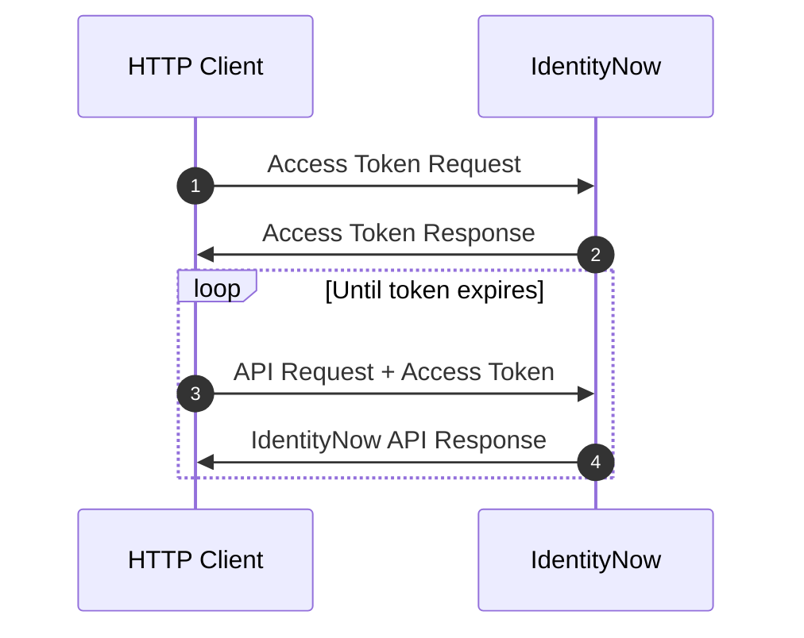
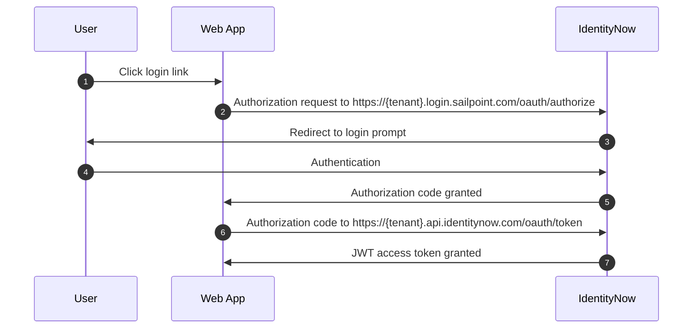

import Tabs from '@theme/Tabs'; import TabItem from '@theme/TabItem';

## Overview

With SailPoint's IdentityNow (IDN) APIs, you can extend your IDN platform far beyond its current capabilities. 
	
To be able to do so, you must first authenticate to the IDN APIs. 
Authentication is the act of validating a user's identity, generally by passing some kind of credentials. 
A fast, simple way to authenticate to the APIs is to generate a [personal access token](#generate-a-personal-access-token) and pass that token. 

If the PAT is valid, the API responds with a JSON Web Token (JWT) `access_token` that you can provide to authorize your API requests. 
Authorization is the act of validating the user's permission to access a given resource. 
A successful API request must include the `access_token` in the `Authorization` request header. 

This JWT `access_token` grants access matching that of the user who generated the PAT. 
For example, if the user who generated the PAT is an admin, the returned JWT `access_token` would grant admin access to the APIs. 

This diagram shows the flow of this authentication/authorization process: 

<div align="center">



</div>

The flow involves these four key steps: 
1. **Access Token Request**: The HTTP client (a script, application, Postman, cURL, etc.) makes a request to IDN to get a JWT `access_token`.  
2. **Access Token Response**: If the request is valid, IDN responds to the HTTP client with a JWT `access_token`. 
3. **API Request**: The HTTP client makes a request to an IDN endpoint with the header, `Authorization: Bearer {access_token}`. 
4. **API Response**: If both the request itself and the JWT `access_token` in its header are valid, IDN responds to the client. 
If you encounter unexpected errors, refer to the [Troubleshooting](#troubleshooting) section of this document. 

The idea is that once you have authenticated to the IDN APIs and you have received an `access_token`, you can use that `access_token` to provide authorization for your API requests. 

This document includes all the information you need to know to engage in this authentication/authorization process, as well as a guide on how to get started. 

## Get started

Read this guide to learn how to authenticate to SailPoint's IDN APIs. 

To authenticate to the IDN APIs, you must be able to connect to your tenant to send the access token request. 
To do so, you need to do the following: 
1. [Find your tenant's OAuth details](#find-your-tenant's-oauth-details)
2. [Generate personal access token](#generate-personal-access-token)
3. [Choose authorization grant flow](#choose-authorization-grant-flow)
4. [Request access token](#request-access-token-with-client-credentials-grant-flow)

### Find your tenant's OAuth details

Your tenant's OAuth details refer to the details you need to know to connect it to the APIs. 
You need to know your tenant's name, its `authorizeEndpoint` URL, and its `tokenEndpoint` URL. 

Your IDN instance is likely using the domain name supplied by SailPoint (`{tenant}.api.identitynow.com`), in which case, the tenant name is in the URL. 
This is assumed to be the case in this guide.  
However, if your IDN instance is using a vanity URL, you must enter this URL into your browser to get your OAuth info:
`https://{tenant}.api.identitynow.com/oauth/info`

If you have admin access but don't know your tenant name, you can learn it by following these steps: 
1. Log into your IDN instance.
2. Select the 'Dashboard' dropdown. 
3. Select 'Overview'. 
4. Find the tenant name ('Org Name') in the dashboard's `Org Details` section. 

This is an example of the OAuth details of the tenant, "iga-acme-sb": 

```json
{
  "tenantId": "cc31a307-8a8d-49e8-93b9-c7cbe20e2e6b",
  "tenantName": "iga-acme-sb",
  "authorizeEndpoint": "https://iga-sb.login.sailpoint.com/oauth/authorize",
  "tokenEndpoint": "https://iga-sb.api.identitynow.com/oauth/token",
  "cloudDomainUrl": "https://iga-sb.acme.com",
  "logoutUrl": "https://iga-sb.acme.com/logout",
  "pod": "stg01-useast1"
}
```

You can use the `authorizeEndpoint` and `tokenEndpoint` URLs from this example to test out the different authentication methods listed in this guide. 

### Generate a personal access token 

A personal access token (PAT) is a method of authenticating to an API as a user without providing a username and password.
PATs are primarily used in scripts or programs that lack an easy way to implement an OAuth2 flow but need to call API endpoints that require user context. 
PATs are also convenient for use in tools like [Postman](https://www.postman.com/) when you are exploring and testing the APIs. 

Any IDN user can generate a PAT. 
To do so, follow these steps: 
1. Select **Preferences** from the drop-down menu under your username, then **Personal Access Tokens** on the left. 
You can also go directly to the page by using this URL (replace `{tenant}` with your IdentityNow tenant): `https://{tenant}.identitynow.com/ui/d/user-preferences/personal-access-tokens`

2. Click **New Token** and enter a meaningful description to help differentiate the token from others.

:::caution

The **New Token** button will be disabled when you reach the limit of 10 personal access tokens per user. 
To avoid reaching this limit, it is recommended that you delete any tokens that are no longer necessary.

:::

3. Click **Create Token** to generate and view the two components that comprise the token: the `Client ID` and the `Client Secret`.

:::danger Important

After you create the token, the value of the `Client ID` will be visible in the Personal Access Tokens list, but the corresponding `Secret` will not be visible after you close the window. Store the `Secret` somewhere secure.

:::

4. Copy both values somewhere that will be secure and accessible to you when you need to use the the token.

To generate a personal access token from the API, use the [create personal access token endpoint](/idn/api/beta/create-personal-access-token).

Once you have created the PAT and you know its `Client ID` and `Client Secret`, you have everything you need to follow the [Client Credentials Grant Flow](#request-access-token-with-client-credentials-grant-flow) and use the PAT to generate an `access_token`. 
You will need this `access_token` to authenticate your requests to the APIs. 

### Choose authorization grant flow

There are several different authorization flows that OAuth 2.0 supports, and each has a grant-type defining its different use cases. 
You must choose the one that best serves your purposes. 
This document covers these three common flows: 

1. [**Client Credentials**](https://oauth.net/2/grant-types/client-credentials/) - Clients use this grant type to obtain a JWT `access_token` without user involvement such as scripts, programs or system to system integration.
2. [**Authorization Code**](https://oauth.net/2/grant-types/authorization-code/) - Clients use this grant type to exchange an authorization code for an `access_token`. Authorization codes are mainly used by web applications because there is a login into IDN with a subsequent redirect back to the web application/client.
3. [**Refresh Token**](https://oauth.net/2/grant-types/refresh-token/) - Clients use this grant type to exchange a refresh token for a new `access_token` when the existing `access_token` has expired. This allows clients to continue using the APIs without having to re-authenticate as frequently. This grant type is commonly used together with `Authorization Code` to prevent a user from having to log in several times per day.

One way to determine which authorization flow you need to use is to look at the specification for the endpoint you want to use. 
The endpoint will have the supported OAuth flows listed under the 'Authorization' dropdown, like the [List Access Profiles endpoint](https://developer.sailpoint.com/idn/api/beta/list-access-profiles):


For more information about how to choose the best grant flow for your use case, refer to [Grant Flow Use Cases](#grant-flow-use-cases)

The guide will detail the three different authorization grant flows you can use to request the access token you need to authenticate your requests. 

### Request access token with client credentials grant flow 

Clients use the 'Client Credentials' grant type to obtain access tokens without user involvement. This is the simplest authentication flow.

API endpoints that require [user level permissions](https://documentation.sailpoint.com/saas/help/common/users/user_level_matrix.html) require the use of Personal access tokens (PATs). Correspondingly, the endpoints a personal access token (PAT) can call depends on the permissions of the user who generated it and the configuration of IDN.

Note: If an API Key is used then IDN API calls are made outside of the context of a user and some API calls will not work.

An OAuth 2.0 client using the client credentials grant flow must have `CLIENT_CREDENTIALS` as one of its grantTypes (PATs are implicitly granted the `CLIENT_CREDENTIALS` grant type):

```json
{
 "enabled": true,
 "created": "2019-05-23T02:06:20.685Z",
 "name": "My Application",
 "description": "My Application",
 "id": "b61429f5-203d-494c-94c3-04f54e17bc5c",
 "secret": null,
 "grantTypes": [
  "CLIENT_CREDENTIALS"
 ],
 ...
}
```

This is the overall authorization flow:

1. The client first submits an OAuth 2.0 token request to IDN in this form:
  
```text
POST https://{tenant}.api.identitynow.com/oauth/token
```
  
The request includes the client credential information passed in the request body, as shown in this example using [Postman](https://www.getpostman.com): 


This example shows how to pass the information with form-data in the request body. You can also use these options to pass in the information: 

- Use x-www-form-urlencoded data to pass in the client credential information in the request body. 
- Use query parameters to pass the information in the request URL. The request URL will look like this: 
  ```text
  https://{tenant}.api.identitynow.com/oauth/token?grant_type=client_credentials&client_id={{clientId}}&client_secret={{clientSecret}}
  ```
- If you are using Postman, you can use the 'Authorization' tab to pass in the client credentials. If you use this option, you must also specify the access token URL: https://{tenant}.api.identitynow.com/oauth/token

The OAuth 2.0 token request must include this information: 

| Key | Description |
| --- | --- |
| `grant_type` | This is set to `CLIENT_CREDENTIALS` for the authorization code grant type. |
| `client_id` | This is the API client's ID (e.g. `b61429f5-203d-494c-94c3-04f54e17bc5c`). You can generate this ID at `https://{tenant}.identitynow.com/ui/admin/#admin:global:security:apimanagementpanel`, or you can generate it when you create a PAT. |
| `client_secret` | This is the API client's secret describing (e.g. `c924417c85b19eda40e171935503d8e9747ca60ddb9b48ba4c6bb5a7145fb6c5`). You can generate this secret at `https://{tenant}.identitynow.com/ui/admin/#admin:global:security:apimanagementpanel`, or you can generate it when you create a PAT. |

This example cURL command passes client credentials in the body as form-data to generate an access token:

```bash
curl --location 'https://{tenant}.api.identitynow.com/oauth/token' \
--header 'scope: sp:scope:all' \
--form 'grant_type="client_credentials"' \
--form 'client_id="{clientId}"' \
--form 'client_secret="{clientSecret}"'
```

2. IDN validates the token request and responds. 
If the request is successful, the response contains a JWT access token. 
For more information about the JWT access token in the response, refer to [#OAuth-token-response](#oauth-token-response).

Once you have the JWT access token, you can pass the token as a basic "Authorization" header in your requests using the OAuth endpoints. 

To learn more about the OAuth client credentials grant flow, refer [here](https://oauth.net/2/grant-types/client-credentials/). 

### Request access token with authorization code grant flow 

Further Reading: [https://oauth.net/2/grant-types/authorization-code/](https://oauth.net/2/grant-types/authorization-code/)

Clients use this grant type to exchange an authorization code for an `access_token`. 
This is mainly used for web apps because there is a login into IDN with a subsequent redirect back to the web app/client.

The OAuth 2.0 client you are using must have `AUTHORIZATION_CODE` as one of its grant types. 
The redirect URLs must also match the list in the client as well:

```json
{
 "enabled": true,
 "created": "2019-05-23T02:06:20.685Z",
 "name": "My Application",
 "description": "My Application",
 "id": "b61429f5-203d-494c-94c3-04f54e17bc5c",
 "secret": null,
 "grantTypes": [
  "AUTHORIZATION_CODE"
 ],
 "redirectUris": [
  "http://localhost:8080/myApp/code"
 ],
 ...
}
```

<br></br>

The authorization code grant flow looks a little different because it involves the exchange of the access token and authorization code. 

This diagram shows the authorization code grant flow: 

<div align="center">



</div>

This is the overall authorization flow:

1. The user clicks the login link on a web app.

2. The web app sends an authorization request to IDN in this form:

```Text
GET https://{tenant}.login.sailpoint.com/oauth/authorize?client_id={client-id}&client_secret={client-secret}&response_type=code&redirect_uri={redirect-url}
```

3. IDN redirects the user to a login prompt to authenticate to IdentityNow.

4. The user authenticates to IDN.

5. Once authentication is successful, IDN issues an authorization code back to the web app.

6. The web app submits an OAuth 2.0 token request to IDN in this form:

```text
POST https://{tenant}.api.identitynow.com/oauth/token?grant_type=authorization_code&client_id={client-id}&client_secret={client-secret}&code={code}&redirect_uri={redirect-url}
```

:::info

The token endpoint URL is `{tenant}.api.identitynow.com`, and the authorize URL is `{tenant}.identitynow.com`. Be sure to use the correct URL when you're setting up your webapp to use this flow.

:::

7. IDN validates the token request and submits a response. If the request is successful, the response contains a JWT `access_token`.
For more information about the JWT access token in the response, refer to [#OAuth-token-response](#oauth-token-response).

These are the query parameters in the OAuth 2.0 token request for the authorization code grant:

| Key | Description |
| --- | --- |
| `grant_type` | Set this to `authorization_code` for the authorization code grant type. |
| `client_id` | This is the client ID for the API client (e.g. `b61429f5-203d-494c-94c3-04f54e17bc5c`). This can be generated at `https://{tenant}.identitynow.com/ui/admin/#admin:global:security:apimanagementpanel` |
| `client_secret` | This is the client secret for the API client (e.g. `c924417c85b19eda40e171935503d8e9747ca60ddb9b48ba4c6bb5a7145fb6c5`). This can be generated at `https://{tenant}.identitynow.com/ui/admin/#admin:global:security:apimanagementpanel` |
| `code` | This is a code returned by `/oauth/authorize`. |
| `redirect_uri` | This is the application URL to redirect to once the token has been granted. |

Here is an example OAuth 2.0 token request for the authorization code grant type.

```bash
curl -X POST \
 'https://example.api.identitynow.com/oauth/token?grant_type=authorization_code&client_id=b61429f5-203d-494c-94c3-04f54e17bc5c&client_secret=c924417c85b19eda40e171935503d8e9747ca60ddb9b48ba4c6bb5a7145fb6c5&code=6688LQJB0y652z6ZjFmkCKuBUjv2sTIqKS2JthWrZ7qlPgI9TClJ6FnpweEhO6w7&redirect_uri=https://myappdomain.com/oauth/redirect' \
 -H 'cache-control: no-cache'
 
```

Once you have the JWT access token, you can pass the token as a basic "Authorization" header in your requests using the OAuth endpoints. 

For more information about the OAuth authorization code grant flow, refer [here](https://oauth.net/2/grant-types/authorization-code/).

### Request access token with refresh token grant flow 

Clients use this grant type in order to exchange a refresh token for a new `access_token` once the existing `access_token` has expired. This allows clients to continue to have a valid `access_token` without the need for the user to login as frequently.

The OAuth 2.0 client you are using must have `REFRESH_TOKEN` as one of its grant types, and you would typically use this type in conjunction with another grant type, like `CLIENT_CREDENTIALS` or `AUTHORIZATION_CODE`:

```json
{
 "enabled": true,
 "created": "2019-05-23T02:06:20.685Z",
 "name": "My Application",
 "description": "My Application",
 "id": "b61429f5-203d-494c-94c3-04f54e17bc5c",
 "secret": null,
 "grantTypes": [
  "REFRESH_TOKEN",
  "AUTHORIZATION_CODE"
 ],
 ...
}
```

This is the overall authorization flow:

1. The client application receives an `access_token` and a `refresh_token` from one of the other OAuth grant flows, like `AUTHORIZATION_CODE`.
2. The client application detects that the `access_token` is about to expire, based on the `expires_in` attribute contained within the JWT token.
3. The client submits an OAuth 2.0 token request to IDN in this form:

```text
POST https://{tenant}.api.identitynow.com/oauth/token?grant_type=refresh_token&client_id={client_id}&client_secret={client_secret}&refresh_token={refresh_token}
```

4. IDN validates the token request and submits a response. If the request is successful, the response contains a new `access_token` and `refresh_token`.

These are the query parameters in the OAuth 2.0 token request for the refresh token grant flow:

| Key | Description |
| --- | --- |
| `grant_type` | Set to `refresh_token` for the authorization code grant type. |
| `client_id` | This is the client ID for the API client (e.g. `b61429f5-203d-494c-94c3-04f54e17bc5c`). This can be generated at `https://{tenant}.identitynow.com/ui/admin/#admin:global:security:apimanagementpanel`. |
| `client_secret` | This is the client secret for the API client (e.g. `c924417c85b19eda40e171935503d8e9747ca60ddb9b48ba4c6bb5a7145fb6c5`). This can be generated at `https://{tenant}.identitynow.com/ui/admin/#admin:global:security:apimanagementpanel`. |
| `refresh_token` | This is the `refresh_token` that was provided along with the now expired `access_token`. |

Here is an example call OAuth 2.0 Token Request for the Refresh Token grant.

```bash
curl -X POST \
 'https://example.api.identitynow.com/oauth/token?grant_type=refresh_token&client_id=b61429f5-203d-494c-94c3-04f54e17bc5c&client_secret=c924417c85b19eda40e171935503d8e9747ca60ddb9b48ba4c6bb5a7145fb6c5&refresh_token=ey...4M' \
 -H 'cache-control: no-cache'
```

Once you have the `refresh_token`, you can pass the `refresh_token` as a basic "Authorization" header in your requests using the OAuth endpoints, allowing your requests to continue to succeed without being affected by the expired `access_token`. 

For more information about the OAuth refresh token grant flow, refer [here](https://oauth.net/2/grant-types/refresh-token/). 

### OAuth token response

A successful request using any of the grant flows to `https://{tenant}.api.identitynow.com/oauth/token` will contain a response body like this:

```json
{
  "access_token": "eyJhbGciOiJIUzI1NiIsInR5cCI6IkpXVCJ9.eyJ0ZW5hbnRfaWQiOiI1OGViMDZhNC1kY2Q3LTRlOTYtOGZhYy1jY2EyYWZjMDNlNjEiLCJpbnRlcm5hbCI6ZmFsc2UsInBvZCI6ImNvb2siLCJvcmciOiJuZWlsLXRlc3QiLCJpZGVudGl0eV9pZCI6ImZmODA4MTgxNTVmZThjMDgwMTU1ZmU4ZDkyNWIwMzE2IiwidXNlcl9uYW1lIjoic2xwdC5zZXJ2aWNlcyIsInN0cm9uZ19hdXRoIjp0cnVlLCJhdXRob3JpdGllcyI6WyJPUkdfQURNSU4iXSwiZW5hYmxlZCI6dHJ1ZSwiY2xpZW50X2lkIjoiZmNjMGRkYmItMTA1Yy00Y2Q3LWI5NWUtMDI3NmNiZTQ1YjkwIiwiYWNjZXNzVHlwZSI6Ik9GRkxJTkUiLCJzdHJvbmdfYXV0aF9zdXBwb3J0ZWQiOmZhbHNlLCJ1c2VyX2lkIjoiNTk1ODI2Iiwic2NvcGUiOlsicmVhZCIsIndyaXRlIl0sImV4cCI6MTU2NTg5MTA2MywianRpIjoiOTQ5OWIyOTktOTVmYS00N2ZiLTgxNWMtODVkNWY2YjQzZTg2In0.zJYfjIladuGHoLXr92EOJ3A9qGNkiG5UJ9eqrtSYXAQ",
  "token_type": "bearer",
  "refresh_token": "eyJhbGciOiJIUzI1NiIsInR5cCI6IkpXVCJ9.eyJ0ZW5hbnRfaWQiOiI1OGViMDZhNC1kY2Q3LTRlOTYtOGZhYy1jY2EyYWZjMDNlNjEiLCJpbnRlcm5hbCI6ZmFsc2UsInBvZCI6ImNvb2siLCJvcmciOiJuZWlsLXRlc3QiLCJpZGVudGl0eV9pZCI6ImZmODA4MTgxNTVmZThjMDgwMTU1ZmU4ZDkyNWIwMzE2IiwidXNlcl9uYW1lIjoic2xwdC5zZXJ2aWNlcyIsInN0cm9uZ19hdXRoIjp0cnVlLCJhdXRob3JpdGllcyI6WyJPUkdfQURNSU4iXSwiZW5hYmxlZCI6dHJ1ZSwiY2xpZW50X2lkIjoiZmNjMGRkYmItMTA1Yy00Y2Q3LWI5NWUtMDI3NmNiZTQ1YjkwIiwiWYNjZXNzVHlwZSI6Ik9GRkxJTkUiLCJzdHJvbmdfYXV0aF9zdXBwb3J0ZWQiOmZhbHNlLCJ1c2VyX2lkIjoiNTk1ODI2Iiwic2NvcGUiOlsicmVhZCIsIndyaXRlIl0sImF0aSI6Ijk0OTliMjk5LTk1ZmEtNDdmYi04MTVjLTg1ZDVmNmI0M2U4NiIsImV4cCI6MTU2NTk3NjcxMywianRpIjoiODliODk1ZDMtNTdlNC00ZDAwLWI5ZjctOTFlYWVjNDcxMGQ3In0.pfDcB0sGChdHk-oDNmiIxsKFLxq9CcPQV5-eXWgIcp4",
  "expires_in": 749,
  "scope": "read write",
  "accessType": "OFFLINE",
  "tenant_id": "58eb06a4-dcd7-4e96-8fac-cca2afc03e61",
  "internal": false,
  "pod": "cook",
  "strong_auth_supported": false,
  "org": "example",
  "user_id": "595826",
  "identity_id": "ff80818155fe8c080155fe8d925b0316",
  "strong_auth": true,
  "enabled": true,
  "jti": "9499b299-95fa-47fb-815c-85d5f6b43e86"
}
```

You can use the JWT `access_token` to authorize REST API calls through the IDN API gateway. 
To use the `access_token`, simply include it in the `Authorization` header as a `Bearer` token. 
This is an example V3 API request that has the access token in the header:

```bash
curl -X GET \
 'https://{tenant}.api.identitynow.com/v3/account-activities' \
 -H 'Authorization: Bearer {access_token}' \
 -H 'cache-control: no-cache'
```

Some of the other values can also be useful to know: 
- The `expires_in` value describes the lifetime, in seconds, of the `access_token`. 
For example, the value 749 means that the `access_token` will expire 12.5 minutes from the time the response was generated. 
The exact expiration date is also contained within the `access_token`. 
You can view this expiration time by decoding the JWT `access_token` using a tool like [jwt.io](https://jwt.io/).

- The `refresh token` exists for use in the refresh token grant flow to replace the `access_token` when it expires. 
However, the `refresh_token` will only be present if the API client has the `REFRESH_TOKEN` grant flow.

- The `user_id` and `identity_id` define the identity context of the person who authenticated. 
However, these values aren't set for the client credentials grant type because it doesn't have a user context.

With the JWT `access_token`, you can now successfully send authenticated IDN API requests. To learn more about authorization and the scopes you can apply to further control access to the APIs, refer to [Authorization](/idn/api/authorization). 

## More Information

This section of the document includes additional information about the authentication/authorization process, including some different use cases for the different authorization grant flows. 

### OAuth 2.0 
The SailPoint authentication/authorization model is fully [OAuth 2.0](https://oauth.net/2/) compliant. 
[OAuth 2.0](https://oauth.net/2/) is an industry-standard protocol for authorization. 
It provides a variety of authorization flows for web applications, desktop applications, mobile phones, and devices. 
This specification and its extensions are developed within the [IETF OAuth Working Group](https://www.ietf.org/mailman/listinfo/oauth).

### JSON Web Token
The issued JWT `access_token` leverages the [JSON Web Token (JWT)](https://jwt.io/) standard. 
JWT is an industry-standard protocol for creating access tokens which assert various claims about the resource who has authenticated. 
The tokens have a specific structure consisting of a header, payload, and signature.

A raw JWT might look like this:

```text
eyJhbGciOiJIUzI1NiIsInR5cCI6IkpXVCJ9.eyJ0ZW5hbnRfaWQiOiI1OGViMDZhNC1kY2Q3LTRlOTYtOGZhYy1jY2EyYWZjMDNlNjEiLCJpbnRlcm5hbCI6dHJ1ZSwicG9kIjoiY29vayIsIm9yZyI6ImV4YW1wbGUiLCJpZGVudGl0eV9pZCI6ImZmODA4MTgxNTVmZThjMDgwMTU1ZmU4ZDkyNWIwMzE2IiwidXNlcl9uYW1lIjoic2xwdC5zZXJ2aWNlcyIsInN0cm9uZ19hdXRoIjp0cnVlLCJhdXRob3JpdGllcyI6WyJPUkdfQURNSU4iXSwiY2xpZW50X2lkIjoibktCUE93akpIOExYU2pJbCIsInN0cm9uZ19hdXRoX3N1cHBvcnRlZCI6dHJ1ZSwidXNlcl9pZCI6IjU5NTgyNiIsInNjb3BlIjpbInJlYWQiLCJ3cml0ZSJdLCJleHAiOjE1NjU4ODgzMTksImp0aSI6ImM5OGQxMjM2LTQ1MTMtNGM4OS1hMGQwLTBjYjlmMzI3NmI1NiJ9.SAY4ZQkXGi2cY_qz57Ah9_zDq4-bnF-oDJKotXa-LCY
```

If you were to decode the access token data, it might look something like this:

<Tabs>
  <TabItem value="header" label="Header" default>

```json
{
  "alg": "HS256",
  "typ": "JWT"
}
```

  </TabItem>
  <TabItem value="payload" label="Payload">

```json
{
  "tenant_id": "58eb06a4-dcd7-4e96-8fac-cca2afc03e61",
  "internal": true,
  "pod": "cook",
  "org": "example",
  "identity_id": "ff80818155fe8c080155fe8d925b0316",
  "user_name": "slpt.services",
  "strong_auth": true,
  "authorities": ["ORG_ADMIN"],
  "client_id": "nKBPOwjJH8LXSjIl",
  "strong_auth_supported": true,
  "user_id": "595826",
  "scope": ["read", "write"],
  "exp": 1565888319,
  "jti": "c98d1236-4513-4c89-a0d0-0cb9f3276b56"
}
```

  </TabItem>
  <TabItem value="signature" label="Signature">

```text
HMACSHA256(
base64UrlEncode(header) + "." +
base64UrlEncode(payload),
{secret}
)
```

  </TabItem>
</Tabs>

You can check the JWT access token data online at [jwt.io](https://jwt.io).

### Grant flow use cases

This section describes some different use cases and which grant flow you would want to use for the different cases. 

#### Daily work or quick actions

For daily work or short, quick administrative actions, you can just use a PAT. This makes the process easier because you don't really need to worry about grant types - you can easily generate a PAT in the user interface (UI).

Follow these steps to do so: 
1. Log in to IDN.
2. Go to 'Preferences', then 'Personal Access Tokens', and [generate a PAT](#generate-a-personal-access-token). 
3. The PAT's `client_id` and `client_secret` provide the necessary authentication to send API requests, without any grant flow. 

#### Postman
[Postman](https://www.postman.com/) is a popular HTTP client you can use to design, build, test, and iterate your APIs. Postman users and teams can create public workspaces they can use to make it easy to access their API collections and environments and get started. SailPoint maintains a [public workspace for the IdentityNow API collections](https://www.postman.com/sailpoint/workspace/identitynow). You can use this workspace to access all the IDN API collections and stay up to date.

If you're using Postman, you have some different ways to set up your authorization. 
You can just leverage the accessToken as mentioned above, or you can configure Postman to use OAuth 2.0 directly.
For more information about how to do so, refer [here](https://learning.postman.com/docs/sending-requests/authorization/). 

#### Web applications 
If you are making a web application, the best grant flow to use is the [Authorization Code grant flow](#request-access-token-with-authorization-grant-flow). This will allow users to be directed to IDN to login and then redirected back to the web application through a URL redirect. This also works well with Single Sign-on (SSO), strong authentication, and pass-through authentication mechanisms.

SailPoint doesn't recommend using a password grant flow for web applications because doing so would involve entering IDN credentials in the web application. 
This flow also doesn't allow you to work with SSO, strong authentication, or pass-through authentication.

#### Scripts, programs or system to system integration
If you are writing scripts, programs or system integrations that leverage the IDN APIs, the OAuth 2.0 grant you should use typically depends on what you're doing and the user context you need to operate under. 

Because scripts, code, and programs lack an interactive web-interface, it is difficult, but not impossible, to implement a working authorization code grant flow. System to system integrations may require an elevated level of access and utilize a service account to make API calls beyond the privileges of the authenticated user.

Most scripts, programs, and many integrations use the [Client Credentials grant flow](#request-access-token-with-client-credentials-grant-flow). 
Using a PAT allows your API calls to work within a user context making client credentials ideal. 

## Troubleshooting

Having issues? Follow these steps: 

### Verify API endpoint calls 

1. Verify the structure of the API call:
2. Verify that the API calls are going through the API gateway: `https://{tenant}.api.identitynow.com`
3. Verify you are calling their version correctly:

   - Private APIs: `https://{tenant}.api.identitynow.com/cc/api/{endpoint}`
   - V2 APIs: `https://{tenant}.api.identitynow.com/v2/{endpoint}`
   - V3 APIs: `https://{tenant}.api.identitynow.com/v3/{endpoint}`
   - Beta APIs: `https://{tenant}.api.identitynow.com/beta/{endpoint}`

4. Verify that the API calls have the correct headers (e.g., `content-type`), query parameters, and body data.
5. If the HTTP response is **401 Unauthorized** , this is an indication either that there is no `Authorization` header or that the `access_token` is invalid. Verify that the API calls are providing the `access_token` in the `Authorization` header correctly (ex. `Authorization: Bearer {access_token}`) and that the `access_token` has not expired.
6. If the HTTP response is **403 Forbidden**, this is an indication that the `access_token` is valid, but the user you're running as doesn't have access to this endpoint. Check the user's associated access rights.

:::info

You can also get a **403 Forbidden** response error when you call an API that expects a user, but your authorization grant type lacks a user context. Calling most admin APIs with a `CLIENT_CREDENTIAL` grant often produces this result. 

:::

### Verify OAuth client 

1. Verify that the OAuth 2.0 client is not a legacy OAuth client. Legacy OAuth clients will not work. This can become very apparent when you look at the client ID - OAuth 2.0 client IDs have dashes. 
Here are two examples that illustrate the difference: 

Legacy Client ID: `G6xLlBBOKIcOAQuK` 

OAuth 2.0 Client ID: `b61429f5-203d-494c-94c3-04f54e17bc5c`

1. Verify that the OAuth 2.0 client ID exists. You can verify this by calling this endpoint:

```text
 GET /beta/oauth-clients/{client-id}
```

or

```text
GET /beta/oauth-clients/
```

You can also view all of the active clients in the UI by going to `https://{tenant}.identitynow.com/ui/admin/#admin:global:security:apimanagementpanel`.

3. Verify that the OAuth 2.0 client grant types match the OAuth 2.0 grant type flow you're trying to use. For example, this client will work with [Authorization Code](#authorization-code-grant-flow) and [Client Credentials](#client-Credentials-grant-flow) grant flows, but not [Refresh Token](#refresh-token-grant-flow) flows:

```json
{
 "enabled": true,
 "created": "2019-05-23T02:06:20.685Z",
 "name": "My Application",
 "description": "My Application",
 "id": "b61429f5-203d-494c-94c3-04f54e17bc5c",
 "secret": null,
 "grantTypes": [
  "AUTHORIZATION_CODE",
  "CLIENT_CREDENTIALS"
 ],
 ...
}
```

4. If you're using an [Authorization Code](#authorization-code-grant-flow) grant flow, verify that the redirect URL(s) for your application match the `redirectUris` value in the client. 
You can check this by calling the [List OAuth Clients endpoint](/idn/api/beta/list-oauth-clients).

### Verify OAuth calls
Verify that the OAuth call flow is going to the right URLs, with the correct query parameters and data values. 
A common source of errors is using the wrong host for authorization and token API calls. 
The token endpoint URL is `{tenant}.api.identitynow.com`, while the authorize URL is `{tenant}.identitynow.com`.
