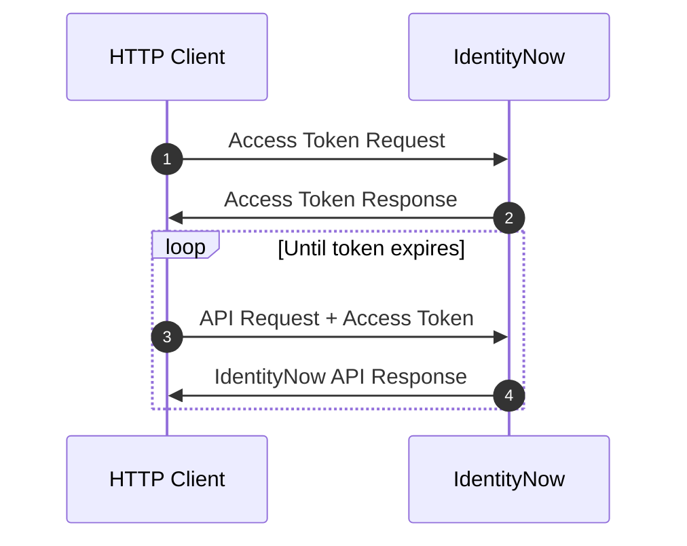
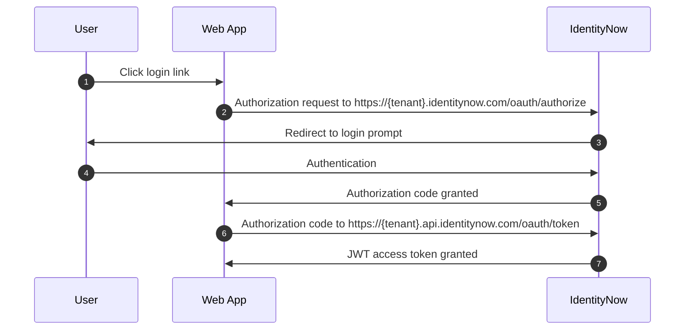

import Tabs from '@theme/Tabs'; import TabItem from '@theme/TabItem';

## Overview

The quickest way to authenticate and start using SailPoint APIs is to generate a [personal access token](#personal-access-tokens). If you are interested in using OAuth2 for authentication, then please continue to read this document.

In order to use the IdentityNow REST API, you must first authenticate with IdentityNow and get an `access_token`. This `access_token` will need to be provided in the `Authorization` header of each API request. The steps of the flow are as follows:

<div align="center">



</div>

1. **Access Token Request** - The HTTP client (a script, application, Postman, cURL, etc.) makes a request to IdentityNow to get an `access_token`. The details of this are described in the [Authentication Details](#authentication-details) section.
2. **Access Token Response** - Assuming the request is valid, IdentityNow will issue an `access_token` to the HTTP client in response.
3. **API Request** - The HTTP client makes a request to an IdentityNow API endpoint. Included in that request is the header `Authorization: Bearer {access_token}`.
4. **API Response** - Assuming the request and the `access_token` are valid, IdentityNow will return a response to the client. If unexpected errors occur, see the [Troubleshooting](#troubleshooting) section of this document.

The SailPoint authentication/authorization model is fully [OAuth 2.0](https://oauth.net/2/) compliant, with issued `access_tokens` leveraging the [JSON Web Token (JWT)](https://jwt.io/) standard. This document provides the necessary information for interacting with SailPoint's OAuth2 services.

## Find Your Tenant's OAuth Details

This document assumes your IDN instance is using the domain name supplied by SailPoint. If your instance is using a vanity URL, then you will need to open the following URL in your browser to get your OAuth info. See [finding your org/tenant name](./getting-started.md#finding-your-orgtenant-name) in the [getting started guide](./getting-started.md) to get your `{tenant}`.

`https://{tenant}.api.identitynow.com/oauth/info`

This page will present you with your `authorizeEndpoint` and `tokenEndpoint`, which you will need to follow along with the examples in this document.

```json
{
  "tenantId": "cc31a307-8a8d-49e8-93b9-c7cbe20e2e6b",
  "tenantName": "iga-acme-sb",
  "authorizeEndpoint": "https://iga-sb.acme.com/oauth/authorize",
  "tokenEndpoint": "https://iga-sb.api.identitynow.com/oauth/token",
  "cloudDomainUrl": "https://iga-sb.acme.com",
  "logoutUrl": "https://iga-sb.acme.com/logout",
  "pod": "stg01-useast1"
}
```

## Personal Access Tokens

A personal access token is a method of authenticating to an API as a user without needing to supply a username and password. The primary use case for personal access tokens is in scripts or programs that don't have an easy way to implement an OAuth 2.0 flow and that need to call API endpoints that require a user context. Personal access tokens are also convenient when using Postman to explore and test APIs.

:::info Update

Previously, only users with the `Admin` or `Source Admin` role were allowed to generate personal access tokens. Now, all users are able to generate personal access tokens!

:::

To generate a personal access token from the IdentityNow UI, perform the following steps after logging into your IdentityNow instance:

1. Select **Preferences** from the drop-down menu under your username, then **Personal Access Tokens** on the left. You can also go straight to the page using this URL, replacing `{tenant}` with your IdentityNow tenant: `https://{tenant}.identitynow.com/ui/d/user-preferences/personal-access-tokens`.

2. Click **New Token** and enter a meaningful description to help differentiate the token from others.

:::caution

The **New Token** button will be disabled when you’ve reached the limit of 10 personal access tokens per user. To avoid reaching this limit, we recommend you delete any tokens that are no longer needed.

:::

3. Click **Create Token** to generate and view the two components that comprise the token: the `Secret` and the `Client ID`.

:::danger Important

After you create the token, the value of the `Client ID` will be visible in the Personal Access Tokens list, but the corresponding `Secret` will not be visible after you close the window. You will need to store the `Secret` somewhere secure.

:::

4. Copy both values somewhere that will be secure and accessible to you when you need to use the the token.

To generate a personal access token from the API, use the [create personal access token endpoint](/idn/api/beta/create-personal-access-token).

To use a personal access token to generate an `access_token` that can be used to authenticate requests to the API, follow the [Client Credentials Grant Flow](#client-credentials-grant-flow), using the `Client ID` and `Client Secret` obtained from the personal access token.

## OAuth 2.0

[OAuth 2.0](https://oauth.net/2/) is an industry-standard protocol for authorization, and provides a variety of authorization flows for web applications, desktop applications, mobile phones, and devices. This specification and its extensions are developed within the [IETF OAuth Working Group](https://www.ietf.org/mailman/listinfo/oauth).

There are several different authorization flows that OAuth 2.0 supports, and each of these has a grant-type which defines the different use cases. Some of the common ones which might be used with IdentityNow are as follows:

1. [**Authorization Code**](https://oauth.net/2/grant-types/authorization-code/) - This grant type is used by clients to exchange an authorization code for an `access_token`. This is mainly used for web applications as there is a login into IdentityNow, with a subsequent redirect back to the web application / client.
2. [**Client Credentials**](https://oauth.net/2/grant-types/client-credentials/) - This grant type is used by clients to obtain an `access_token` outside the context of a user. Because this is outside of a user context, only a subset of IdentityNow REST APIs may be accessible with this kind of grant type.
3. [**Refresh Token**](https://oauth.net/2/grant-types/refresh-token/) - This grant type is used by clients in order to exchange a refresh token for a new `access_token` when the existing `access_token` has expired. This allows clients to continue using the API without having to re-authenticate as frequently. This grant type is commonly used together with `Authorization Code` to prevent a user from having to log in several times per day.

## JSON Web Token (JWT)

[JSON Web Token (JWT)](https://jwt.io) is an industry-standard protocol for creating access tokens which assert various claims about the resource who has authenticated. The tokens have a specific structure consisting of a header, payload, and signature.

A raw JWT might look like this:

```text
eyJhbGciOiJIUzI1NiIsInR5cCI6IkpXVCJ9.eyJ0ZW5hbnRfaWQiOiI1OGViMDZhNC1kY2Q3LTRlOTYtOGZhYy1jY2EyYWZjMDNlNjEiLCJpbnRlcm5hbCI6dHJ1ZSwicG9kIjoiY29vayIsIm9yZyI6ImV4YW1wbGUiLCJpZGVudGl0eV9pZCI6ImZmODA4MTgxNTVmZThjMDgwMTU1ZmU4ZDkyNWIwMzE2IiwidXNlcl9uYW1lIjoic2xwdC5zZXJ2aWNlcyIsInN0cm9uZ19hdXRoIjp0cnVlLCJhdXRob3JpdGllcyI6WyJPUkdfQURNSU4iXSwiY2xpZW50X2lkIjoibktCUE93akpIOExYU2pJbCIsInN0cm9uZ19hdXRoX3N1cHBvcnRlZCI6dHJ1ZSwidXNlcl9pZCI6IjU5NTgyNiIsInNjb3BlIjpbInJlYWQiLCJ3cml0ZSJdLCJleHAiOjE1NjU4ODgzMTksImp0aSI6ImM5OGQxMjM2LTQ1MTMtNGM4OS1hMGQwLTBjYjlmMzI3NmI1NiJ9.SAY4ZQkXGi2cY_qz57Ah9_zDq4-bnF-oDJKotXa-LCY
```

If you were to decode the access token data, it might look something like this:

<Tabs>
  <TabItem value="header" label="Header" default>

```json
{
  "alg": "HS256",
  "typ": "JWT"
}
```

  </TabItem>
  <TabItem value="payload" label="Payload">

```json
{
  "tenant_id": "58eb06a4-dcd7-4e96-8fac-cca2afc03e61",
  "internal": true,
  "pod": "cook",
  "org": "example",
  "identity_id": "ff80818155fe8c080155fe8d925b0316",
  "user_name": "slpt.services",
  "strong_auth": true,
  "authorities": ["ORG_ADMIN"],
  "client_id": "nKBPOwjJH8LXSjIl",
  "strong_auth_supported": true,
  "user_id": "595826",
  "scope": ["read", "write"],
  "exp": 1565888319,
  "jti": "c98d1236-4513-4c89-a0d0-0cb9f3276b56"
}
```

  </TabItem>
  <TabItem value="signature" label="Signature">

```text
HMACSHA256(
base64UrlEncode(header) + "." +
base64UrlEncode(payload),
{secret}
)
```

  </TabItem>
</Tabs>

You can check the JWT access token data online at [jwt.io](https://jwt.io).

## Authentication Details

This section details how to call the SailPoint Platform OAuth 2.0 token endpoints to get an `access_token`.

### Prerequisites

Before any OAuth 2.0 token requests can be initiated, a Client ID and secret are necessary. As an `ORG_ADMIN`, browse to your API Management Admin Page at `https://{tenant}.identitynow.com/ui/admin/#admin:global:security:apimanagementpanel` and create an API client with the appropriate grant types for your use case. If you are not an admin of your org, you can ask an admin to create this for you. Be sure to save your `Client Secret` somewhere secure, as you will not be able to view or change it later.

### OAuth 2.0 Token Request

When authenticating to IdentityNow, the OAuth 2.0 token endpoint resides on the IdentityNow API Gateway at:

```text
POST https://{tenant}.api.identitynow.com/oauth/token
```

How you call this endpoint to get your token depends largely on the OAuth 2.0 flow and grant type you wish to implement. The details for each grant type within IdentityNow are described in the following sections.

### Authorization Code Grant Flow

Further Reading: [https://oauth.net/2/grant-types/authorization-code/](https://oauth.net/2/grant-types/authorization-code/)

This grant type is used by clients to exchange an authorization code for an `access_token`. This is mainly used for web apps as there is a login into IdentityNow, with a subsequent redirect back to the web app / client.

The OAuth 2.0 client you are using must have `AUTHORIZATION_CODE` as one of its grant types. The redirect URLs must also match the list in the client as well:

```json
{
 "enabled": true,
 "created": "2019-05-23T02:06:20.685Z",
 "name": "My Application",
 "description": "My Application",
 "id": "b61429f5-203d-494c-94c3-04f54e17bc5c",
 "secret": null,
 "grantTypes": [
  "AUTHORIZATION_CODE"
 ],
 "redirectUris": [
  "http://localhost:8080/myApp/code"
 ],
 ...
}
```

<br></br>

### Authorization Flow

<div align="center">



</div>

1. The user clicks the login link on a web app.

2. The web app sends an authorization request to IdentityNow in the form:

```Text
GET https://{tenant}.identitynow.com/oauth/authorize?client_id={client-id}&client_secret={client-secret}&response_type=code&redirect_uri={redirect-url}
```

3. IdentityNow redirects the user to a login prompt to authenticate to IdentityNow.

4. The user authenticates to IdentityNow.

5. Once authentication is successful, IdentityNow issues an authorization code back to the web app.

6. The web app submits an **OAuth 2.0 Token Request** to IdentityNow in the form:

```text
POST https://{tenant}.api.identitynow.com/oauth/token?grant_type=authorization_code&client_id={client-id}&client_secret={client-secret}&code={code}&redirect_uri={redirect-url}
```

> **Note**: the token endpoint URL is `{tenant}.api.identitynow.com`, while the authorize URL is `{tenant}.identitynow.com`. Be sure to use the correct URL when setting up your webapp to use this flow.

7. IdentityNow validates the token request and submits a response. If successful, the response will contain a JWT `access_token`.

The query parameters in the OAuth 2.0 token request for the Authorization Code grant are as follows:

| Key | Description |
| --- | --- |
| `grant_type` | Set to `authorization_code` for the authorization code grant type. |
| `client_id` | This is the client ID for the API client (e.g. `b61429f5-203d-494c-94c3-04f54e17bc5c`). This can be generated at `https://{tenant}.identitynow.com/ui/admin/#admin:global:security:apimanagementpanel` |
| `client_secret ` | This is the client secret for the API client (e.g. `c924417c85b19eda40e171935503d8e9747ca60ddb9b48ba4c6bb5a7145fb6c5`). This can be generated at `https://{tenant}.identitynow.com/ui/admin/#admin:global:security:apimanagementpanel` |
| `code` | This is a code returned by `/oauth/authorize`. |
| `redirect_uri` | This is a URL of the application to redirect to once the token has been granted. |

Here is an example OAuth 2.0 token request for the Authorization Code grant type.

```bash
curl -X POST \
 'https://example.api.identitynow.com/oauth/token?grant_type=authorization_code&client_id=b61429f5-203d-494c-94c3-04f54e17bc5c&client_secret=c924417c85b19eda40e171935503d8e9747ca60ddb9b48ba4c6bb5a7145fb6c5&code=6688LQJB0y652z6ZjFmkCKuBUjv2sTIqKS2JthWrZ7qlPgI9TClJ6FnpweEhO6w7&redirect_uri=https://myappdomain.com/oauth/redirect' \
 -H 'cache-control: no-cache'
```

### Client Credentials Grant Flow

Further Reading: [https://oauth.net/2/grant-types/client-credentials/](https://oauth.net/2/grant-types/client-credentials/)

This grant type is used by clients to obtain an access token outside the context of a user. This is probably the simplest authentication flow, but comes with a major drawback; API endpoints that require [user level permissions](https://documentation.sailpoint.com/saas/help/common/users/user_level_matrix.html) will not work. [Personal Access Tokens](#personal-access-tokens) are a form of Client Credentials that have a user context, so they do not share this drawback. However, the APIs that can be invoked with a personal access token depend on the permissions of the user that generated it.

An OAuth 2.0 client using the Client Credentials flow must have `CLIENT_CREDENTIALS` as one of its grantTypes:

```json
{
 "enabled": true,
 "created": "2019-05-23T02:06:20.685Z",
 "name": "My Application",
 "description": "My Application",
 "id": "b61429f5-203d-494c-94c3-04f54e17bc5c",
 "secret": null,
 "grantTypes": [
  "CLIENT_CREDENTIALS"
 ],
 ...
}
```

[Personal Access Tokens](#personal-access-tokens) are implicly granted a `CLIENT_CREDENTIALS` grant type.

The overall authorization flow looks like this:

1. The client submits an **OAuth 2.0 Token Request** to IdentityNow in the form:

```text
POST https://{tenant}.api.identitynow.com/oauth/token?grant_type=client_credentials&client_id={client-id}&client_secret={client-secret}
```

2. IdentityNow validates the token request and submits a response. If successful, the response will contain a JWT access token.

The query parameters in the OAuth 2.0 Token Request for the Client Credentials grant are as follows:

| Key | Description |
| --- | --- |
| `grant_type` | Set to `CLIENT_CREDENTIALS` for the authorization code grant type. |
| `client_id` | This is the client ID describing for the API client (e.g. `b61429f5-203d-494c-94c3-04f54e17bc5c`). This can be generated at `https://{tenant}.identitynow.com/ui/admin/#admin:global:security:apimanagementpanel` or by [creating a personal access token](#personal-access-tokens). |
| `client_secret` | This is the client secret describing for the API client (e.g. `c924417c85b19eda40e171935503d8e9747ca60ddb9b48ba4c6bb5a7145fb6c5`). This can be generated at `https://{tenant}.identitynow.com/ui/admin/#admin:global:security:apimanagementpanel` or by [creating a personal access token](#personal-access-tokens). |

Here is an example request to generate an `access_token` using Client Credentials.

```bash
curl -X POST \
 'https://{tenant}.api.identitynow.com/oauth/token?grant_type=client_credentials&client_id={client_id}&client_secret={client_secret}' \
 -H 'cache-control: no-cache'
```

### Refresh Token Grant Flow

Further Reading: [https://oauth.net/2/grant-types/refresh-token/](https://oauth.net/2/grant-types/refresh-token/)

This grant type is used by clients in order to exchange a refresh token for a new `access_token` once the existing `access_token` has expired. This allows clients to continue to have a valid `access_token` without the need for the user to login as frequently.

The OAuth 2.0 client you are using must have `REFRESH_TOKEN` as one of its grant types, and is typically used in conjunction with another grant type, like `CLIENT_CREDENTIALS` or `AUTHORIZATION_CODE`:

```json
{
 "enabled": true,
 "created": "2019-05-23T02:06:20.685Z",
 "name": "My Application",
 "description": "My Application",
 "id": "b61429f5-203d-494c-94c3-04f54e17bc5c",
 "secret": null,
 "grantTypes": [
  "REFRESH_TOKEN",
  "AUTHORIZATION_CODE"
 ],
 ...
}
```

The overall authorization flow looks like this:

1. The client application receives an `access_token` and a `refresh_token` via one of the other OAuth grant flows, like `AUTHORIZATION_CODE`.
2. The client application notices that the `access_token` is about to expire, based on the `expires_in` attribute contained within the JWT token.
3. The client submits an **OAuth 2.0 Token Request** to IdentityNow in the form:

```text
POST https://{tenant}.api.identitynow.com/oauth/token?grant_type=refresh_token&client_id={client_id}&client_secret={client_secret}&refresh_token={refresh_token}
```

4. IdentityNow validates the token request and submits a response. If successful, the response will contain a new `access_token` and `refresh_token`.

The query parameters in the OAuth 2.0 Token Request for the Refresh Token grant are as follows:

| Key | Description |
| --- | --- |
| `grant_type` | Set to `refresh_token` for the authorization code grant type. |
| `client_id` | This is the client ID for the API client (e.g. `b61429f5-203d-494c-94c3-04f54e17bc5c`). This can be generated at `https://{tenant}.identitynow.com/ui/admin/#admin:global:security:apimanagementpanel`. |
| `client_secret` | This is the client secret for the API client (e.g. `c924417c85b19eda40e171935503d8e9747ca60ddb9b48ba4c6bb5a7145fb6c5`). This can be generated at `https://{tenant}.identitynow.com/ui/admin/#admin:global:security:apimanagementpanel`. |
| `refresh_token` | This is the `refresh_token` that was provided along with the now expired `access_token`. |

Here is an example call OAuth 2.0 Token Request for the Refresh Token grant.

```bash
curl -X POST \
 'https://example.api.identitynow.com/oauth/token?grant_type=refresh_token&client_id=b61429f5-203d-494c-94c3-04f54e17bc5c&client_secret=c924417c85b19eda40e171935503d8e9747ca60ddb9b48ba4c6bb5a7145fb6c5&refresh_token=ey...4M' \
 -H 'cache-control: no-cache'
```

## OAuth 2.0 Token Response

A successful request to `https://{tenant}.api.identitynow.com/oauth/token` will contain a response body similar to this:

```json
{
  "access_token": "eyJhbGciOiJIUzI1NiIsInR5cCI6IkpXVCJ9.eyJ0ZW5hbnRfaWQiOiI1OGViMDZhNC1kY2Q3LTRlOTYtOGZhYy1jY2EyYWZjMDNlNjEiLCJpbnRlcm5hbCI6ZmFsc2UsInBvZCI6ImNvb2siLCJvcmciOiJuZWlsLXRlc3QiLCJpZGVudGl0eV9pZCI6ImZmODA4MTgxNTVmZThjMDgwMTU1ZmU4ZDkyNWIwMzE2IiwidXNlcl9uYW1lIjoic2xwdC5zZXJ2aWNlcyIsInN0cm9uZ19hdXRoIjp0cnVlLCJhdXRob3JpdGllcyI6WyJPUkdfQURNSU4iXSwiZW5hYmxlZCI6dHJ1ZSwiY2xpZW50X2lkIjoiZmNjMGRkYmItMTA1Yy00Y2Q3LWI5NWUtMDI3NmNiZTQ1YjkwIiwiYWNjZXNzVHlwZSI6Ik9GRkxJTkUiLCJzdHJvbmdfYXV0aF9zdXBwb3J0ZWQiOmZhbHNlLCJ1c2VyX2lkIjoiNTk1ODI2Iiwic2NvcGUiOlsicmVhZCIsIndyaXRlIl0sImV4cCI6MTU2NTg5MTA2MywianRpIjoiOTQ5OWIyOTktOTVmYS00N2ZiLTgxNWMtODVkNWY2YjQzZTg2In0.zJYfjIladuGHoLXr92EOJ3A9qGNkiG5UJ9eqrtSYXAQ",
  "token_type": "bearer",
  "refresh_token": "eyJhbGciOiJIUzI1NiIsInR5cCI6IkpXVCJ9.eyJ0ZW5hbnRfaWQiOiI1OGViMDZhNC1kY2Q3LTRlOTYtOGZhYy1jY2EyYWZjMDNlNjEiLCJpbnRlcm5hbCI6ZmFsc2UsInBvZCI6ImNvb2siLCJvcmciOiJuZWlsLXRlc3QiLCJpZGVudGl0eV9pZCI6ImZmODA4MTgxNTVmZThjMDgwMTU1ZmU4ZDkyNWIwMzE2IiwidXNlcl9uYW1lIjoic2xwdC5zZXJ2aWNlcyIsInN0cm9uZ19hdXRoIjp0cnVlLCJhdXRob3JpdGllcyI6WyJPUkdfQURNSU4iXSwiZW5hYmxlZCI6dHJ1ZSwiY2xpZW50X2lkIjoiZmNjMGRkYmItMTA1Yy00Y2Q3LWI5NWUtMDI3NmNiZTQ1YjkwIiwiWYNjZXNzVHlwZSI6Ik9GRkxJTkUiLCJzdHJvbmdfYXV0aF9zdXBwb3J0ZWQiOmZhbHNlLCJ1c2VyX2lkIjoiNTk1ODI2Iiwic2NvcGUiOlsicmVhZCIsIndyaXRlIl0sImF0aSI6Ijk0OTliMjk5LTk1ZmEtNDdmYi04MTVjLTg1ZDVmNmI0M2U4NiIsImV4cCI6MTU2NTk3NjcxMywianRpIjoiODliODk1ZDMtNTdlNC00ZDAwLWI5ZjctOTFlYWVjNDcxMGQ3In0.pfDcB0sGChdHk-oDNmiIxsKFLxq9CcPQV5-eXWgIcp4",
  "expires_in": 749,
  "scope": "read write",
  "accessType": "OFFLINE",
  "tenant_id": "58eb06a4-dcd7-4e96-8fac-cca2afc03e61",
  "internal": false,
  "pod": "cook",
  "strong_auth_supported": false,
  "org": "example",
  "user_id": "595826",
  "identity_id": "ff80818155fe8c080155fe8d925b0316",
  "strong_auth": true,
  "enabled": true,
  "jti": "9499b299-95fa-47fb-815c-85d5f6b43e86"
}
```

The `access_token` contains the JSON Web Token which is subsequently used in any further REST API calls through the IdentityNow API gateway. To use the `access_token`, simply include it in the `Authorization` header as a `Bearer` token. For example:

```bash
curl -X GET \
 'https://{tenant}.api.identitynow.com/v3/account-activities' \
 -H 'Authorization: Bearer {access_token}' \
 -H 'cache-control: no-cache'
```

The `expires_in` describes the lifetime, in seconds, of the `access_token`. For example, the value 749 means that the `access_token` will expire in 12.5 minutes from the time the response was generated. The exact expiration date is also contained within the `access_token`. You can view this expiration time by decoding the JWT `access_token` using a tool like [jwt.io](https://jwt.io/).

The `refresh_token` contains a JSON Web Token for use in a [Refresh Token](#refresh-token-grant-flow) grant flow. The `refresh_token` will only be present if the API client has the `REFRESH_CODE` grant flow.

The `user_id` and `identity_id` define the identity context of the person that authenticated. This is not set for the Client Credentials grant type since it doesn't have a user context.

## Which OAuth 2.0 Grant Flow Should I use

Deciding which OAuth 2.0 grant flow you should use largely depends on your use case.

### Daily Work or Quick Actions

For daily work or short, quick administrative actions, you may not really need to worry about grant types, as an access token can easily be obtained in the user interface. In order to see this:

1. Login to IdentityNow.
2. Go to `https://{tenant}.identitynow.com/ui/session`.
3. The `accessToken` is visible in the user interface.
4. Use this access token in the `Authorization` header when making API calls. If the access token expires, log back into Identity Now and retrieve the new access token.

While this is very simple to use, this is only valid for a short period of time (a few minutes).

### Postman

If you are using the popular HTTP client, [Postman](https://www.getpostman.com), you have a couple of options on how you might setup your authorization. You can just leverage the accessToken as mentioned above, or you can also configure Postman to use OAuth 2.0 directly.

### Web Applications

If you are making a web application, the best grant flow to use is the [Authorization Code](#authorization-code-grant-flow) grant flow. This will allow users to be directed to IdentityNow to login, and then redirected back to the web application via a URL redirect. This also works well with SSO, strong authentication, or pass-through authentication mechanisms.

SailPoint does not recommend using a password grant flow for web applications as it would involve entering IdentityNow credentials in the web application. This flow also doesn't allow you to work with SSO, strong authentication, or pass-through authentication.

### Scripts or Programs

If you are writing scripts or programs that leverage the IdentityNow APIs, which OAuth 2.0 grant from you should use typically depends on what you are doing, and which user context you need to operate under.

Because scripts, code, or programs do not have an interactive web-interface it is difficult, but not impossible, to implement a working [Authorization Code](#authorization-code-grant-flow) flow. Most scripts or programs typically run as a [Client Credentials](#client-credentials-grant-flow). If your APIs can work under an API context without a user, then [Client Credentials](#client-credentials-grant-flow) is ideal. However, if your APIs need a user or admin context, then the [Personal Access Token](#personal-access-tokens) approach will be more suitable.

## Troubleshooting

Having issues? Follow these steps.

1. **Verify the API End Point Calls**

1. Verify the structure of the API call:
1. Verify that the API calls are going through the API gateway: `https://{tenant}.api.identitynow.com`
1. Verify you are calling their version correctly:

   - Private APIs: `https://{tenant}.api.identitynow.com/cc/api/{endpoint}`
   - V2 APIs: `https://{tenant}.api.identitynow.com/v2/{endpoint}`
   - V3 APIs: `https://{tenant}.api.identitynow.com/v3/{endpoint}`
   - Beta APIs: `https://{tenant}.api.identitynow.com/beta/{endpoint}`

1. Verify that the API calls have the correct headers (e.g., `content-type`), query parameters, and body data.
1. If the HTTP response is **401 Unauthorized** , this is an indication that either there is no `Authorization` header or the `access_token` is invalid. Verify that the API calls are supplying the `access_token` in the `Authorization` header correctly (ex. `Authorization: Bearer {access_token}`) and that the `access_token` has not expired.
1. If the HTTP response is **403 Forbidden**, this is an indication that the `access_token` is valid, but the user you are running as doesn't have access to this endpoint. Check the access rights which are associated with the user.

:::info

This can also be due to calling an API which expects a user, but your authorization grant type might not have a user context. Calling most administrative APIs with a CLIENT_CREDENTIAL grant will often produce this result.

:::

2. **Verify the OAuth 2.0 Client**

1. Verify that the OAuth 2.0 Client is not a Legacy OAuth client. Legacy OAuth clients will not work. This is very apparent by looking at the Client ID, as OAuth 2.0 Client IDs have dashes. Here is an example: Legacy Client ID: `G6xLlBBOKIcOAQuK` OAuth 2.0 Client ID: `b61429f5-203d-494c-94c3-04f54e17bc5c`

1. Verify the OAuth 2.0 Client ID exists. This can be verified by calling:

```text
 GET /beta/oauth-clients/{client-id}
```

or

```text
GET /beta/oauth-clients/
```

You can also view all of the active clients in the UI by going to `https://{tenant}.identitynow.com/ui/admin/#admin:global:security:apimanagementpanel`.

3. Verify that the OAuth 2.0 Client grant types match the OAuth 2.0 grant type flow you are trying to use. For instance, this client will work with [Authorization Code](#authorization-code-grant-flow) and [Client Credentials](#client-Credentials-grant-flow) flows, but not [Refresh Token](#refresh-token-grant-flow) flows:

```json
{
 "enabled": true,
 "created": "2019-05-23T02:06:20.685Z",
 "name": "My Application",
 "description": "My Application",
 "id": "b61429f5-203d-494c-94c3-04f54e17bc5c",
 "secret": null,
 "grantTypes": [
  "AUTHORIZATION_CODE",
  "CLIENT_CREDENTIALS"
 ],
 ...
}
```

4. If using an A[Authorization Code](#authorization-code-grant-flow) flow, verify the redirect URL(s) for your application match the `redirectUris` value in the client. You can check this using the [oauth-clients endpoint](/idn/api/beta/list-oauth-clients).

5. **Verify the OAuth 2.0 Calls**

6. Verify that the OAuth call flow is going to the right URLs, with the correct query parameters and data values. A common source of errors is using the wrong host for authorization and token API calls. The token endpoint URL is `{tenant}.api.identitynow.com`, while the authorize URL is `{tenant}.identitynow.com`.
