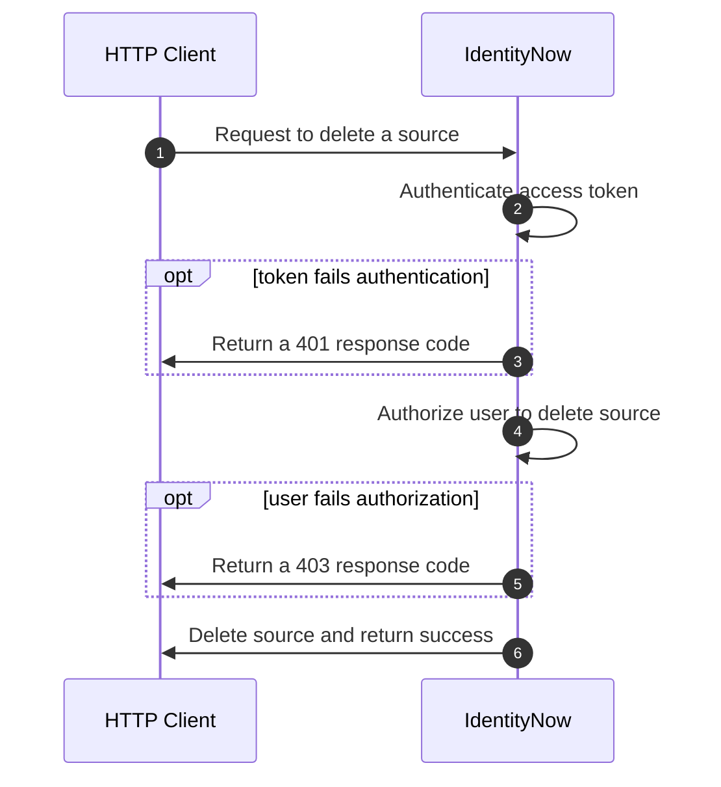

import Tabs from '@theme/Tabs'; import TabItem from '@theme/TabItem';

## Overview

Authorization and authentication are two related concepts that help secure APIs. Authentication is the act of verifying a user's identify. Authorization is the act of validating the user's permission to access a given resource. When a user sends an API request, the server authenticates the user by checking the validity of the access token sent with the request. If the token is valid, the server checks whether the user is authorized to perform the desired operation on the resource. If the user is both authenticated and authorized, the server fulfills the request.

<div align="center">



</div>

## User Level Permissions

To manage user access to the API, you must first define [user level access](https://documentation.sailpoint.com/saas/help/common/users/user_level_matrix.html). User levels are coarse access controls on the API that restrict access based on predefined functional roles. Each user level grants access to a subset of APIs that allow the user to perform their role, with the **Admin** role granting access to all APIs. User levels facilitate secure access to the IdentityNow user interface (UI), where each role grants the user only enough permission to access the pages necessary to perform their tasks. User levels are typically granted through the UI, [following the procedures from this document](https://documentation.sailpoint.com/saas/help/common/users/grant_remove_user_levels.html).  

:::caution

There is an [API that can set an identity's user level](https://developer.sailpoint.com/discuss/t/assign-identitynow-admin-roles-via-api/1874/4), but it is a V1 API with no guaranteed support. Use it at your own risk!

:::

You can use user levels to limit access to API integrations, but their rigidity and broad scopes makes them difficult to configure for integrations that may only need access to a few endpoints. The next section covers scopes, which you can use to refine and limit an API integration's access at a more granular level than you can with user levels.

## Scopes

Scopes are granular permissions you can add to personal access tokens (PATs) to create tokens with the least privilege necessary to fulfill their functions. Unlike user levels, which apply to any PATs created by a user, scopes can be unique to each PAT. This allows a single user to have multiple credentials with different privileges that support unique use cases and software applications. Using scopes is beneficial to security - if a bad actor compromises any one of the credentials, the bad actor can only perform the limited set of operations defined by the credential's scopes, significantly reducing the potential damage that can be done.

Scopes contain one or more rights, low level permissions that grant access to individual endpoints. This means that a single scope, like `idn:access-request:manage`, can grant access to multiple API endpoints. To determine which scopes a credential needs, you must first identify which endpoints the credential needs to invoke. Each endpoint's API specification indicates which scope is necessary to call the endpoint. You can use this approach to curate a list of scopes that must be applied to the credential to call the necessary endpoints.  [Learn more about how to find an API's required scopes here](#identifying-necessary-authorization-for-an-endpoint).

By default, each PAT has the scope, `sp:scopes:all`, which grants access to all the rights appropriate for the [user level](https://documentation.sailpoint.com/saas/help/common/users/user_level_matrix.html). For example, a user with the **Admin** user level has access to all APIs, so `sp:scopes:all` grants **Admin** users access to all APIs. A user with the **Cert Admin** user level, however, has access to only a subset of APIs necessary to perform their role, most notably the certification APIs, so `sp:scopes:all` grants **Cert Admin** users access to only that subset of APIs.

Alternatively, `sp:scopes:default` is the least privileged scope that only grants access to endpoints that require no authorization at all, such as [list public identities](https://developer.sailpoint.com/idn/api/v3/get-public-identities).

Scopes are additive, which means the final right set is the intersection of all the rights granted by the scopes assigned to a PAT, excluding any rights that fall outside of the user level. Each scope added to an PAT builds up the credential's permission set, incrementally increasing access to the API.  If a PAT has `sp:scopes:all` granted, then any additional scope is ignored because `sp:scopes:all` already contains the complete set of rights available to the user level.  

:::tip

Because scopes can only grant access to APIs that are a part of the rights included in a user level, it is often easier to assign the **Admin** user level to the user first and then apply scopes to the PAT to limit the access.

:::

### Identifying Necessary Authorization for an Endpoint

Each endpoint document specifies how to authorize with the endpoint in the **Authorization** dropdown, which is located on the right side column below the endpoint path. Selecting **Authorization** expands the dropdown menu showing the details of how to authorize with the endpoint. The following image shows the authorization details of the [List Access Profiles](https://developer.sailpoint.com/idn/api/beta/list-access-profiles) endpoint.


- **type**: The type of authorization method supported for this endpoint. SailPoint uses the [OAuth2 standard](./authentication.md#oauth-20) for all the V3/Beta APIs.
- **flow**: One or more OAuth flows supported by the endpoint. A token only needs to be generated by one flow to be valid. Refer to [Authentication Details](./authentication.md#authentication-details) for more information about the available flows.
- **scopes**: A list of scopes necessary to access the endpoint. A token only needs one of the scopes to authorize with the endpoint. When possible, choose the least privileged scope. Scopes ending in `read` can only retrieve data. Scopes ending in `manage` can retrieve, modify, and delete data.

:::info

SailPoint is working to define scopes for every endpoint, but you may encounter a scenario where you need access to an endpoint that does not yet have a scope defined. Until a scope is defined for the endpoint, you can assign `sp:scopes:all` to ensure that your credentials can access the necessary endpoints. Once all of the endpoints necessary for your use case have scopes defined, you can create a new credential with the appropriate scopes in place.

:::

### Assigning Scopes with the UI

When you create a PAT in the UI, you can apply scopes to the token. More information on how to do this will be added in the near future.

### Assigning Scopes with the API

You can [create PATs](https://developer.sailpoint.com/idn/api/v3/create-personal-access-token) programmatically with the API. The request body for the endpoint allows the caller to specify a list of scopes to be applied to the PAT. If the `scope` property is omitted from the request body, then `sp:scopes:all` is granted to the credentials. The following example shows how to generate a PAT with the `idn:access-request:manage` and `idn:nelm:manage` scopes.

POST <https://{tenant}.api.identitynow.com/v3/personal-access-tokens>

Request Body

```json
{
    "name": "Access Request and NELM Management",
    "scope": [
        "idn:access-request:manage",
        "idn:nelm:manage"
    ]
}
```

This request produces the following response, indicating that the scopes were successfully applied to the PAT.

```json
{
    "id": "86286c0c456e4b03a8ccb1f892dd456d",
    "name": "Access Request and NELM Management",
    "secret": "********",
    "scope": [
        "idn:access-request:manage",
        "idn:nelm:manage"
    ],
    "created": "2023-01-04T18:58:17.486584Z",
    "owner": {
        "name": "jane.doe",
        "id": "2c9180ab7624cbd7017642d8c8c81a73",
        "type": "IDENTITY"
    }
}
```

:::caution

If you attempt to add a scope that is outside the permissions of the [target user's level](#user-level-permissions), the request will still succeed and include the invalid scope in the credentials. However, any token generated with these credentials will **not** include the rights of the invalid scope.  This is not an issue when you apply scopes with the UI - the UI only shows scopes available to the current user.

:::
