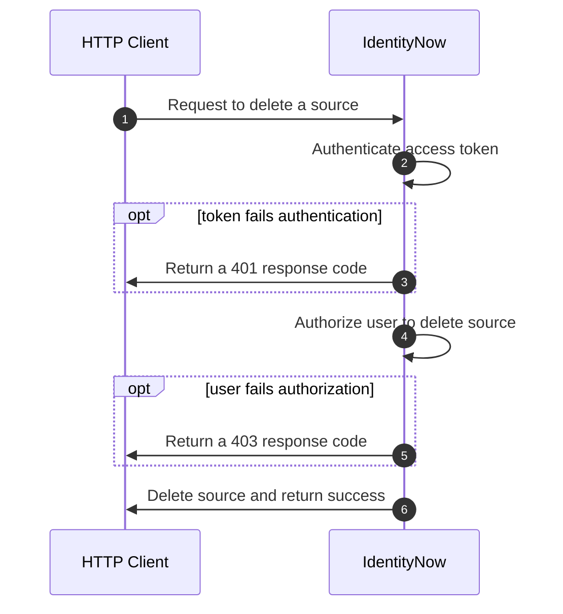

import Tabs from '@theme/Tabs'; import TabItem from '@theme/TabItem';

TODO:

- Update the API guidelines and add these new rules to the linter
  - All endpoints must define scopes.  
  - Scopes names must follow this pattern: `{product}:{tag}:{manage|read}`
    - Product must be `idn` for IdentityNow API
    - The `{tag}` must be the name of the API tag the endpoint is assigned to, with all lowercase letters and hyphens instead of spaces.  For example, if the tag is Account Activities it would translate to `idn:account-activities`.
    - This makes it easier to document because the expectation will be for the scope to match the tag name.  Otherwise, we have to maintain a table of scopes to map them properly.
  - Scopes must only apply to the endpoints within a tag, and nothing outside of the tag.  the `manage` scope should grant access to all endpoints in the tag.  The `read` scope should only grant access to the GET endpoints.  If the `manage` scope for a tag would grant too much access, it might be necessary to break out some endpoints into a separate tag.
  - A GET endpoint must declare the `read` and the `manage` scopes, since both can be used to execute GET.
  - All other operations must declare the `manage` scope only.
  - If an endpoint requires more than one scope (ex. GET operation), then the scopes must be ordered from least to most privileged.

## Overview

Authorization and authentication are two related concepts that help secure APIs.  Authentication is the act of verifying a user's identity, while authorization is the act of validating that the user has permission to access a given resource.  When making an API request, the server will authenticate the caller by checking the validity of the access token that was sent with the request.  If the token is valid, then the server will check if the user is authorized to perform the desired operation on the resource.  If a user is authenticated and authorized, the server will fulfill the request.

## User Level Permissions

The first step to managing user access to the API is through [user level permissions](https://documentation.sailpoint.com/saas/help/common/users/user_level_matrix.html).  User level permissions are coarse access controls on the API that restrict access based on predefined, functional roles.  Each user level grants access to a subset of APIs that allow the user to perform their role, with the Admin role granting access to all APIs.  User levels are intended to facilitate secure access to the IdentityNow user interface, where each role has just enough permission to access the pages needed to perform their day-to-day tasks.  

Although user levels can be used to limit access to API integrations, their rigidity makes them difficult to configure for integrations that may only need access to a few endpoints.  In the next section, we will learn about scopes, which can be used to refine and limit the access of an API integration beyond what user level permissions are capable of.

## Scopes

Scopes are granular permission sets that can be individually added to OAuth credentials to create a token that has the least level of privilege needed to fulfill its function.  Unlike user level permissions, which apply to any OAuth credentials created by a user, scopes can be unique to each OAuth credential, allowing a single user to have multiple credentials that support unique use cases.

TODO: Insert diagram here showing how scopes can be applied to individual credentials

By default, each OAuth credential will have the scope `sp:scopes-all`, which allows the credential to access any API endpoint granted by the user level.  When a new scope is added to an OAuth credential, it overrides `sp:scopes-all` and limits the credential's access to just the scopes that are explicitly added.  For example, if a new credential is generated for an Admin user without any scopes, then those credentials will default to `sp:scopes-all` and have access to all API endpoints.  If a new credential is generated with the `idn:access-request:manage` scope, then the credential will only have access to the access request endpoints.

:::note

Since scopes can only grant access to APIs that are a part of the permissions included in a user level, it is often easier to assign the Admin user level to the user first and then apply scopes to the OAuth credentials to limit the access.

:::

### Assigning Scopes via the API
