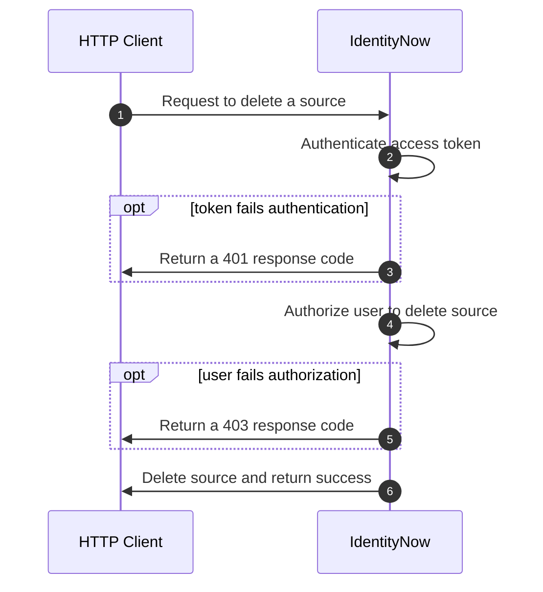

import Tabs from '@theme/Tabs'; import TabItem from '@theme/TabItem';

## Overview

Authorization and authentication are two related concepts that help secure APIs.  Authentication is the act of verifying a user's identity, while authorization is the act of validating that the user has permission to access a given resource.  When making an API request, the server will authenticate the caller by checking the validity of the access token that was sent with the request.  If the token is valid, then the server will check if the user is authorized to perform the desired operation on the resource.  If a user is authenticated and authorized, the server will fulfill the request.

<div align="center">



</div>

## User Level Permissions

The first step to managing user access to the API is through [user level access](https://documentation.sailpoint.com/saas/help/common/users/user_level_matrix.html).  User levels are coarse access controls on the API that restrict access based on predefined, functional roles.  Each user level grants access to a subset of APIs that allow the user to perform their role, with the Admin role granting access to all APIs.  User levels are intended to facilitate secure access to the IdentityNow user interface, where each role has just enough permission to access the pages needed to perform their day-to-day tasks.  User levels are typically granted through the UI, [following the procedures from this document](https://documentation.sailpoint.com/saas/help/common/users/grant_remove_user_levels.html).  

:::caution

There is also an [API that can set an identity's user level](https://developer.sailpoint.com/discuss/t/assign-identitynow-admin-roles-via-api/1874/4), but this is a v1 API with no guaranteed support.  Use at your own risk!

:::

Although user levels can be used to limit access to API integrations, their rigidity and broad scope makes them difficult to configure for integrations that may only need access to a few endpoints.  In the next section, we will learn about scopes, which can be used to refine and limit the access of an API integration at a more granular level than user levels are capable of.

## Scopes

Scopes are granular permissions that can be added to OAuth credentials to create a token that has the least level of privilege needed to fulfill its function.  Unlike user levels, which apply to any OAuth credentials created by a user, scopes can be unique to each OAuth credential, allowing a single user to have multiple credentials with different privileges that support unique use cases and software applications.  The advantage to using scopes in this manner is that if any one of the credentials are compromised by a bad actor, then the actor can only perform the limited set of operations defined by the scopes of the credential, greatly reducing the damage that can be done.

Scopes contain one or more rights, which are low level permissions that grant access to individual endpoints.  This means that a single scope, like `idn:access-request:manage`, can grant access to several API endpoints.  In order to determine which scopes are needed for a credential, it is necessary to first identify which endpoints the credential will need to invoke.  The API specification for each endpoint will indicate which scope is needed to call the endpoint.  By following this approach, you can curate a list of scopes that will need to be applied to the credential in order to call the necessary endpoints. TODO: link to section that shows this process in detail.

By default, each OAuth credential will have the scope `sp:scopes:all`, which allows access to all of the rights associated with a user or system’s capabilities.  For example, the **Cert Admin** user level only has access to subset of APIs needed to perform the role, most notably the certification APIs, while the **Admin** user level has access to all APIs.  Applying the scope `sp:scopes:all` to either user level will automatically grant them access to the full set of APIs appropriate for their [user level](https://documentation.sailpoint.com/saas/help/common/users/user_level_matrix.html).  Alternatively, `sp:scopes:default` is the least privileged scope that only grants access to endpoints that require no authorization, such as [list public identities](https://developer.sailpoint.com/idn/api/v3/get-public-identities).

Scopes are additive, which means the final right set is the intersection of all the rights granted by the scopes that are assigned to an OAuth credential, excluding any rights that fall outside of the user level.  Each scope that is added to the OAuth credential will build up the permission set for that credential, incrementally increasing access to the API.  If an OAuth credential is granted `sp:scopes:all`, then any additional scope is ignored, since `sp:scopes:all` already contains the complete set of rights available to the user level.  

:::tip

Since scopes can only grant access to APIs that are a part of the rights included in a user level, it is often easier to assign the Admin user level to the user first and then apply scopes to the OAuth credentials to limit the access.

:::

### Identifying Authorization Needed for an Endpoint

Each endpoint document specifies how to authorize with the endpoint in the **Authorization** dropdown, which is located on the right side column below the endpoint path.  Clicking on **Authorization** will expand the dropdown menu that shows the details of how to authorize with the endpoint.  The following image shows the authorization details of the [list access profiles](https://developer.sailpoint.com/idn/api/beta/list-access-profiles) endpoint.


- **type**: the type of authorization method supported for this endpoint.  SailPoint uses the [OAuth2 standard](./authentication.md#oauth-20) for all of the V3/Beta APIs.
- **flow**: One or more OAuth flows that are supported by the endpoint.  A token only needs to be generated by one of the flows to be valid.  See [authentication details](./authentication.md#authentication-details) for more information on the available flows.
- **scopes**: A list of scopes needed to access the endpoint.  A token only needs one of the listed scopes to authorize with the endpoint.  When possible, choose the least privileged scope.  Scopes that end in `read` can only retrieve data, while scopes that end in `manage` can retrieve, modify, and delete data.

:::info

SailPoint is working on defining scopes for every endpoint, but you may encounter a scenario where you need access to an endpoint that doesn't yet have a scope.  Until a scope is defined for the endpoint, you may have to assign `sp:scopes:all` to make sure your credentials can access the necessary endpoints.  Once all of the endpoints required for your use case have scopes defined, you can create a new credential with the proper scopes in place.

:::

### Assigning Scopes via the UI

TODO: Ask Jennifer Mitchel if the UI docs are ready.

### Assigning Scopes via the API

[Personal access tokens](https://developer.sailpoint.com/idn/api/v3/create-personal-access-token) and [OAuth clients](https://developer.sailpoint.com/idn/api/v3/create-oauth-client) can be created programmatically via the API.  The request body for each API endpoint allows the caller to specify a list of scopes to be applied to the credentials.  If the `scope` property is omitted from the request body, then `sp:scopes:all` will be granted to the credentials.  Please see below for an example of generating a personal access token with the `idn:access-request:manage` and `idn:nelm:manage` scopes.

POST <https://{tenant}.api.identitynow.com/v3/personal-access-tokens>

Request Body

```json
{
    "name": "Access Request and NELM Management",
    "scope": [
        "idn:access-request:manage",
        "idn:nelm:manage"
    ]
}
```

This request will produce the following response, indicating that the scopes were successfully applied to the PAT.

```json
{
    "id": "86286c0c456e4b03a8ccb1f892dd456d",
    "name": "Access Request and NELM Management",
    "secret": "********",
    "scope": [
        "idn:access-request:manage",
        "idn:nelm:manage"
    ],
    "created": "2023-01-04T18:58:17.486584Z",
    "owner": {
        "name": "jane.doe",
        "id": "2c9180ab7624cbd7017642d8c8c81a73",
        "type": "IDENTITY"
    }
}
```

:::caution

If you attempt to add a scope that is outside the permissions of the [target user's level](#user-level-permissions), then the request will still succeed and include the invalid scope in the credentials.  However, any token generated with these credentials will **not** include the rights of the invalid scope.  This isn't an issue when assigning scopes via the user interface, as the UI will only show scopes available to the current user.

:::
