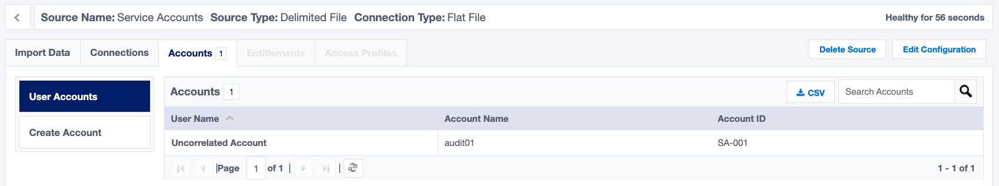
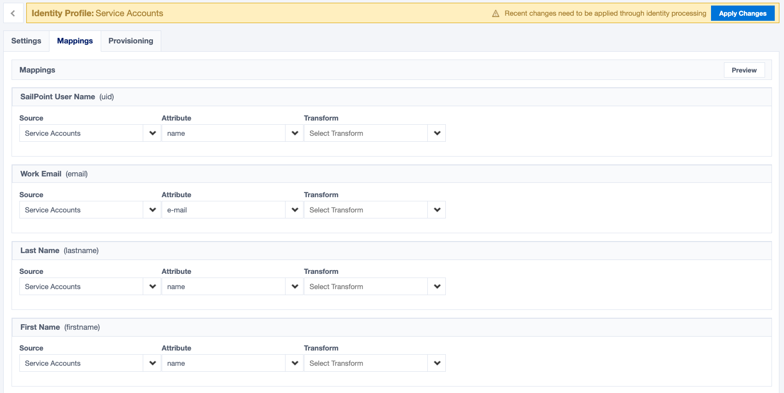
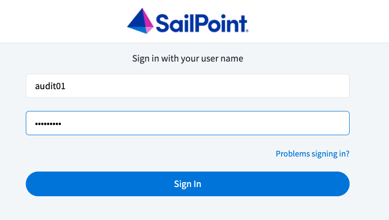

## Service Accounts

Service accounts are identities in IdentityNow that are not a real people.  Their purpose is to provide credentials for automation services that can be managed and controlled separately from real identities.  As a developer of integrations with IdentityNow, the two main advantages of creating service accounts is the ability to scope access to the least privilege necessary to do the job, and to ensure your integration's access doesn't end when you leave your organization.  If you use your user account to generate credentials for integrations, then they are tied to your level of access (i.e. admin) and they can be revoked when you leave the organization, which can cause downtime in your integrations.

## Implementing Service Accounts

Any authoritative source can be used to create and manage service accounts, with Active Directory being a likely choice.  Creating service accounts via Active Directory has the advantage of provisioning your service accounts with unique email addresses that can be used to login to IdentityNow as the service account.  If, however, you don't want to create service accounts using Active Directory, you can use a flat file source to create and manage your accounts.  This section will describe the process of configuring your flat file source to manage service accounts.

### Create a Delimited File Source

Create a new delimited file source and name it "Service Accounts". Then, navigate to the "Account Schema" section and modify the schema as follows.  You can add additional attributes if desired, but these four are good to start with.

### Creating Service Accounts

To create a service account, you must export the account CSV file and add a new row for each account you want.  Start by downloading the accounts CSV file.

Then, open the CSV and add a new service account:

- Set the `id` to a unique value that won't be duplicated anywhere in this file (ex. `SA-001`).
- Set the `name` to quickly describe the account's purpose (ex. `audit01`).
- Set the `e-mail` to a valid email address that you have access to.  This is important so you receive the IDN invite to set the password and login as the service account. This can be your email address or any other email address you have access to (ex `admin@company.com`).  You can also reuse this email address as many times as you want.
- Set the `purpose` to a brief description of what this account is used for.  This can help you identify accounts later on when you need to manage and delete old accounts (ex. `Automate monthly audit report`).

Save the CSV and upload it to your source from the "Import Accounts" tab.

If it's successful, you should see one account imported.

### Make the Source Authoritative

The service account source needs to be authoritative in order to create new identities for each service account.  This will allow us to login as the service account to generate access tokens. To make the service account source authoritative, you must create a new identity profile and link it to your source.

Start by creating a new identity profile named "Service Accounts" that is linked to your Service Accounts source.

Configure the identity profile as desired. Once configured, go to the "Mappings" tab to set up the identity attribute mappings as follows:

- Set `SailPoint User Name` to the `name` attribute
- Set `Work Email` to the `e-mail` attribute
- Set `Last Name` to the `name` attribute
- Set `First Name` to the `name` attribute

Click "Save" and then "Apply Changes" to create the first identity from the service accounts source.  Once the identity is created, you might need to manually send the invite.  To do so, go to the identity list and search for the accounts name (ex. `audit01`).  

If you have not received the invite, check your junk folder or deleted folder, as it might have been automatically filtered by your email provider.  Once you receive the invite, follow the steps to register your service account.  Once your user is registered, login as the service account with the password you created for it.

### Permissions and Access Tokens

New service accounts will be given the basic "user" level.  Depending on what you need your service account to do, you will need to modify the user level appropriately.  Please see the [user level permissions](./authorization.md#user-level-permissions) for more information on user levels and how to set them.

Once your service account has the appropriate user level, you can now generate [personal access tokens](./authentication.md#personal-access-tokens) (PAT) from the service account to fulfill the needs of your integrations.  You can further refine the access of your personal access tokens by applying [scopes](./authorization.md#scopes) to each PAT that you create.
