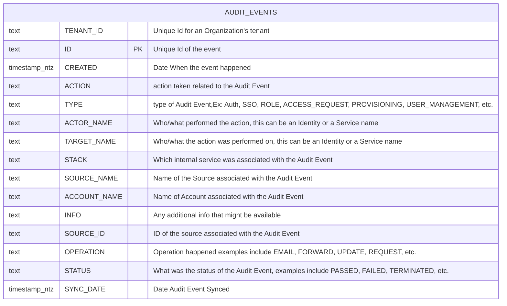

import MermaidViewer from '@site/src/components/MermaidViewer';

Secure Data Sharing makes SailPoint's Identity data avaiable directly to customer via their Snowflake account. DataSet comprises of structured Identity and audit data. Includes relationship tables that connects Identity with other domain entities like entitlements, roles, access profiles, accounts and Apps. This dataset has an additional Audit events table that is a flattened representation of all the events happening in IdentityNow for your organization.

<MermaidViewer diagram='erDiagram
    IDENTITY_ACCOUNTS {
        text TENANT_ID "Unique Id for an Organizations tenant"
        text ID PK "unique ID of the identity this account is correlated to"
        text DISPLAY_NAME "Human-readable display name of the object"
        timestamp_ntz CREATED_DATE "date when the Identity was created"
        timestamp_ntz UPDATED_DATE "date when the identity was modified"
        text ACCOUNT_ID PK "unique ID of the account"
        text NATIVE_IDENTITY "unique ID of the account generated by the source system"
        text ACCOUNT_DISPLAY_NAME "Human-readable display name of the Account"
        text SOURCE_ID "unique ID of the source this account belongs to"
        text SOURCE_DISPLAY_NAME "display name of the source this account belongs to"
        text SOURCE_TYPE "Type of the Source Ex: Azure Active Directory, Okta etc."
        timestamp_ltz SYNC_DATE "When the row is last synced"
    }
    IDENTITY_ENTITLEMENTS {
        text TENANT_ID "Unique Id for an Organizations tenant"
        text ID PK "Unique Id for the identity"
        text DISPLAY_NAME "Human-readable display name of the object"
        timestamp_ntz CREATED_DATE "date when the Identity was created"
        timestamp_ntz UPDATED_DATE "date when the identity was modified"
        text ENTITLEMENT_ID PK "unique ID of the entitlement"
        text SOURCE_DISPLAY_NAME "display name of the source this entitlement belongs to"
        text ENTITLEMENT_ATTRIBUTE "entitlement attribute name"
        text ENTITLEMENT_VALUE "value of the entitlement"
        timestamp_ltz SYNC_DATE "When the row is last synced"
    }
    IDENTITY {
        varchar PK "The primary Key"
        varchar TENANT_ID "Unique ID of customer organization"
        varchar IDENTITY_ID "This contains the unique identifier for the identity"
        timestamp IDENTITY_CREATED "Identity created Date"
        timestamp IDENTITY_UPDATED "Identity modified Date"
        varchar NAME "The name of identity"
        varchar DISPLAY_NAME "This is the displayable name usually First Name Last Name"
        varchar MANAGERS_NAME "Managers name for the identity"
        varchar EMAIL "Identity email"
        varchar STATUS "Identity status"
        varchar JOB_TITLE "Identity job title"
        varchar LOCATION "Identity location"
        varchar LOCATION_CODE "Identity location code"
        varchar DEPARTMENT "Identity department"
        varchar IDENTITY_CREATED_MONTH_SORT "A field to sort charts based on the month an Identity was created"
        number IDENTITY_CREATED_WEEK_SORT "A field to sort charts based on the week an Identity was created"
        timestamp SYNC_DATE "The date the data was synced to the table"
    }
    IDENTITY_ROLES {
        text TENANT_ID "Unique Id for an Organizations tenant"
        text ID PK "Unique Id for the identity"
        text DISPLAY_NAME "Human-readable display name of the object"
        timestamp_ntz CREATED_DATE "date when the Identity was created"
        timestamp_ntz UPDATED_DATE "date when the identity was modified"
        text ROLE_ID PK "Unique Id for the Role"
        text ROLE_NAME "Name of the Role Object"
        text ROLE_DISPLAY_NAME "Human-readable display name of the role"
        timestamp_ntz SYNC_DATE "When the row is last synced"
    }
    IDENTITY_ACCESS_PROFILES {
        text TENANT_ID "Unique Id for an Organizations tenant"
        text ID PK "Unique Id for the identity"
        text DISPLAY_NAME "Human-readable display name of the object"
        timestamp_ntz CREATED_DATE "date when the Identity was created"
        timestamp_ntz UPDATED_DATE "date when the identity was modified"
        text ACCESS_PROFILE_ID PK "Unique Id for the Access Profile"
        text ACCESS_PROFILE_NAME "Name of the Access Profile Object"
        text ACCESS_PROFILE_DISPLAY_NAME "Human-readable display name of the Access Profile"
        timestamp_ntz SYNC_DATE "When the row is last synced"
    }
    IDENTITY_APPS {
        text TENANT_ID "Unique Id for an Organizations tenant"
        text ID PK "Unique Id for the identity"
        text DISPLAY_NAME "Human-readable display name of the object"
        timestamp_ntz CREATED_DATE "date when the Identity was created"
        timestamp_ntz UPDATED_DATE "date when the identity was modified"
        text APP_ID PK "Unique Id for the APP"
        text APP_DISPLAY_NAME "Human-readable display name of the APP"
        timestamp_ntz SYNC_DATE "When the row is last synced"
    }
    IDENTITY ||--o{ IDENTITY_ACCOUNTS : "has and owns"
    IDENTITY ||--o{ IDENTITY_ENTITLEMENTS : "associated to and owns"
    IDENTITY ||--o{ IDENTITY_ROLES : "associated to and owns"
    IDENTITY ||--o{ IDENTITY_ACCESS_PROFILES: "associated to and owns"
    IDENTITY ||--o{ IDENTITY_APPS: "assocaited with"'></MermaidViewer>

### Consumer Setup:
https://github.com/sailpoint-oss/developer.sailpoint.com/assets/117477193/cec57fb2-850a-458b-8d1e-07e3cf98a6ba
