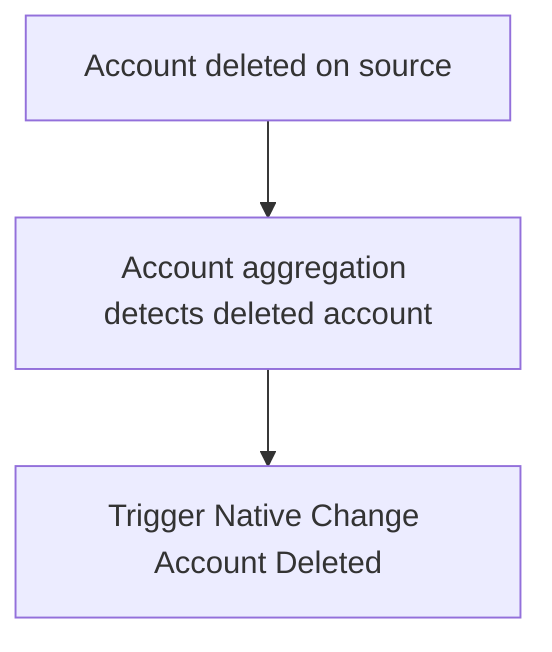

## Event Context

:::info Important Setup Steps

You must have at least one source configured for Native Change Detection (NCD) before you will receive events from this trigger.  There are two ways you can configure a source for NCD:

1. Invoke the [update native change detection configuration](https://developer.sailpoint.com/idn/api/beta/put-native-change-detection-config) for each source you want to receive events for NCD.
2. Configure the NCD options on the source in the source configuration UI.

:::

The Native Change Account Deleted trigger fires after Account Aggregations detects that an account is deleted external to Identity Security Platform on sources where:

1. Native Change Detection is enabled
2. Account Delete operations are monitored
3. at least one attribute that is selected for monitoring changed.

<div align="center">



</div>

This event trigger can be used to immediately notify interested parties and remediate accounts that are deleted directly on the source.  Some examples of how this trigger can be used are as follows:

- Notify the identity's manager and the source owner of the deleted account

This is an example input from this trigger:

```json
{
	"identity": {
		"manager": {
			"name": "Martena Heath",
			"id": "2c91808378eb9fa30178fb8caf90097f",
			"type": "IDENTITY"
		},
		"name": "Letty Wilson",
		"alias": "Letty.Wilson",
		"id": "2c91808978eb9fab0178fb8ca6d308fb",
		"type": "IDENTITY"
	},
	"singleValueAttributeChanges": [{
			"newValue": null,
			"name": "cn",
			"oldValue": "Letty Wilson"
		},
		{
			"newValue": null,
			"name": "displayName",
			"oldValue": "Letty Wilson"
		},
		{
			"newValue": null,
			"name": "distinguishedName",
			"oldValue": "CN=Letty Wilson,OU=Austin,OU=Americas,OU=Demo,DC=seri,DC=sailpointdemo,DC=com"
		}
	],
	"entitlementChanges": [{
		"removed": [{
				"owner": {
					"id": "2c91808978eb9fab0178fb8ca9280919",
					"name": "Gregory Brooks",
					"type": "IDENTITY"
				},
				"name": "ProductionManagement",
				"id": "2c91808778eb9fa30178fb9482f00c60",
				"value": "CN=ProductionManagement,OU=Groups,OU=Demo,DC=seri,DC=sailpointdemo,DC=com"
			},
			{
				"owner": null,
				"name": "Employees",
				"id": "2c91808378eb9fa30178fb94818e0af8",
				"value": "CN=Employees,OU=BirthRight,OU=Groups,OU=Demo,DC=seri,DC=sailpointdemo,DC=com"
			},
			{
				"owner": null,
				"name": "WindowsAdministration",
				"id": "2c91808378eb9fa30178fb9481c30b02",
				"value": "CN=WindowsAdministration,OU=Groups,OU=Demo,DC=seri,DC=sailpointdemo,DC=com"
			}
		],
		"added": [],
		"attributeName": "memberOf"
	}],
	"eventType": "ACCOUNT_DELETED",
	"source": {
		"owner": {
			"name": "Aaron Andrew",
			"id": "2c9180867a7c46d0017a7ca099d50531",
			"type": "IDENTITY"
		},
		"name": "Active Directory",
		"alias": "Active Directory [source]",
		"id": "2c91808a78efc63e0178fb8624b248c5",
		"type": "SOURCE",
		"governanceGroup": {
			"id": "fd0d1393-35fb-47d8-9809-0e385b73f25e",
			"name": "Active Directory Owners",
			"type": "GOVERNANCE_GROUP"
		}
	},
	"accountChangeTypes": [
		"ATTRIBUTES_CHANGED",
		"ENTITLEMENTS_REMOVED"
	],
	"multiValueAttributeChanges": [{
			"removedValues": [
				"top",
				"person",
				"organizationalPerson",
				"user"
			],
			"addedValues": [],
			"name": "objectClass"
		},
		{
			"removedValues": [
				"Normal User Account",
				"Password Cannot Expire",
				"User Account is Disabled"
			],
			"addedValues": [],
			"name": "accountFlags"
		}
	],
	"account": {
		"name": "letty.wilson",
		"id": "6805a47c09cc4dfca9083f1ce84552ee",
		"type": "ACCOUNT",
		"uuid": "{3c096158-9188-46f4-bb13-20ef9daafa7f}",
		"nativeIdentity": "CN=Letty Wilson,OU=Austin,OU=Americas,OU=Demo,DC=seri,DC=sailpointdemo,DC=com"
	}
}
```

- `identity` The identity correlated to this account.
- `singleValueAttributeChanges` Contains a list of account attributes that have changed.  During an account deleted event, all aggregated account attributes will be listed, and their `newValue` will be null.
  - it will include ALL account attributes if the config is `"allNonEntitlementAttributes": true`
  - it will include the enumerated list of attributes contained in `"selectedNonEntitlementAttributes": []`
- `entitlementChanges` Contains a list of entitlements that have been aggregated with the account.  the `added` list will always be empty for an account deleted event.
- `eventType` Will always be `ACCOUNT_DELETED` for account deleted events.
- `source` The source where this account originated from.
- `accountChangeTypes` A list of change types you can expect to see in the event input.
  - Possible values are `ATTRIBUTES_CHANGED` and `ENTITLEMENTS_REMOVED`.
  - The above example lists both change types since both attributes and entitlements were removed.  If an event payload only contains attributes removed, then this list will only contain the `ATTRIBUTES_CHANGED` value.  This can be useful when filtering events based on change types, or quickly checking what types of objects changed in the account before continuing to process the input.
- `multiValueAttributeChanges` List of multivalued attributes that were aggregated with the account.  Only `removedValues` will appear for account deleted events.
  - it will include ALL account attributes if the config is `"allNonEntitlementAttributes": true`
  - it will include the enumerated list of attributes contained in `"selectedNonEntitlementAttributes": []`
- `account` The details of the account as it appears in IdentityNow.  This information can be used to query the account API for more information.

## Additional Information and Links

- **Trigger Type**: [FIRE_AND_FORGET](../trigger-types.md#fire-and-forget)
